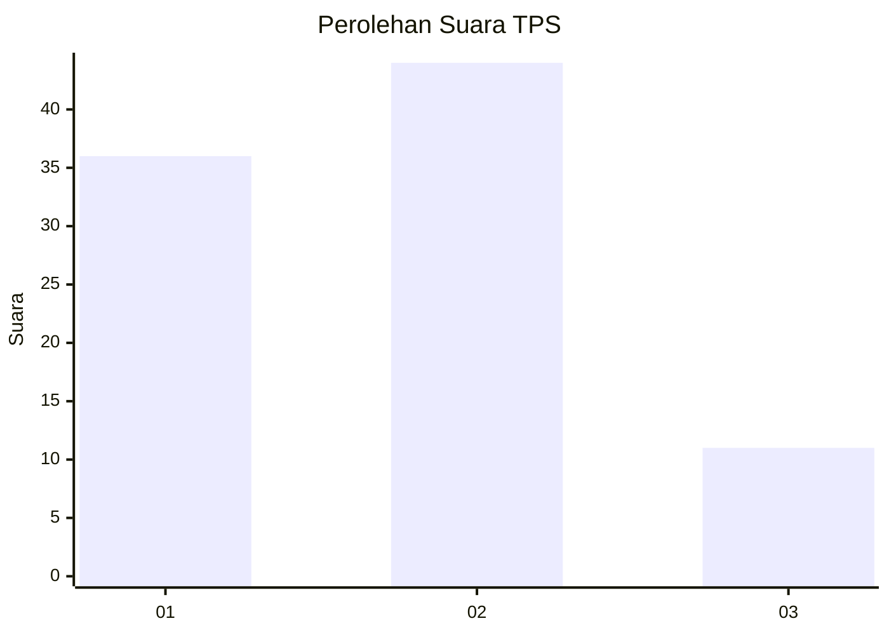
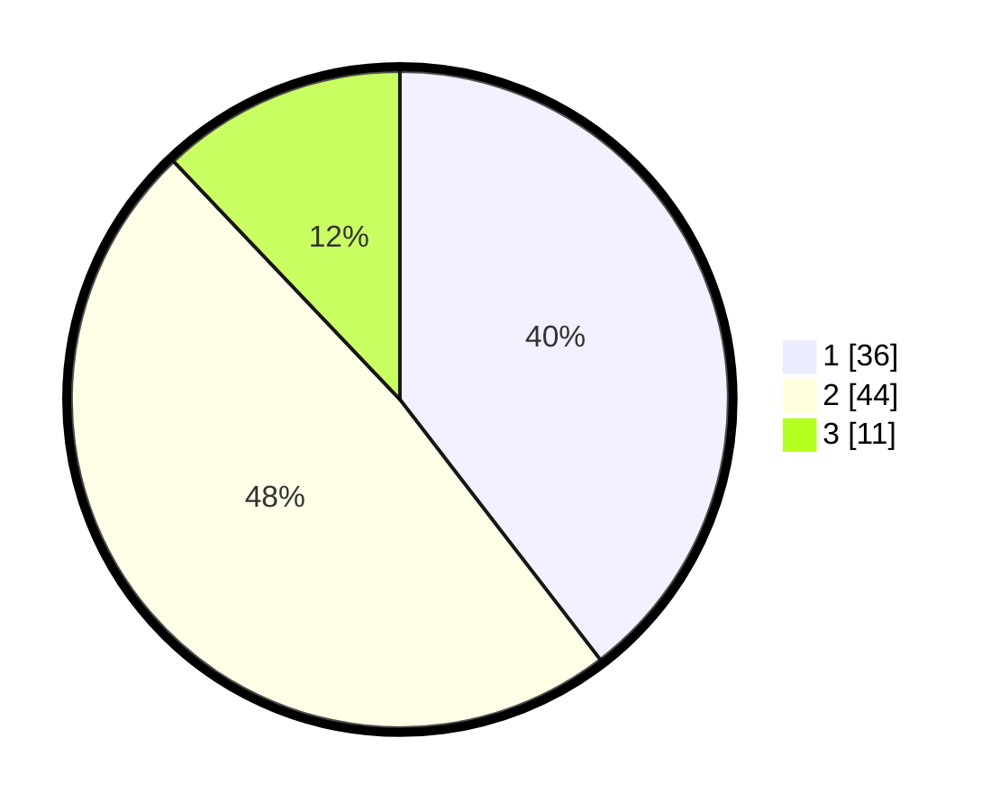

# Hasil

## Grafik

## Tabel

| No. | Nama Paslon    | Suara | Suara (raw) | Persentase |
|:--- |:-------------- | -----:| -----------:| ----------:|
| 1   | ANIES MUHAIMIN | 36    | [36][p-1]   | 39,56      |
| 2   | PRABOWO GIBRAN | 44    | [44][p-2]   | 48,35      |
| 3   | GANJAR MAHFUD  | 11    | [11][p-3]   | 12,09      |

[p-1]: https://github.com/gigit-pemilu/pemilu-2024-35-jawa-timur/blob/main/pilpres/hitung-suara/sub/35-jawa-timur/sub/09-jember/sub/25-jelbuk/sub/2001-sucopangepok/sub/002-tps/sub/paslon-1.txt
[p-2]: https://github.com/gigit-pemilu/pemilu-2024-35-jawa-timur/blob/main/pilpres/hitung-suara/sub/35-jawa-timur/sub/09-jember/sub/25-jelbuk/sub/2001-sucopangepok/sub/002-tps/sub/paslon-2.txt
[p-3]: https://github.com/gigit-pemilu/pemilu-2024-35-jawa-timur/blob/main/pilpres/hitung-suara/sub/35-jawa-timur/sub/09-jember/sub/25-jelbuk/sub/2001-sucopangepok/sub/002-tps/sub/paslon-3.txt

## Foto C Plano

https://sirekap-obj-formc.kpu.go.id/6b36/pemilu/ppwp/35/09/25/20/01/3509252001002-20240220-094506--facb9450-69ca-4e1d-a3c5-6774565eadf6.jpg

https://sirekap-obj-formc.kpu.go.id/6b36/pemilu/ppwp/35/09/25/20/01/3509252001002-20240220-094848--ac09d589-5bd2-431b-8424-0fe394597ae5.jpg

https://sirekap-obj-formc.kpu.go.id/6b36/pemilu/ppwp/35/09/25/20/01/3509252001002-20240220-095018--b42fa73d-2083-483d-9d97-412538388a1a.jpg

## Metadata

| Key        | Value               |
| ---------- | ------------------- |
| Time Stamp | 2024-02-25 15:00:00 |

