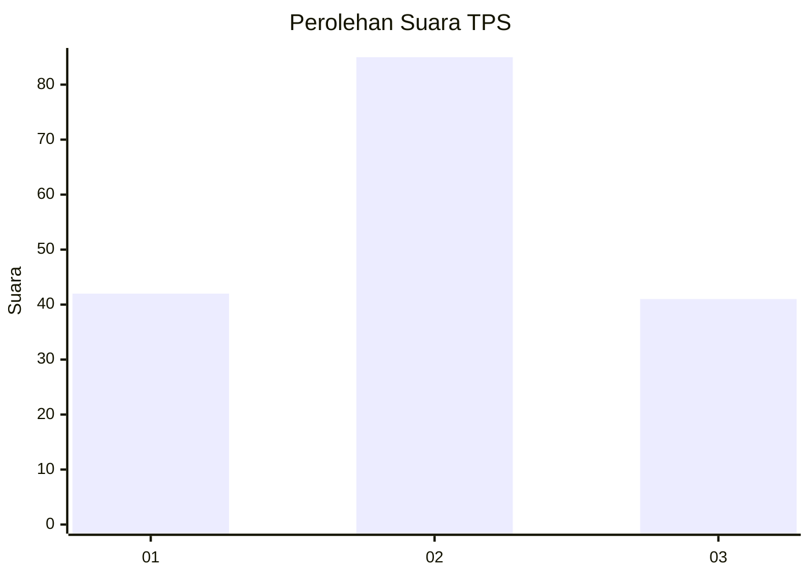
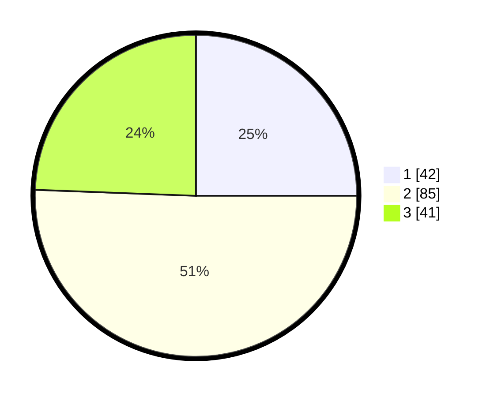

# Hasil

## Grafik

## Tabel

| No. | Nama Paslon    | Suara | Suara (raw) | Persentase |
|:--- |:-------------- | -----:| -----------:| ----------:|
| 1   | ANIES MUHAIMIN | 42    | [42][p-1]   | 25,00      |
| 2   | PRABOWO GIBRAN | 85    | [85][p-2]   | 50,60      |
| 3   | GANJAR MAHFUD  | 41    | [41][p-3]   | 24,40      |

[p-1]: https://github.com/gigit-pemilu/pemilu-2024/blob/main/pilpres/hitung-suara/sub/35-jawa-timur/sub/09-jember/sub/25-jelbuk/sub/2001-sucopangepok/sub/003-tps/sub/paslon-1.txt
[p-2]: https://github.com/gigit-pemilu/pemilu-2024/blob/main/pilpres/hitung-suara/sub/35-jawa-timur/sub/09-jember/sub/25-jelbuk/sub/2001-sucopangepok/sub/003-tps/sub/paslon-2.txt
[p-3]: https://github.com/gigit-pemilu/pemilu-2024/blob/main/pilpres/hitung-suara/sub/35-jawa-timur/sub/09-jember/sub/25-jelbuk/sub/2001-sucopangepok/sub/003-tps/sub/paslon-3.txt

## Foto C Plano

https://sirekap-obj-formc.kpu.go.id/0f5a/pemilu/ppwp/35/09/25/20/01/3509252001003-20240220-095315--0d5e044c-fbb8-47bf-aec0-8e9827b694aa.jpg

https://sirekap-obj-formc.kpu.go.id/0f5a/pemilu/ppwp/35/09/25/20/01/3509252001003-20240220-095736--78dbde1a-9629-4306-9707-2a90216d740b.jpg

https://sirekap-obj-formc.kpu.go.id/0f5a/pemilu/ppwp/35/09/25/20/01/3509252001003-20240220-095958--8af69c01-d462-4a09-9c67-7096f09803ec.jpg

## Metadata

| Key        | Value               |
| ---------- | ------------------- |
| Time Stamp | 2024-02-24 22:31:28 |

