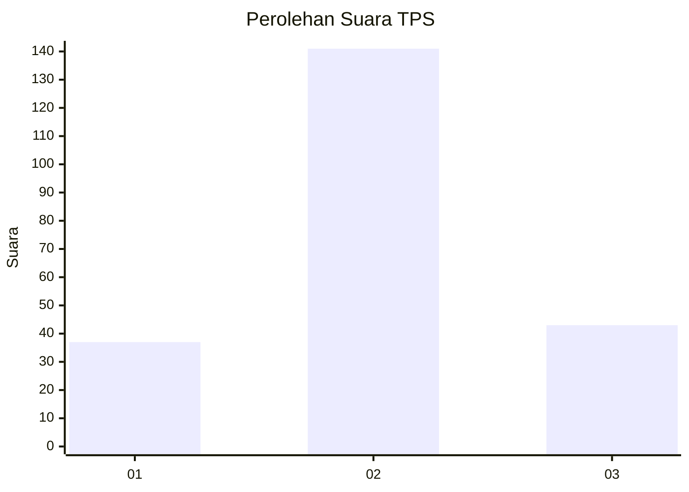
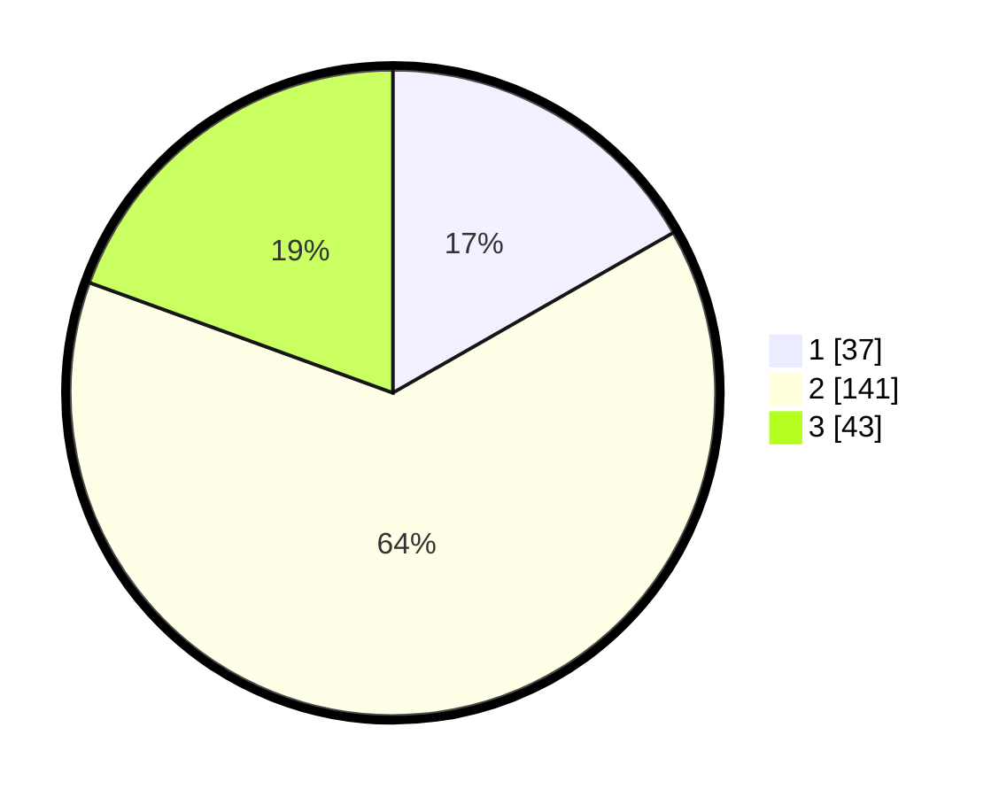

# Hasil

## Grafik

## Tabel

| No. | Nama Paslon    | Suara | Suara (raw) | Persentase |
|:--- |:-------------- | -----:| -----------:| ----------:|
| 1   | ANIES MUHAIMIN | 37    | [37][p-1]   | 16,74      |
| 2   | PRABOWO GIBRAN | 141   | [141][p-2]  | 63,80      |
| 3   | GANJAR MAHFUD  | 43    | [43][p-3]   | 19,46      |

[p-1]: https://github.com/gigit-pemilu/pemilu-2024-35-jawa-timur/blob/main/pilpres/hitung-suara/sub/35-jawa-timur/sub/09-jember/sub/25-jelbuk/sub/2001-sucopangepok/sub/004-tps/sub/paslon-1.txt
[p-2]: https://github.com/gigit-pemilu/pemilu-2024-35-jawa-timur/blob/main/pilpres/hitung-suara/sub/35-jawa-timur/sub/09-jember/sub/25-jelbuk/sub/2001-sucopangepok/sub/004-tps/sub/paslon-2.txt
[p-3]: https://github.com/gigit-pemilu/pemilu-2024-35-jawa-timur/blob/main/pilpres/hitung-suara/sub/35-jawa-timur/sub/09-jember/sub/25-jelbuk/sub/2001-sucopangepok/sub/004-tps/sub/paslon-3.txt

## Foto C Plano

https://sirekap-obj-formc.kpu.go.id/e4d0/pemilu/ppwp/35/09/25/20/01/3509252001004-20240220-100231--23af41b2-3206-49cc-8172-f2cd109883d0.jpg

https://sirekap-obj-formc.kpu.go.id/e4d0/pemilu/ppwp/35/09/25/20/01/3509252001004-20240220-100412--da84bbdb-d6a1-4a68-92f1-c05cd8383f69.jpg

https://sirekap-obj-formc.kpu.go.id/e4d0/pemilu/ppwp/35/09/25/20/01/3509252001004-20240220-100543--413992e2-43fd-40f2-9901-685d1383cd49.jpg

## Metadata

| Key        | Value               |
| ---------- | ------------------- |
| Time Stamp | 2024-02-25 21:00:00 |

