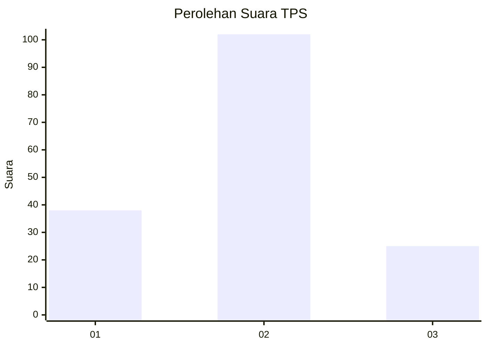
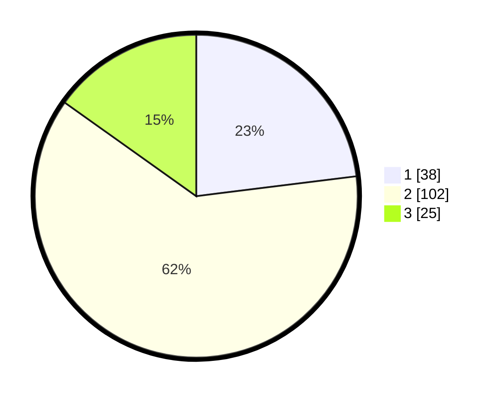

# Hasil

## Grafik

## Tabel

| No. | Nama Paslon    | Suara | Suara (raw) | Persentase |
|:--- |:-------------- | -----:| -----------:| ----------:|
| 1   | ANIES MUHAIMIN | 38    | [38][p-1]   | 23,03      |
| 2   | PRABOWO GIBRAN | 102   | [102][p-2]  | 61,82      |
| 3   | GANJAR MAHFUD  | 25    | [25][p-3]   | 15,15      |

[p-1]: https://github.com/gigit-pemilu/pemilu-2024/blob/main/pilpres/hitung-suara/sub/35-jawa-timur/sub/09-jember/sub/25-jelbuk/sub/2001-sucopangepok/sub/005-tps/sub/paslon-1.txt
[p-2]: https://github.com/gigit-pemilu/pemilu-2024/blob/main/pilpres/hitung-suara/sub/35-jawa-timur/sub/09-jember/sub/25-jelbuk/sub/2001-sucopangepok/sub/005-tps/sub/paslon-2.txt
[p-3]: https://github.com/gigit-pemilu/pemilu-2024/blob/main/pilpres/hitung-suara/sub/35-jawa-timur/sub/09-jember/sub/25-jelbuk/sub/2001-sucopangepok/sub/005-tps/sub/paslon-3.txt

## Foto C Plano

https://sirekap-obj-formc.kpu.go.id/a609/pemilu/ppwp/35/09/25/20/01/3509252001005-20240220-100748--1c9700c3-d251-4436-b9b6-dfdf62d67812.jpg

https://sirekap-obj-formc.kpu.go.id/a609/pemilu/ppwp/35/09/25/20/01/3509252001005-20240220-100927--55a6436c-f170-4896-8d68-548cfd7d1579.jpg

https://sirekap-obj-formc.kpu.go.id/a609/pemilu/ppwp/35/09/25/20/01/3509252001005-20240220-101055--d1d59216-dc8f-4e9a-a207-f32b384804e5.jpg

## Metadata

| Key        | Value               |
| ---------- | ------------------- |
| Time Stamp | 2024-02-25 21:00:00 |

