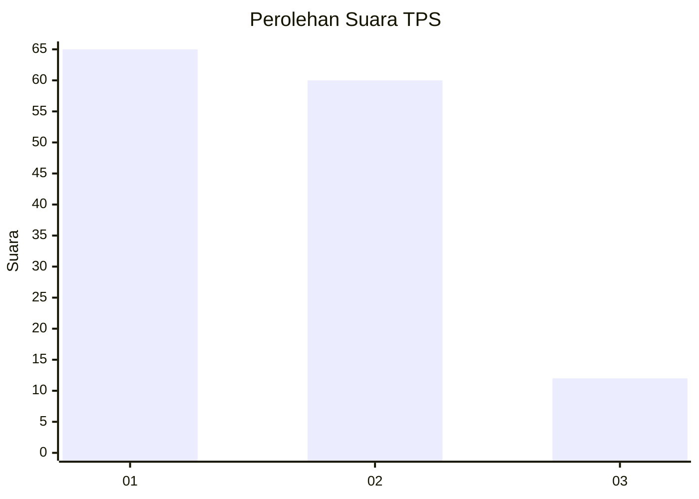
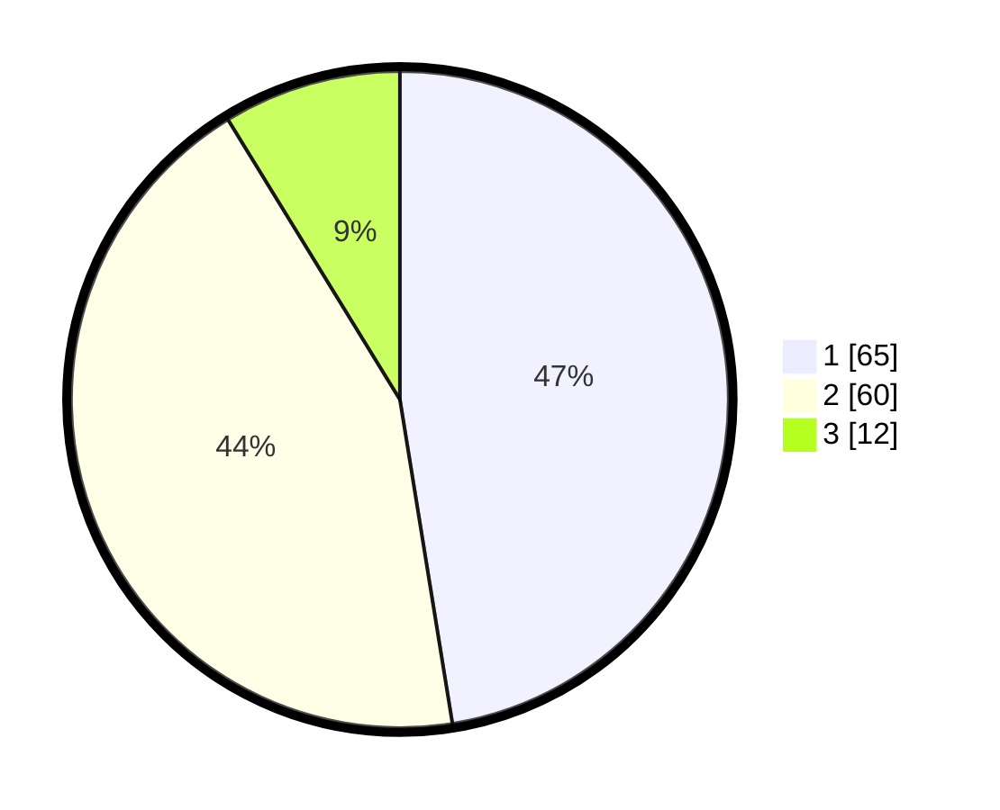

# Hasil

## Grafik

## Tabel

| No. | Nama Paslon    | Suara | Suara (raw) | Persentase |
|:--- |:-------------- | -----:| -----------:| ----------:|
| 1   | ANIES MUHAIMIN | 65    | [65][p-1]   | 47,45      |
| 2   | PRABOWO GIBRAN | 60    | [60][p-2]   | 43,80      |
| 3   | GANJAR MAHFUD  | 12    | [12][p-3]   | 8,76       |

[p-1]: https://github.com/gigit-pemilu/pemilu-2024/blob/main/pilpres/hitung-suara/sub/35-jawa-timur/sub/09-jember/sub/25-jelbuk/sub/2001-sucopangepok/sub/006-tps/sub/paslon-1.txt
[p-2]: https://github.com/gigit-pemilu/pemilu-2024/blob/main/pilpres/hitung-suara/sub/35-jawa-timur/sub/09-jember/sub/25-jelbuk/sub/2001-sucopangepok/sub/006-tps/sub/paslon-2.txt
[p-3]: https://github.com/gigit-pemilu/pemilu-2024/blob/main/pilpres/hitung-suara/sub/35-jawa-timur/sub/09-jember/sub/25-jelbuk/sub/2001-sucopangepok/sub/006-tps/sub/paslon-3.txt

## Foto C Plano

https://sirekap-obj-formc.kpu.go.id/dab8/pemilu/ppwp/35/09/25/20/01/3509252001006-20240220-101302--3a9d15ec-d08e-459e-bef1-19f940086a64.jpg

https://sirekap-obj-formc.kpu.go.id/dab8/pemilu/ppwp/35/09/25/20/01/3509252001006-20240220-101411--bec953a2-dde8-44d9-a69b-1910429cb07b.jpg

https://sirekap-obj-formc.kpu.go.id/dab8/pemilu/ppwp/35/09/25/20/01/3509252001006-20240220-101611--4bc825c4-eed9-4200-a96d-b58fa8986d71.jpg

## Metadata

| Key        | Value               |
| ---------- | ------------------- |
| Time Stamp | 2024-02-25 15:00:00 |

