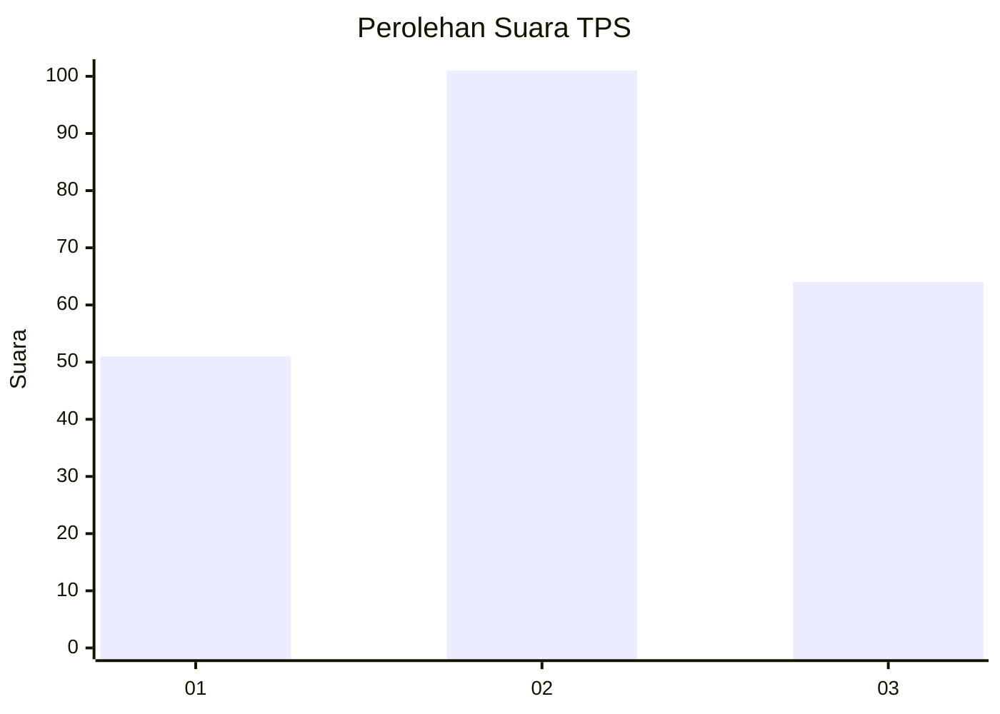
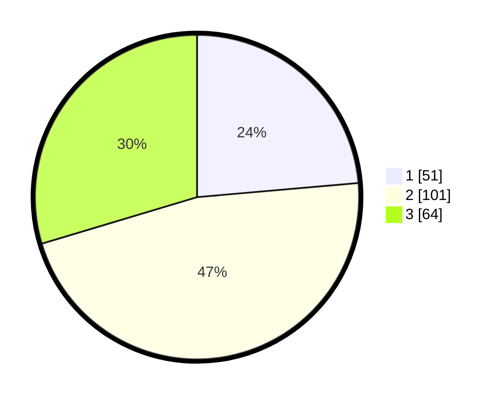

# Hasil

## Grafik

## Tabel

| No. | Nama Paslon    | Suara | Suara (raw) | Persentase |
|:--- |:-------------- | -----:| -----------:| ----------:|
| 1   | ANIES MUHAIMIN | 51    | [51][p-1]   | 23,61      |
| 2   | PRABOWO GIBRAN | 101   | [101][p-2]  | 46,76      |
| 3   | GANJAR MAHFUD  | 64    | [64][p-3]   | 29,63      |

[p-1]: https://github.com/gigit-pemilu/pemilu-2024-35-jawa-timur/blob/main/pilpres/hitung-suara/sub/35-jawa-timur/sub/09-jember/sub/25-jelbuk/sub/2001-sucopangepok/sub/007-tps/sub/paslon-1.txt
[p-2]: https://github.com/gigit-pemilu/pemilu-2024-35-jawa-timur/blob/main/pilpres/hitung-suara/sub/35-jawa-timur/sub/09-jember/sub/25-jelbuk/sub/2001-sucopangepok/sub/007-tps/sub/paslon-2.txt
[p-3]: https://github.com/gigit-pemilu/pemilu-2024-35-jawa-timur/blob/main/pilpres/hitung-suara/sub/35-jawa-timur/sub/09-jember/sub/25-jelbuk/sub/2001-sucopangepok/sub/007-tps/sub/paslon-3.txt

## Foto C Plano

https://sirekap-obj-formc.kpu.go.id/60fc/pemilu/ppwp/35/09/25/20/01/3509252001007-20240220-101820--d3a6d6f7-37cf-4883-977e-b13b605b3fb9.jpg

https://sirekap-obj-formc.kpu.go.id/60fc/pemilu/ppwp/35/09/25/20/01/3509252001007-20240220-101951--2df71eb7-1493-4784-bbd8-90af76e27366.jpg

https://sirekap-obj-formc.kpu.go.id/60fc/pemilu/ppwp/35/09/25/20/01/3509252001007-20240220-102156--12ff3fdf-997a-4d79-8a56-b7daac033d48.jpg

## Metadata

| Key        | Value               |
| ---------- | ------------------- |
| Time Stamp | 2024-02-24 22:31:28 |

