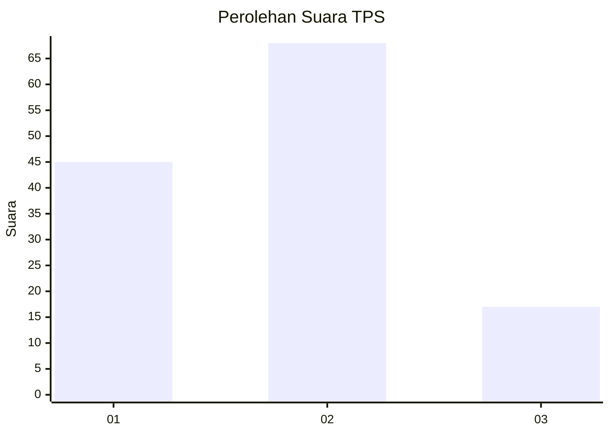
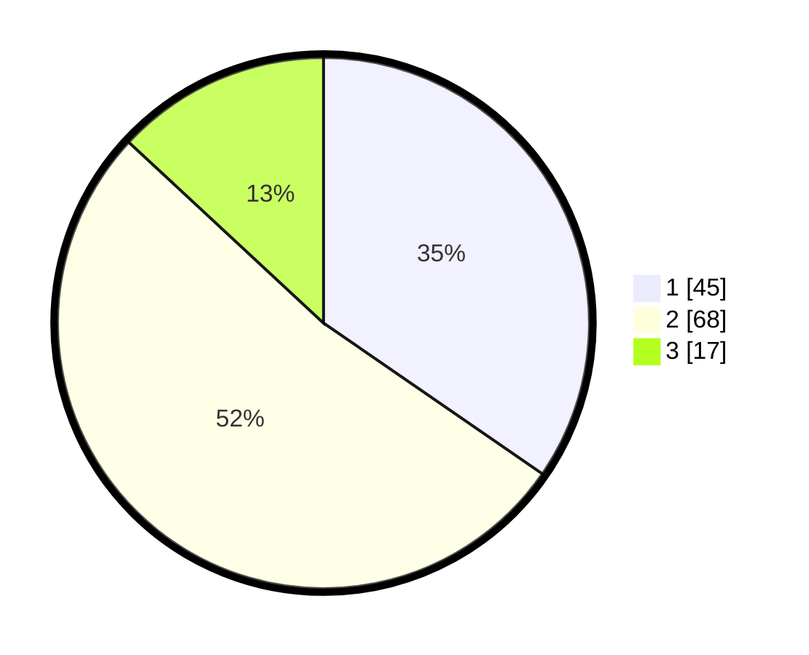

# Hasil

## Grafik

## Tabel

| No. | Nama Paslon    | Suara | Suara (raw) | Persentase |
|:--- |:-------------- | -----:| -----------:| ----------:|
| 1   | ANIES MUHAIMIN | 45    | [45][p-1]   | 34,62      |
| 2   | PRABOWO GIBRAN | 68    | [68][p-2]   | 52,31      |
| 3   | GANJAR MAHFUD  | 17    | [17][p-3]   | 13,08      |

[p-1]: https://github.com/gigit-pemilu/pemilu-2024/blob/main/pilpres/hitung-suara/sub/35-jawa-timur/sub/09-jember/sub/25-jelbuk/sub/2001-sucopangepok/sub/008-tps/sub/paslon-1.txt
[p-2]: https://github.com/gigit-pemilu/pemilu-2024/blob/main/pilpres/hitung-suara/sub/35-jawa-timur/sub/09-jember/sub/25-jelbuk/sub/2001-sucopangepok/sub/008-tps/sub/paslon-2.txt
[p-3]: https://github.com/gigit-pemilu/pemilu-2024/blob/main/pilpres/hitung-suara/sub/35-jawa-timur/sub/09-jember/sub/25-jelbuk/sub/2001-sucopangepok/sub/008-tps/sub/paslon-3.txt

## Foto C Plano

https://sirekap-obj-formc.kpu.go.id/0be0/pemilu/ppwp/35/09/25/20/01/3509252001008-20240220-102415--10b1fe3a-962f-419d-8e0f-2dca6029be47.jpg

https://sirekap-obj-formc.kpu.go.id/0be0/pemilu/ppwp/35/09/25/20/01/3509252001008-20240220-102543--b976026f-7761-4bbc-98c0-a0d43aab251f.jpg

https://sirekap-obj-formc.kpu.go.id/0be0/pemilu/ppwp/35/09/25/20/01/3509252001008-20240220-102700--993ca3a9-58ea-420d-8889-cff49b0ab922.jpg

## Metadata

| Key        | Value               |
| ---------- | ------------------- |
| Time Stamp | 2024-02-25 21:00:00 |

