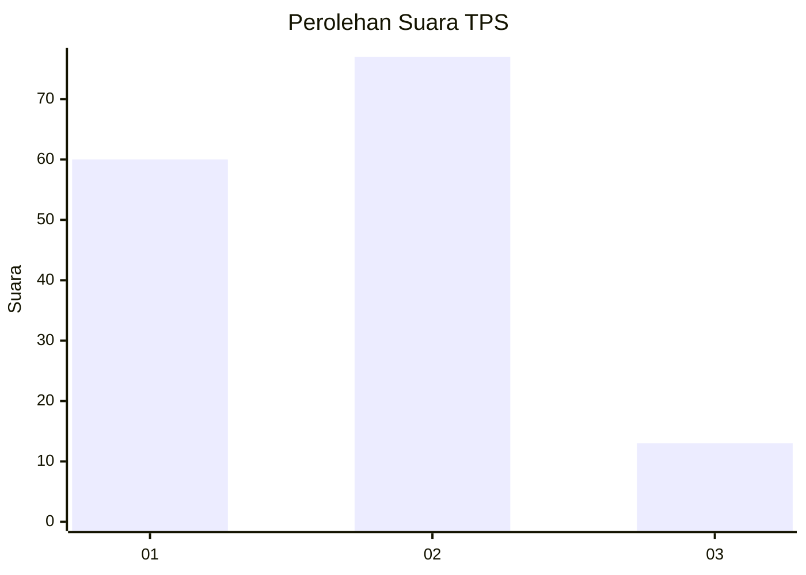

# Hasil

## Grafik

## Tabel

| No. | Nama Paslon    | Suara | Suara (raw) | Persentase |
|:--- |:-------------- | -----:| -----------:| ----------:|
| 1   | ANIES MUHAIMIN | 60    | [60][p-1]   | 40,00      |
| 2   | PRABOWO GIBRAN | 77    | [77][p-2]   | 51,33      |
| 3   | GANJAR MAHFUD  | 13    | [13][p-3]   | 8,67       |

[p-1]: https://github.com/gigit-pemilu/pemilu-2024-35-jawa-timur/blob/main/pilpres/hitung-suara/sub/35-jawa-timur/sub/09-jember/sub/25-jelbuk/sub/2001-sucopangepok/sub/010-tps/sub/paslon-1.txt
[p-2]: https://github.com/gigit-pemilu/pemilu-2024-35-jawa-timur/blob/main/pilpres/hitung-suara/sub/35-jawa-timur/sub/09-jember/sub/25-jelbuk/sub/2001-sucopangepok/sub/010-tps/sub/paslon-2.txt
[p-3]: https://github.com/gigit-pemilu/pemilu-2024-35-jawa-timur/blob/main/pilpres/hitung-suara/sub/35-jawa-timur/sub/09-jember/sub/25-jelbuk/sub/2001-sucopangepok/sub/010-tps/sub/paslon-3.txt

## Foto C Plano

https://sirekap-obj-formc.kpu.go.id/067c/pemilu/ppwp/35/09/25/20/01/3509252001010-20240220-093044--e75a0ea8-66b5-4fe9-9f96-0cbb321dc4f5.jpg

https://sirekap-obj-formc.kpu.go.id/067c/pemilu/ppwp/35/09/25/20/01/3509252001010-20240220-093654--27a532e1-f38d-4e4b-8118-b22eb3d357c3.jpg

https://sirekap-obj-formc.kpu.go.id/067c/pemilu/ppwp/35/09/25/20/01/3509252001010-20240220-093821--53d745d0-980a-43dd-ab97-90bc261e53f4.jpg

## Metadata

| Key        | Value               |
| ---------- | ------------------- |
| Time Stamp | 2024-02-24 22:31:28 |

## DATA PEMILIH TETAP

Jumlah pemilih dalam DPT: **210**.
 * L: **105**.
 * P: **105**.

## DATA PENGGUNA HAK PILIH

Jumlah pengguna hak pilih dalam DPT: **188**.
 * L: **88**.
 * P: **82**.

Jumlah pengguna hak pilih dalam DPTb: **48**.
 * L: **8**.
 * P: **888**.

Jumlah pengguna hak pilih dalam DPK: **800**.
 * L: **0**.
 * P: **0**.

Jumlah pengguna hak pilih: **158**.
 * L: **76**.
 * P: **82**.

## JUMLAH SUARA SAH DAN TIDAK SAH

JUMLAH SELURUH SUARA SAH: **150**.

JUMLAH SUARA TIDAK SAH: **8**.

JUMLAH SELURUH SUARA SAH DAN SUARA TIDAK SAH: **158**.

