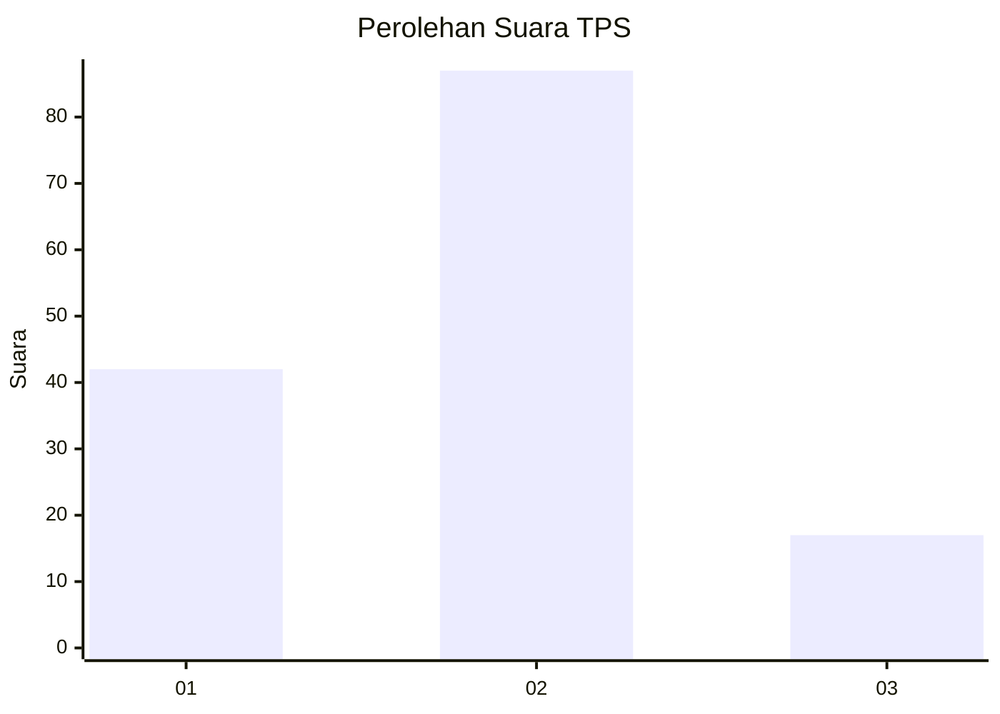
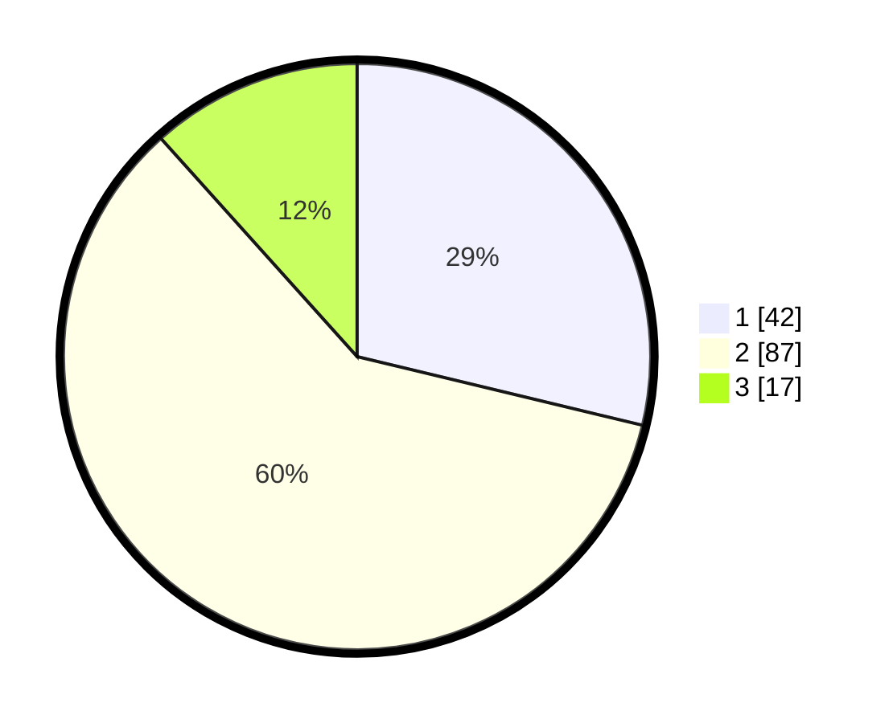

# Hasil

## Grafik

## Tabel

| No. | Nama Paslon    | Suara | Suara (raw) | Persentase |
|:--- |:-------------- | -----:| -----------:| ----------:|
| 1   | ANIES MUHAIMIN | 42    | [42][p-1]   | 28,77      |
| 2   | PRABOWO GIBRAN | 87    | [87][p-2]   | 59,59      |
| 3   | GANJAR MAHFUD  | 17    | [17][p-3]   | 11,64      |

[p-1]: https://github.com/gigit-pemilu/pemilu-2024-35-jawa-timur/blob/main/pilpres/hitung-suara/sub/35-jawa-timur/sub/09-jember/sub/25-jelbuk/sub/2001-sucopangepok/sub/011-tps/sub/paslon-1.txt
[p-2]: https://github.com/gigit-pemilu/pemilu-2024-35-jawa-timur/blob/main/pilpres/hitung-suara/sub/35-jawa-timur/sub/09-jember/sub/25-jelbuk/sub/2001-sucopangepok/sub/011-tps/sub/paslon-2.txt
[p-3]: https://github.com/gigit-pemilu/pemilu-2024-35-jawa-timur/blob/main/pilpres/hitung-suara/sub/35-jawa-timur/sub/09-jember/sub/25-jelbuk/sub/2001-sucopangepok/sub/011-tps/sub/paslon-3.txt

## Foto C Plano

https://sirekap-obj-formc.kpu.go.id/291c/pemilu/ppwp/35/09/25/20/01/3509252001011-20240220-094055--bb5a0ca2-5b2d-4625-86a0-d4c04997449f.jpg

https://sirekap-obj-formc.kpu.go.id/291c/pemilu/ppwp/35/09/25/20/01/3509252001011-20240220-094132--d399a223-9b02-41dd-83f1-3a00fc827f90.jpg

https://sirekap-obj-formc.kpu.go.id/291c/pemilu/ppwp/35/09/25/20/01/3509252001011-20240220-094217--56846994-fa57-4cf0-a6bf-25abdfa5441c.jpg

## Metadata

| Key        | Value               |
| ---------- | ------------------- |
| Time Stamp | 2024-02-25 21:00:00 |

