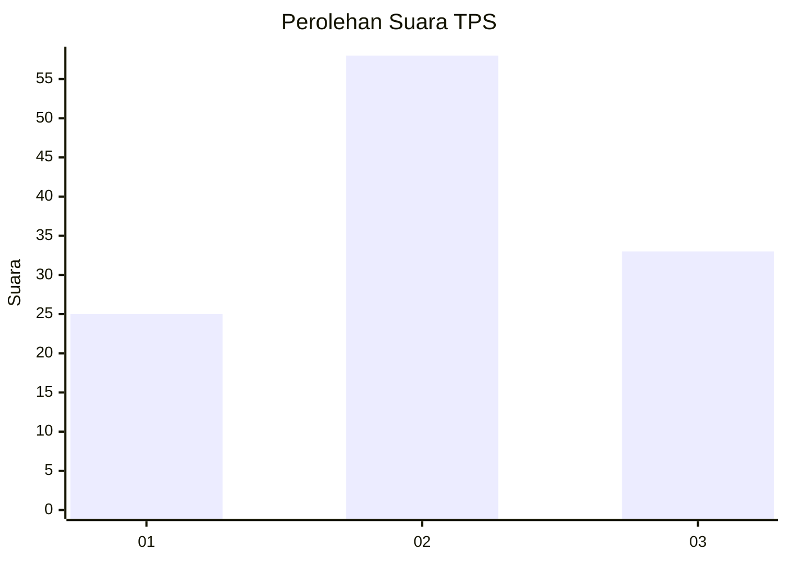
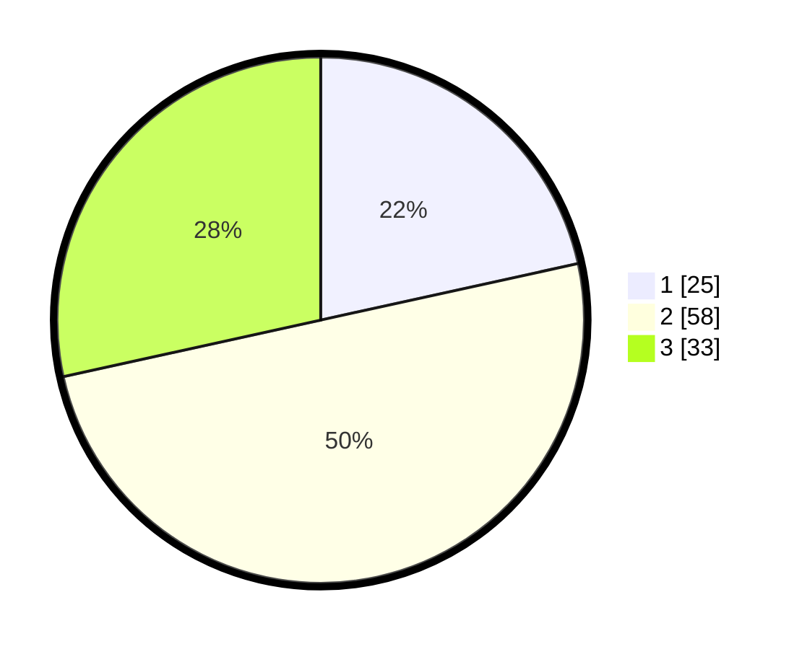

# Hasil

## Grafik

## Tabel

| No. | Nama Paslon    | Suara | Suara (raw) | Persentase |
|:--- |:-------------- | -----:| -----------:| ----------:|
| 1   | ANIES MUHAIMIN | 25    | [25][p-1]   | 21,55      |
| 2   | PRABOWO GIBRAN | 58    | [58][p-2]   | 50,00      |
| 3   | GANJAR MAHFUD  | 33    | [33][p-3]   | 28,45      |

[p-1]: https://github.com/gigit-pemilu/pemilu-2024-35-jawa-timur/blob/main/pilpres/hitung-suara/sub/35-jawa-timur/sub/09-jember/sub/25-jelbuk/sub/2001-sucopangepok/sub/012-tps/sub/paslon-1.txt
[p-2]: https://github.com/gigit-pemilu/pemilu-2024-35-jawa-timur/blob/main/pilpres/hitung-suara/sub/35-jawa-timur/sub/09-jember/sub/25-jelbuk/sub/2001-sucopangepok/sub/012-tps/sub/paslon-2.txt
[p-3]: https://github.com/gigit-pemilu/pemilu-2024-35-jawa-timur/blob/main/pilpres/hitung-suara/sub/35-jawa-timur/sub/09-jember/sub/25-jelbuk/sub/2001-sucopangepok/sub/012-tps/sub/paslon-3.txt

## Foto C Plano

https://sirekap-obj-formc.kpu.go.id/8046/pemilu/ppwp/35/09/25/20/01/3509252001012-20240220-094503--75dffd49-38e2-46e4-9ec2-cee84b513200.jpg

https://sirekap-obj-formc.kpu.go.id/8046/pemilu/ppwp/35/09/25/20/01/3509252001012-20240220-094553--4cc55a7b-9601-41dd-a6cc-6bd84b8551d6.jpg

https://sirekap-obj-formc.kpu.go.id/8046/pemilu/ppwp/35/09/25/20/01/3509252001012-20240220-094958--31ccb9af-83a6-469f-b110-0f02da658311.jpg

## Metadata

| Key        | Value               |
| ---------- | ------------------- |
| Time Stamp | 2024-02-25 16:00:00 |

