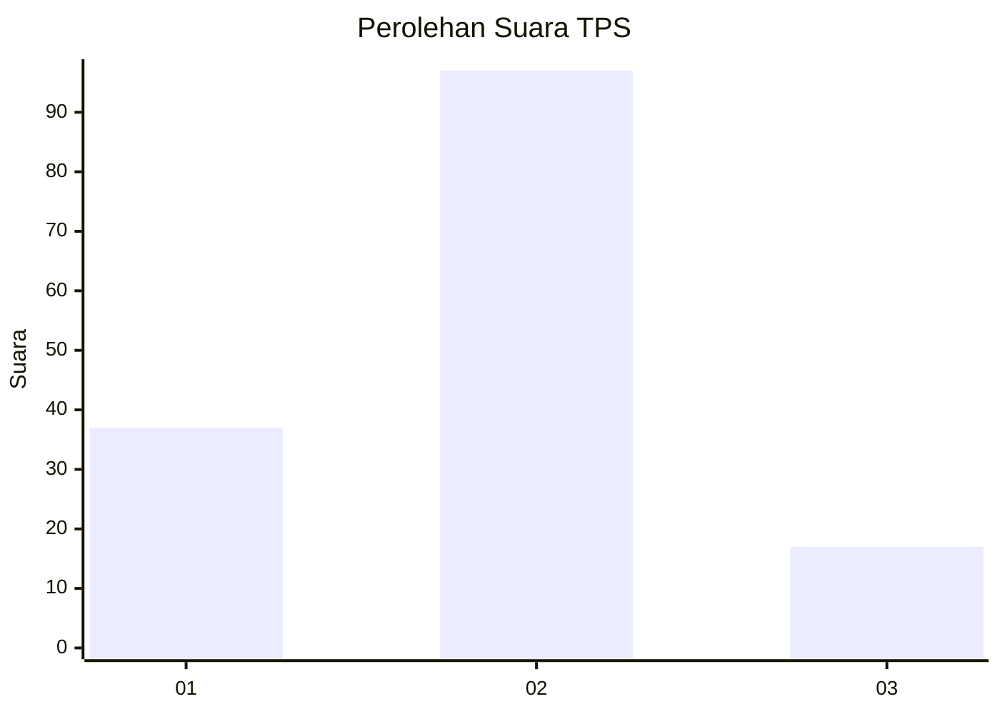
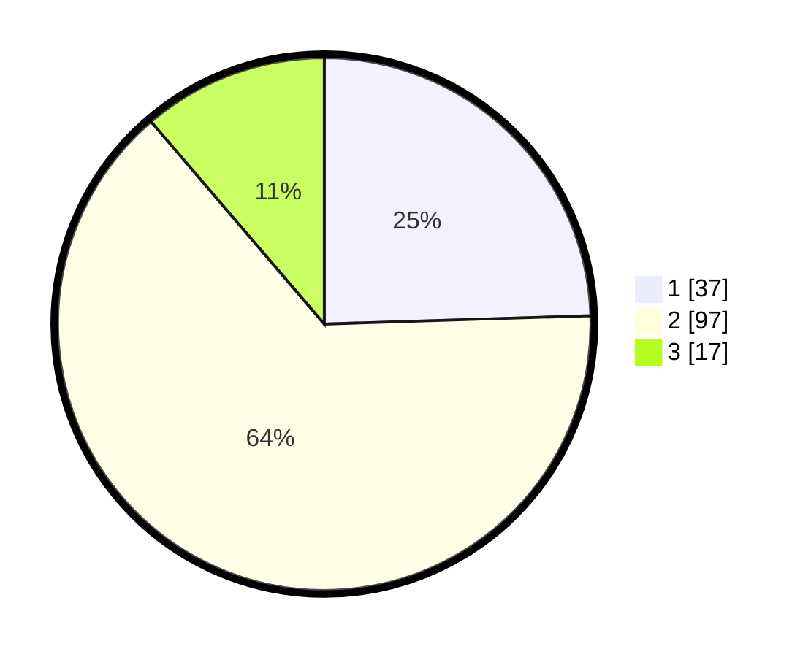

# Hasil

## Grafik

## Tabel

| No. | Nama Paslon    | Suara | Suara (raw) | Persentase |
|:--- |:-------------- | -----:| -----------:| ----------:|
| 1   | ANIES MUHAIMIN | 37    | [37][p-1]   | 24,50      |
| 2   | PRABOWO GIBRAN | 97    | [97][p-2]   | 64,24      |
| 3   | GANJAR MAHFUD  | 17    | [17][p-3]   | 11,26      |

[p-1]: https://github.com/gigit-pemilu/pemilu-2024/blob/main/pilpres/hitung-suara/sub/35-jawa-timur/sub/09-jember/sub/25-jelbuk/sub/2001-sucopangepok/sub/013-tps/sub/paslon-1.txt
[p-2]: https://github.com/gigit-pemilu/pemilu-2024/blob/main/pilpres/hitung-suara/sub/35-jawa-timur/sub/09-jember/sub/25-jelbuk/sub/2001-sucopangepok/sub/013-tps/sub/paslon-2.txt
[p-3]: https://github.com/gigit-pemilu/pemilu-2024/blob/main/pilpres/hitung-suara/sub/35-jawa-timur/sub/09-jember/sub/25-jelbuk/sub/2001-sucopangepok/sub/013-tps/sub/paslon-3.txt

## Foto C Plano

https://sirekap-obj-formc.kpu.go.id/2592/pemilu/ppwp/35/09/25/20/01/3509252001013-20240220-095427--19862dfa-0606-4d10-b3de-2c0c3a5b13f3.jpg

https://sirekap-obj-formc.kpu.go.id/2592/pemilu/ppwp/35/09/25/20/01/3509252001013-20240220-095610--60dfc2f5-dd10-41c2-99d5-1d890b1c49be.jpg

https://sirekap-obj-formc.kpu.go.id/2592/pemilu/ppwp/35/09/25/20/01/3509252001013-20240220-095725--4da5c009-607b-43bd-8c00-95b34f683b36.jpg

## Metadata

| Key        | Value               |
| ---------- | ------------------- |
| Time Stamp | 2024-02-25 12:00:00 |

