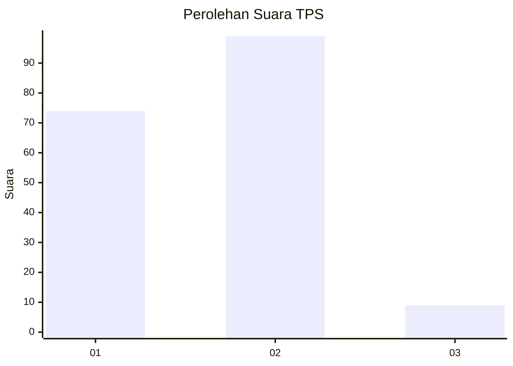
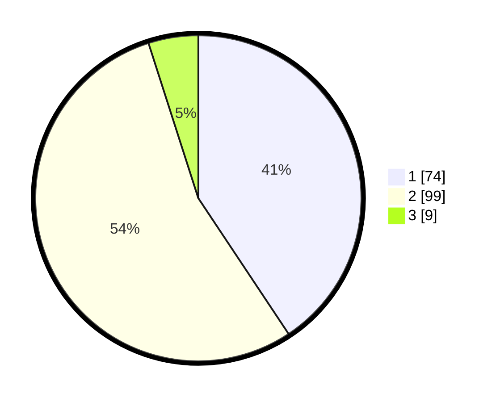

# Hasil

## Grafik

## Tabel

| No. | Nama Paslon    | Suara | Suara (raw) | Persentase |
|:--- |:-------------- | -----:| -----------:| ----------:|
| 1   | ANIES MUHAIMIN | 74    | [74][p-1]   | 40,66      |
| 2   | PRABOWO GIBRAN | 99    | [99][p-2]   | 54,40      |
| 3   | GANJAR MAHFUD  | 9     | [9][p-3]    | 4,95       |

[p-1]: https://github.com/gigit-pemilu/pemilu-2024-35-jawa-timur/blob/main/pilpres/hitung-suara/sub/35-jawa-timur/sub/09-jember/sub/25-jelbuk/sub/2001-sucopangepok/sub/014-tps/sub/paslon-1.txt
[p-2]: https://github.com/gigit-pemilu/pemilu-2024-35-jawa-timur/blob/main/pilpres/hitung-suara/sub/35-jawa-timur/sub/09-jember/sub/25-jelbuk/sub/2001-sucopangepok/sub/014-tps/sub/paslon-2.txt
[p-3]: https://github.com/gigit-pemilu/pemilu-2024-35-jawa-timur/blob/main/pilpres/hitung-suara/sub/35-jawa-timur/sub/09-jember/sub/25-jelbuk/sub/2001-sucopangepok/sub/014-tps/sub/paslon-3.txt

## Foto C Plano

https://sirekap-obj-formc.kpu.go.id/c6c3/pemilu/ppwp/35/09/25/20/01/3509252001014-20240220-100208--77c327e1-f486-4ca5-9f35-09d5c3fc6425.jpg

https://sirekap-obj-formc.kpu.go.id/c6c3/pemilu/ppwp/35/09/25/20/01/3509252001014-20240220-100316--8c1342af-0353-4726-a1e1-e2a6c0cf1ea4.jpg

https://sirekap-obj-formc.kpu.go.id/c6c3/pemilu/ppwp/35/09/25/20/01/3509252001014-20240220-100509--5dc00e50-9ac8-41dd-809b-e928504cc547.jpg

## Metadata

| Key        | Value               |
| ---------- | ------------------- |
| Time Stamp | 2024-02-24 22:31:28 |

