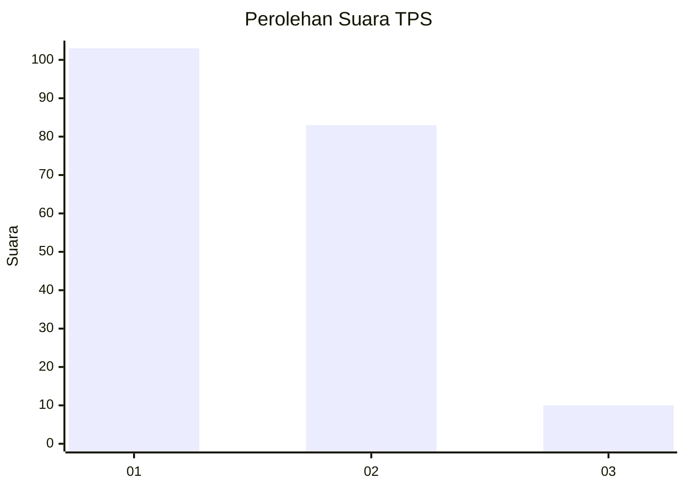
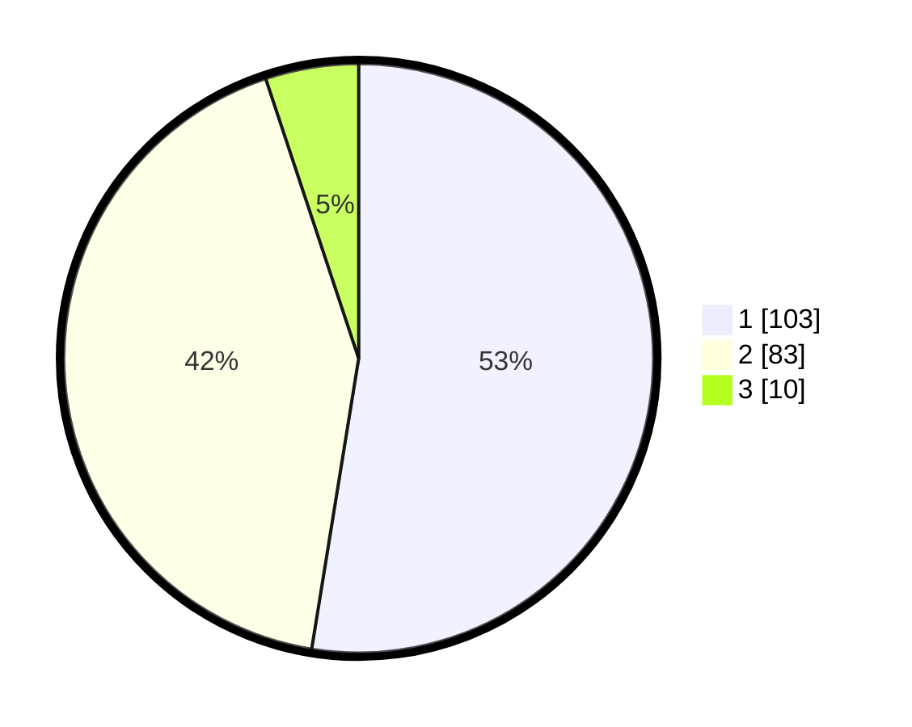

# Hasil

## Grafik

## Tabel

| No. | Nama Paslon    | Suara | Suara (raw) | Persentase |
|:--- |:-------------- | -----:| -----------:| ----------:|
| 1   | ANIES MUHAIMIN | 103   | [103][p-1]  | 52,55      |
| 2   | PRABOWO GIBRAN | 83    | [83][p-2]   | 42,35      |
| 3   | GANJAR MAHFUD  | 10    | [10][p-3]   | 5,10       |

[p-1]: https://github.com/gigit-pemilu/pemilu-2024-35-jawa-timur/blob/main/pilpres/hitung-suara/sub/35-jawa-timur/sub/09-jember/sub/25-jelbuk/sub/2001-sucopangepok/sub/015-tps/sub/paslon-1.txt
[p-2]: https://github.com/gigit-pemilu/pemilu-2024-35-jawa-timur/blob/main/pilpres/hitung-suara/sub/35-jawa-timur/sub/09-jember/sub/25-jelbuk/sub/2001-sucopangepok/sub/015-tps/sub/paslon-2.txt
[p-3]: https://github.com/gigit-pemilu/pemilu-2024-35-jawa-timur/blob/main/pilpres/hitung-suara/sub/35-jawa-timur/sub/09-jember/sub/25-jelbuk/sub/2001-sucopangepok/sub/015-tps/sub/paslon-3.txt

## Foto C Plano

https://sirekap-obj-formc.kpu.go.id/0755/pemilu/ppwp/35/09/25/20/01/3509252001015-20240220-100710--7b8580ff-2cd6-439c-b5f7-1b6237f8d6a2.jpg

https://sirekap-obj-formc.kpu.go.id/0755/pemilu/ppwp/35/09/25/20/01/3509252001015-20240220-100803--a4d8e0f8-124e-45a1-a040-16151b9e7040.jpg

https://sirekap-obj-formc.kpu.go.id/0755/pemilu/ppwp/35/09/25/20/01/3509252001015-20240220-101005--81e28283-2cc0-4fac-be7d-52a073a469e4.jpg

## Metadata

| Key        | Value               |
| ---------- | ------------------- |
| Time Stamp | 2024-02-24 22:31:28 |

