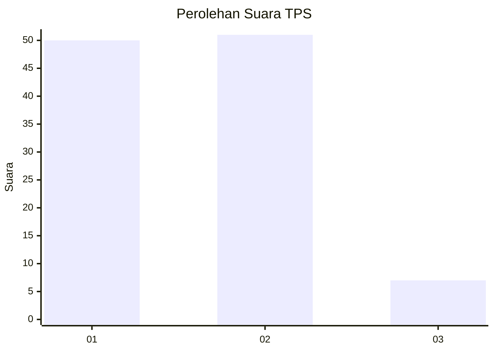
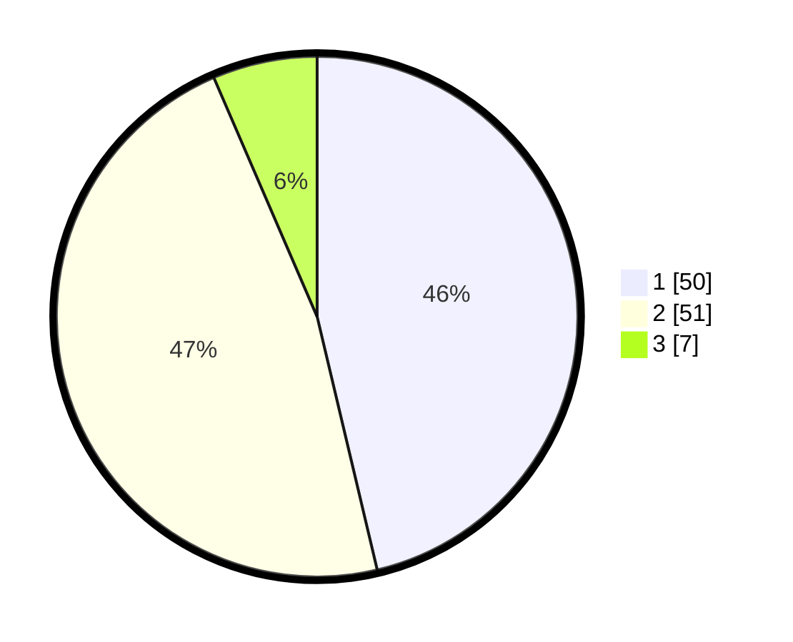

# Hasil

## Grafik

## Tabel

| No. | Nama Paslon    | Suara | Suara (raw) | Persentase |
|:--- |:-------------- | -----:| -----------:| ----------:|
| 1   | ANIES MUHAIMIN | 50    | [50][p-1]   | 46,30      |
| 2   | PRABOWO GIBRAN | 51    | [51][p-2]   | 47,22      |
| 3   | GANJAR MAHFUD  | 7     | [7][p-3]    | 6,48       |

[p-1]: https://github.com/gigit-pemilu/pemilu-2024/blob/main/pilpres/hitung-suara/sub/35-jawa-timur/sub/09-jember/sub/25-jelbuk/sub/2001-sucopangepok/sub/016-tps/sub/paslon-1.txt
[p-2]: https://github.com/gigit-pemilu/pemilu-2024/blob/main/pilpres/hitung-suara/sub/35-jawa-timur/sub/09-jember/sub/25-jelbuk/sub/2001-sucopangepok/sub/016-tps/sub/paslon-2.txt
[p-3]: https://github.com/gigit-pemilu/pemilu-2024/blob/main/pilpres/hitung-suara/sub/35-jawa-timur/sub/09-jember/sub/25-jelbuk/sub/2001-sucopangepok/sub/016-tps/sub/paslon-3.txt

## Foto C Plano

https://sirekap-obj-formc.kpu.go.id/3e25/pemilu/ppwp/35/09/25/20/01/3509252001016-20240220-101154--7ec9c64a-d03e-40c6-9f2f-6a04e9146fd0.jpg

https://sirekap-obj-formc.kpu.go.id/3e25/pemilu/ppwp/35/09/25/20/01/3509252001016-20240220-101248--2be405e8-f021-4d0d-a78f-95af9a4d68b6.jpg

https://sirekap-obj-formc.kpu.go.id/3e25/pemilu/ppwp/35/09/25/20/01/3509252001016-20240220-101635--f3bf43b4-9152-48b2-8bac-d417c6df9a3c.jpg

## Metadata

| Key        | Value               |
| ---------- | ------------------- |
| Time Stamp | 2024-02-25 12:00:00 |

