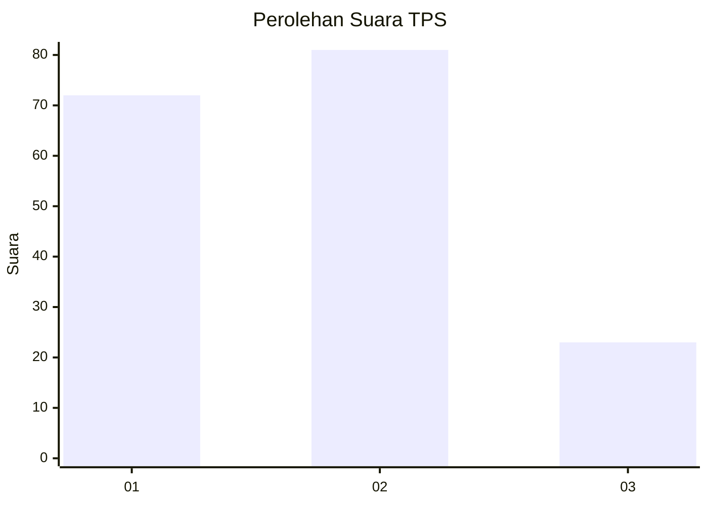
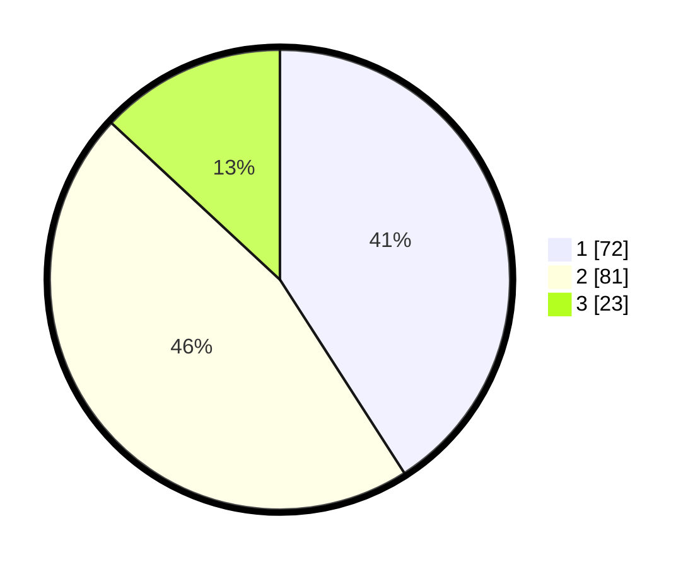

# Hasil

## Grafik

## Tabel

| No. | Nama Paslon    | Suara | Suara (raw) | Persentase |
|:--- |:-------------- | -----:| -----------:| ----------:|
| 1   | ANIES MUHAIMIN | 72    | [72][p-1]   | 40,91      |
| 2   | PRABOWO GIBRAN | 81    | [81][p-2]   | 46,02      |
| 3   | GANJAR MAHFUD  | 23    | [23][p-3]   | 13,07      |

[p-1]: https://github.com/gigit-pemilu/pemilu-2024/blob/main/pilpres/hitung-suara/sub/35-jawa-timur/sub/09-jember/sub/25-jelbuk/sub/2001-sucopangepok/sub/017-tps/sub/paslon-1.txt
[p-2]: https://github.com/gigit-pemilu/pemilu-2024/blob/main/pilpres/hitung-suara/sub/35-jawa-timur/sub/09-jember/sub/25-jelbuk/sub/2001-sucopangepok/sub/017-tps/sub/paslon-2.txt
[p-3]: https://github.com/gigit-pemilu/pemilu-2024/blob/main/pilpres/hitung-suara/sub/35-jawa-timur/sub/09-jember/sub/25-jelbuk/sub/2001-sucopangepok/sub/017-tps/sub/paslon-3.txt

## Foto C Plano

https://sirekap-obj-formc.kpu.go.id/cae8/pemilu/ppwp/35/09/25/20/01/3509252001017-20240220-095332--142b5bf2-feab-4f29-b538-033182301247.jpg

https://sirekap-obj-formc.kpu.go.id/cae8/pemilu/ppwp/35/09/25/20/01/3509252001017-20240220-095426--3fa8098a-9ec9-4d23-8c78-a52c6c3b1e12.jpg

https://sirekap-obj-formc.kpu.go.id/cae8/pemilu/ppwp/35/09/25/20/01/3509252001017-20240220-095544--2bcfdf2e-878c-46df-9674-61af0d37cbdf.jpg

## Metadata

| Key        | Value               |
| ---------- | ------------------- |
| Time Stamp | 2024-02-24 22:31:28 |

