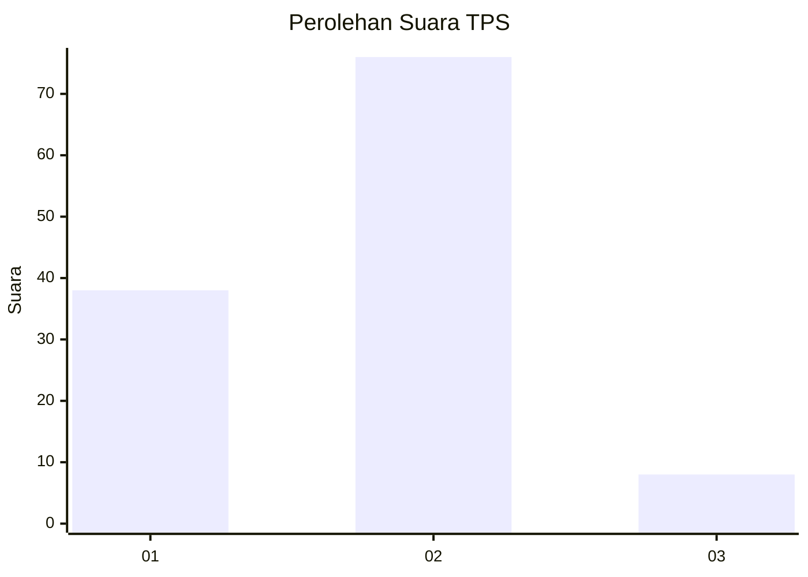
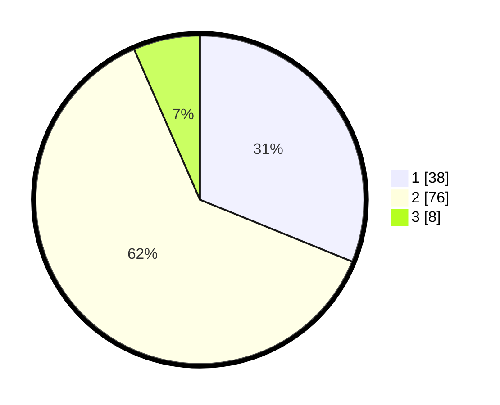

# Hasil

## Grafik

## Tabel

| No. | Nama Paslon    | Suara | Suara (raw) | Persentase |
|:--- |:-------------- | -----:| -----------:| ----------:|
| 1   | ANIES MUHAIMIN | 38    | [38][p-1]   | 31,15      |
| 2   | PRABOWO GIBRAN | 76    | [76][p-2]   | 62,30      |
| 3   | GANJAR MAHFUD  | 8     | [8][p-3]    | 6,56       |

[p-1]: https://github.com/gigit-pemilu/pemilu-2024/blob/main/pilpres/hitung-suara/sub/35-jawa-timur/sub/09-jember/sub/25-jelbuk/sub/2001-sucopangepok/sub/018-tps/sub/paslon-1.txt
[p-2]: https://github.com/gigit-pemilu/pemilu-2024/blob/main/pilpres/hitung-suara/sub/35-jawa-timur/sub/09-jember/sub/25-jelbuk/sub/2001-sucopangepok/sub/018-tps/sub/paslon-2.txt
[p-3]: https://github.com/gigit-pemilu/pemilu-2024/blob/main/pilpres/hitung-suara/sub/35-jawa-timur/sub/09-jember/sub/25-jelbuk/sub/2001-sucopangepok/sub/018-tps/sub/paslon-3.txt

## Foto C Plano

https://sirekap-obj-formc.kpu.go.id/d919/pemilu/ppwp/35/09/25/20/01/3509252001018-20240220-095925--6dfe08a3-abca-473b-b308-d89d509f6da2.jpg

https://sirekap-obj-formc.kpu.go.id/d919/pemilu/ppwp/35/09/25/20/01/3509252001018-20240220-100040--54affaf1-fad6-46ad-af1b-9c9395e8d83e.jpg

https://sirekap-obj-formc.kpu.go.id/d919/pemilu/ppwp/35/09/25/20/01/3509252001018-20240220-100145--a713d563-2308-422a-ae40-5a4c5289b48c.jpg

## Metadata

| Key        | Value               |
| ---------- | ------------------- |
| Time Stamp | 2024-02-25 16:00:00 |

