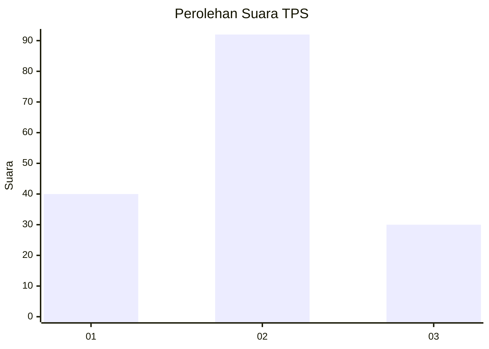
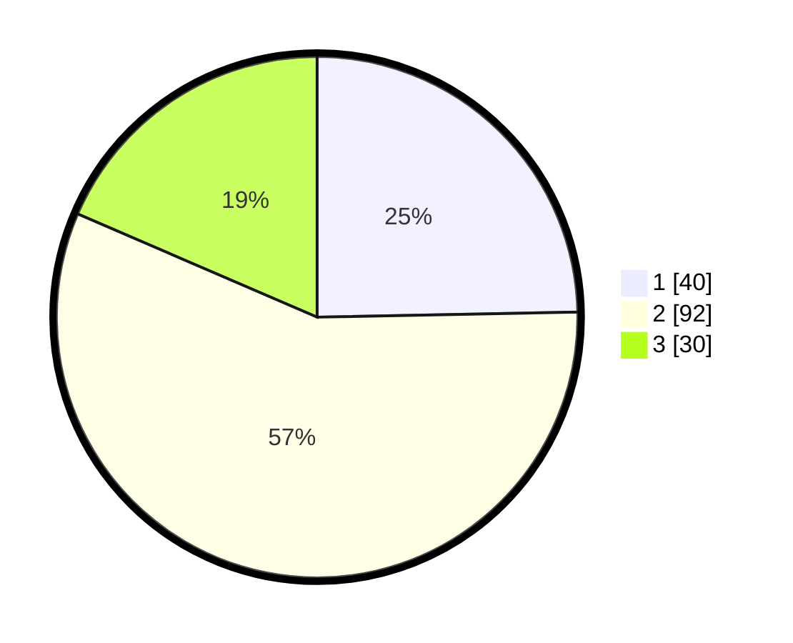

# Hasil

## Grafik

## Tabel

| No. | Nama Paslon    | Suara | Suara (raw) | Persentase |
|:--- |:-------------- | -----:| -----------:| ----------:|
| 1   | ANIES MUHAIMIN | 40    | [40][p-1]   | 24,69      |
| 2   | PRABOWO GIBRAN | 92    | [92][p-2]   | 56,79      |
| 3   | GANJAR MAHFUD  | 30    | [30][p-3]   | 18,52      |

[p-1]: https://github.com/gigit-pemilu/pemilu-2024/blob/main/pilpres/hitung-suara/sub/35-jawa-timur/sub/09-jember/sub/25-jelbuk/sub/2001-sucopangepok/sub/020-tps/sub/paslon-1.txt
[p-2]: https://github.com/gigit-pemilu/pemilu-2024/blob/main/pilpres/hitung-suara/sub/35-jawa-timur/sub/09-jember/sub/25-jelbuk/sub/2001-sucopangepok/sub/020-tps/sub/paslon-2.txt
[p-3]: https://github.com/gigit-pemilu/pemilu-2024/blob/main/pilpres/hitung-suara/sub/35-jawa-timur/sub/09-jember/sub/25-jelbuk/sub/2001-sucopangepok/sub/020-tps/sub/paslon-3.txt

## Foto C Plano

https://sirekap-obj-formc.kpu.go.id/5d54/pemilu/ppwp/35/09/25/20/01/3509252001020-20240220-100728--e71b8906-dd58-4f01-b887-0daa3c3db178.jpg

https://sirekap-obj-formc.kpu.go.id/5d54/pemilu/ppwp/35/09/25/20/01/3509252001020-20240220-100808--2abe4f64-acae-405a-aba6-1b9867d7e52a.jpg

https://sirekap-obj-formc.kpu.go.id/5d54/pemilu/ppwp/35/09/25/20/01/3509252001020-20240220-100909--cb2f62a3-aef1-4685-8e89-38097e5938ae.jpg

## Metadata

| Key        | Value               |
| ---------- | ------------------- |
| Time Stamp | 2024-02-25 13:00:00 |

