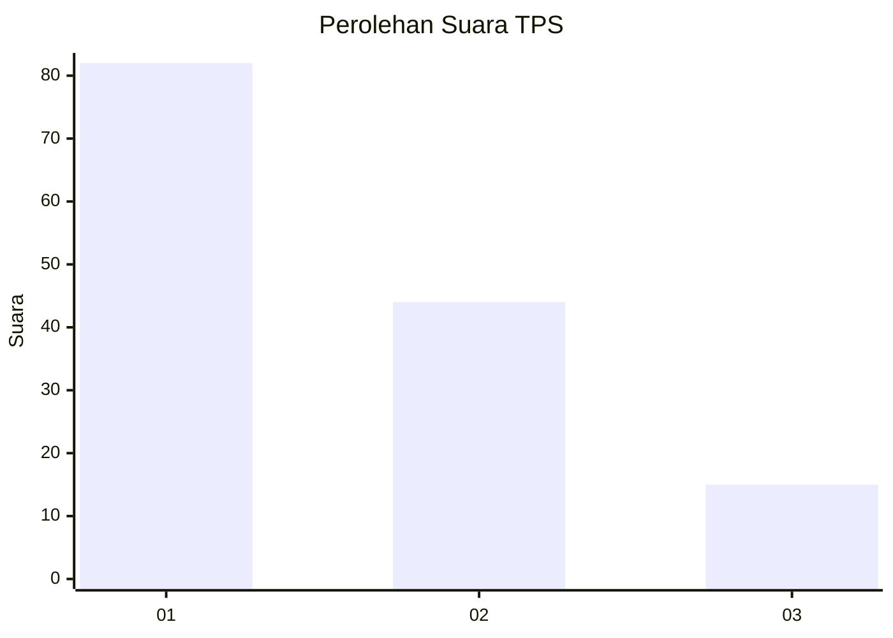
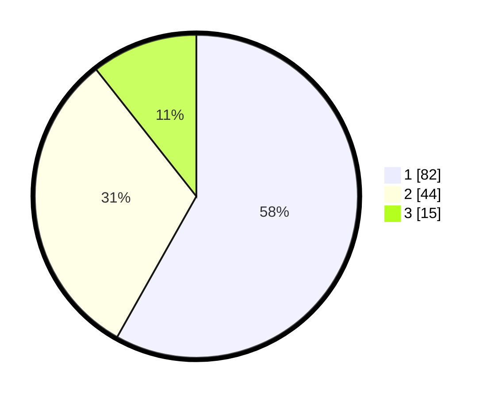

# Hasil

## Grafik

## Tabel

| No. | Nama Paslon    | Suara | Suara (raw) | Persentase |
|:--- |:-------------- | -----:| -----------:| ----------:|
| 1   | ANIES MUHAIMIN | 82    | [82][p-1]   | 58,16      |
| 2   | PRABOWO GIBRAN | 44    | [44][p-2]   | 31,21      |
| 3   | GANJAR MAHFUD  | 15    | [15][p-3]   | 10,64      |

[p-1]: https://github.com/gigit-pemilu/pemilu-2024-35-jawa-timur/blob/main/pilpres/hitung-suara/sub/35-jawa-timur/sub/09-jember/sub/25-jelbuk/sub/2001-sucopangepok/sub/021-tps/sub/paslon-1.txt
[p-2]: https://github.com/gigit-pemilu/pemilu-2024-35-jawa-timur/blob/main/pilpres/hitung-suara/sub/35-jawa-timur/sub/09-jember/sub/25-jelbuk/sub/2001-sucopangepok/sub/021-tps/sub/paslon-2.txt
[p-3]: https://github.com/gigit-pemilu/pemilu-2024-35-jawa-timur/blob/main/pilpres/hitung-suara/sub/35-jawa-timur/sub/09-jember/sub/25-jelbuk/sub/2001-sucopangepok/sub/021-tps/sub/paslon-3.txt

## Foto C Plano

https://sirekap-obj-formc.kpu.go.id/4e46/pemilu/ppwp/35/09/25/20/01/3509252001021-20240220-101108--fd76a788-a680-4c5e-8485-a13b43182c15.jpg

https://sirekap-obj-formc.kpu.go.id/4e46/pemilu/ppwp/35/09/25/20/01/3509252001021-20240220-101203--cfd770f1-fa10-4dcd-bb6b-e38010fd348d.jpg

https://sirekap-obj-formc.kpu.go.id/4e46/pemilu/ppwp/35/09/25/20/01/3509252001021-20240220-101249--0dabbee2-40e7-466a-b30c-83b220c39f9d.jpg

## Metadata

| Key        | Value               |
| ---------- | ------------------- |
| Time Stamp | 2024-02-25 16:00:00 |

