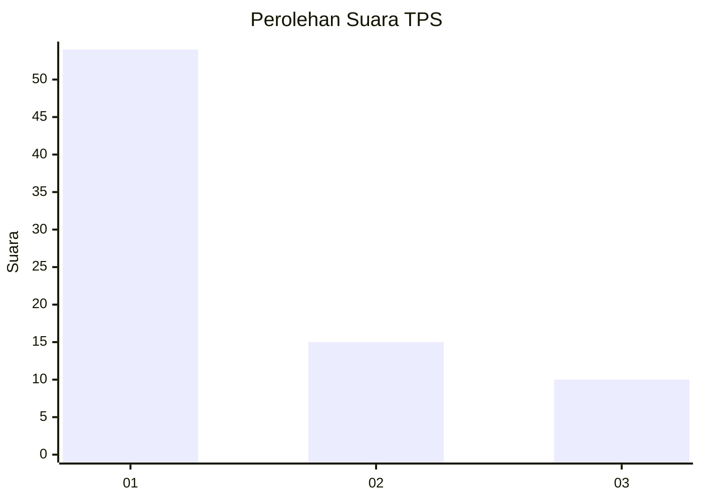
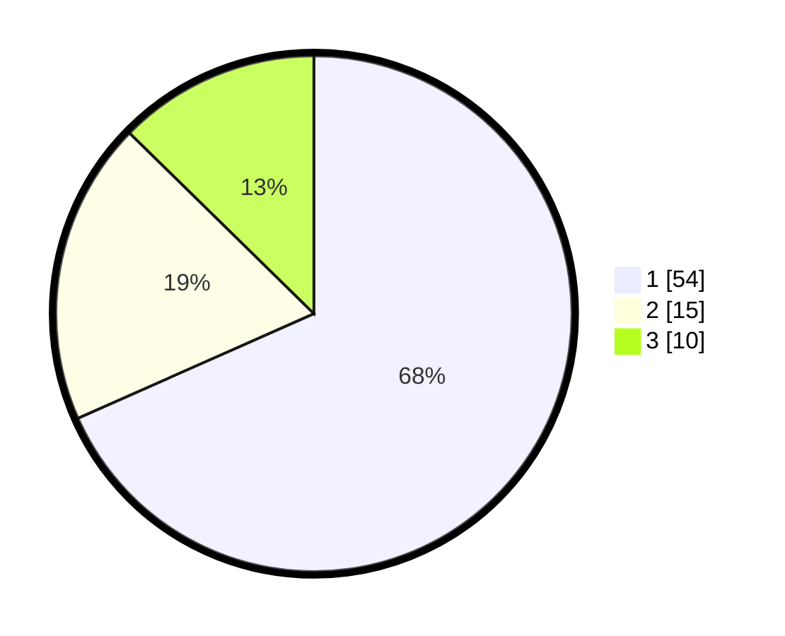

# Hasil

## Grafik

## Tabel

| No. | Nama Paslon    | Suara | Suara (raw) | Persentase |
|:--- |:-------------- | -----:| -----------:| ----------:|
| 1   | ANIES MUHAIMIN | 54    | [54][p-1]   | 68,35      |
| 2   | PRABOWO GIBRAN | 15    | [15][p-2]   | 18,99      |
| 3   | GANJAR MAHFUD  | 10    | [10][p-3]   | 12,66      |

[p-1]: https://github.com/gigit-pemilu/pemilu-2024/blob/main/pilpres/hitung-suara/sub/35-jawa-timur/sub/09-jember/sub/25-jelbuk/sub/2001-sucopangepok/sub/023-tps/sub/paslon-1.txt
[p-2]: https://github.com/gigit-pemilu/pemilu-2024/blob/main/pilpres/hitung-suara/sub/35-jawa-timur/sub/09-jember/sub/25-jelbuk/sub/2001-sucopangepok/sub/023-tps/sub/paslon-2.txt
[p-3]: https://github.com/gigit-pemilu/pemilu-2024/blob/main/pilpres/hitung-suara/sub/35-jawa-timur/sub/09-jember/sub/25-jelbuk/sub/2001-sucopangepok/sub/023-tps/sub/paslon-3.txt

## Foto C Plano

https://sirekap-obj-formc.kpu.go.id/6072/pemilu/ppwp/35/09/25/20/01/3509252001023-20240220-103705--2ffd5d98-c02f-4680-a389-850a5ee6ed88.jpg

https://sirekap-obj-formc.kpu.go.id/6072/pemilu/ppwp/35/09/25/20/01/3509252001023-20240220-103924--bbd4138f-d94b-4c14-a99c-ea87a2644408.jpg

https://sirekap-obj-formc.kpu.go.id/6072/pemilu/ppwp/35/09/25/20/01/3509252001023-20240220-104026--144eb832-4bbe-45ba-9bf2-64e8290879d6.jpg

## Metadata

| Key        | Value               |
| ---------- | ------------------- |
| Time Stamp | 2024-02-24 22:31:28 |

