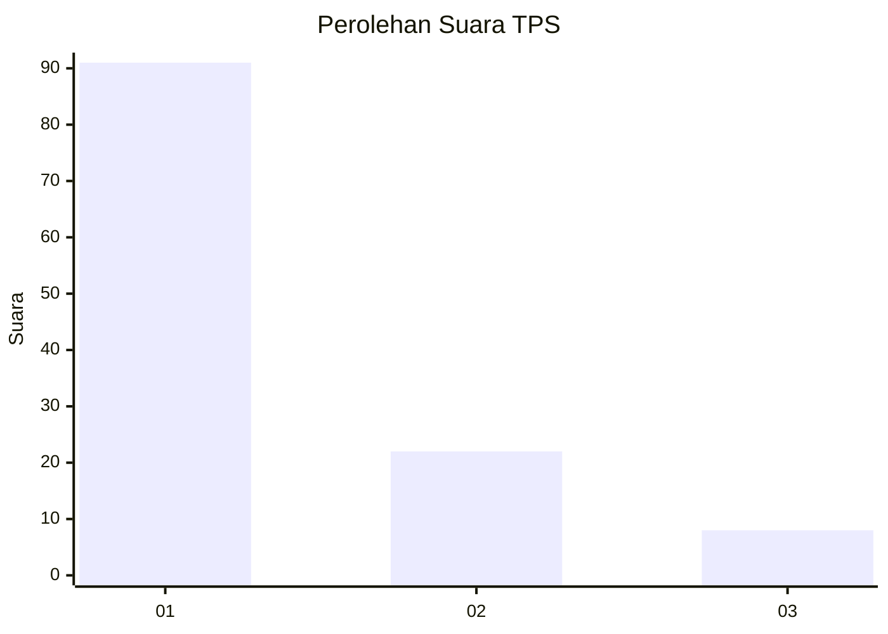
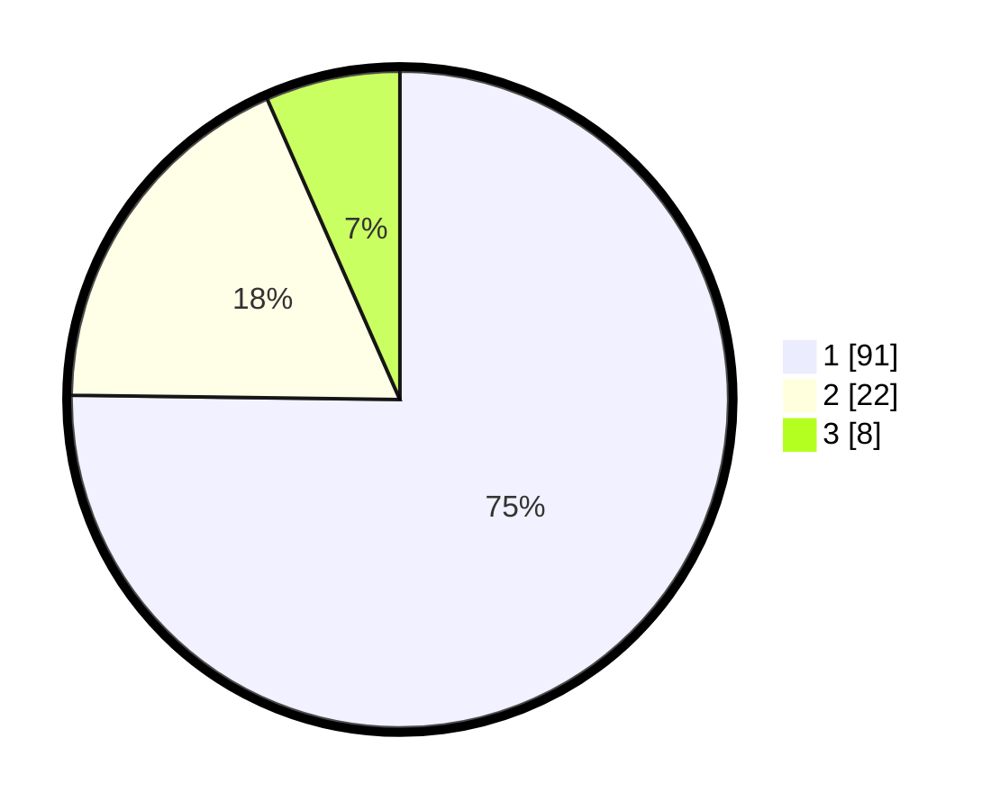

# Hasil

## Grafik

## Tabel

| No. | Nama Paslon    | Suara | Suara (raw) | Persentase |
|:--- |:-------------- | -----:| -----------:| ----------:|
| 1   | ANIES MUHAIMIN | 91    | [91][p-1]   | 75,21      |
| 2   | PRABOWO GIBRAN | 22    | [22][p-2]   | 18,18      |
| 3   | GANJAR MAHFUD  | 8     | [8][p-3]    | 6,61       |

[p-1]: https://github.com/gigit-pemilu/pemilu-2024/blob/main/pilpres/hitung-suara/sub/35-jawa-timur/sub/09-jember/sub/25-jelbuk/sub/2001-sucopangepok/sub/024-tps/sub/paslon-1.txt
[p-2]: https://github.com/gigit-pemilu/pemilu-2024/blob/main/pilpres/hitung-suara/sub/35-jawa-timur/sub/09-jember/sub/25-jelbuk/sub/2001-sucopangepok/sub/024-tps/sub/paslon-2.txt
[p-3]: https://github.com/gigit-pemilu/pemilu-2024/blob/main/pilpres/hitung-suara/sub/35-jawa-timur/sub/09-jember/sub/25-jelbuk/sub/2001-sucopangepok/sub/024-tps/sub/paslon-3.txt

## Foto C Plano

https://sirekap-obj-formc.kpu.go.id/99b5/pemilu/ppwp/35/09/25/20/01/3509252001024-20240220-104215--4b35efa4-e12b-4dae-a3de-86c74dee1da1.jpg

https://sirekap-obj-formc.kpu.go.id/99b5/pemilu/ppwp/35/09/25/20/01/3509252001024-20240220-104301--5ce2271b-71e4-4ed1-b646-b68d9ec11bbb.jpg

https://sirekap-obj-formc.kpu.go.id/99b5/pemilu/ppwp/35/09/25/20/01/3509252001024-20240220-104603--056d943d-8a57-4c34-a93a-750b57f70f22.jpg

## Metadata

| Key        | Value               |
| ---------- | ------------------- |
| Time Stamp | 2024-02-24 22:31:28 |

