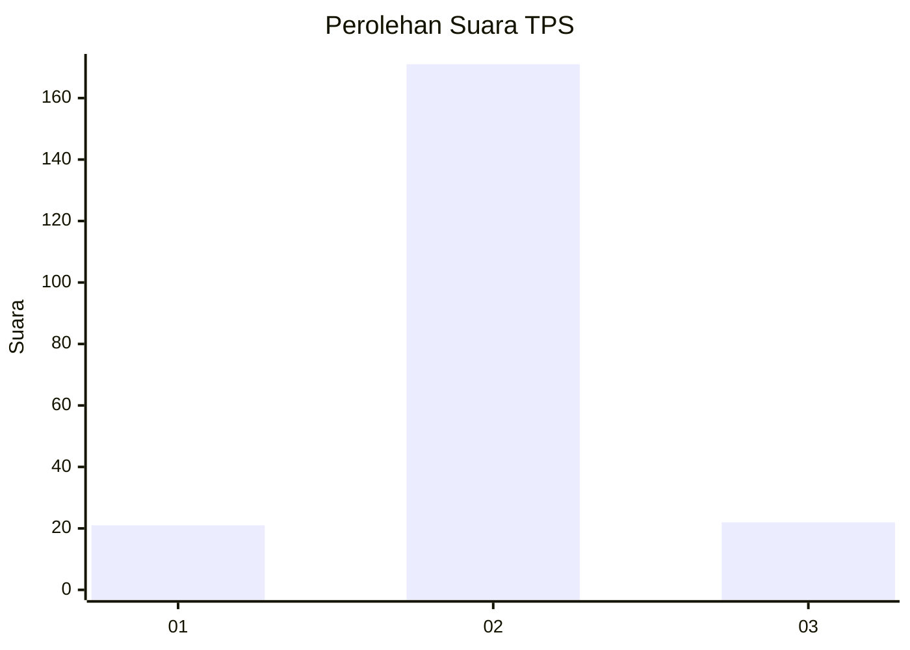
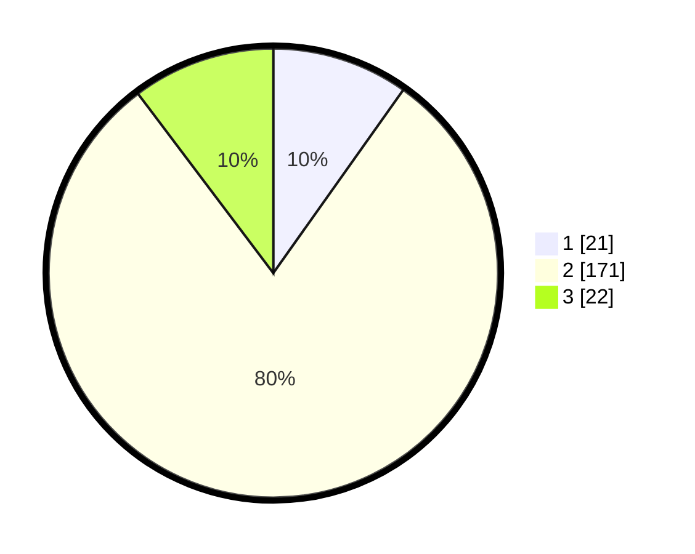

# Hasil

## Grafik

## Tabel

| No. | Nama Paslon    | Suara | Suara (raw) | Persentase |
|:--- |:-------------- | -----:| -----------:| ----------:|
| 1   | ANIES MUHAIMIN | 21    | [21][p-1]   | 9,81       |
| 2   | PRABOWO GIBRAN | 171   | [171][p-2]  | 79,91      |
| 3   | GANJAR MAHFUD  | 22    | [22][p-3]   | 10,28      |

[p-1]: https://github.com/gigit-pemilu/pemilu-2024/blob/main/pilpres/hitung-suara/sub/35-jawa-timur/sub/09-jember/sub/25-jelbuk/sub/2002-panduman/sub/003-tps/sub/paslon-1.txt
[p-2]: https://github.com/gigit-pemilu/pemilu-2024/blob/main/pilpres/hitung-suara/sub/35-jawa-timur/sub/09-jember/sub/25-jelbuk/sub/2002-panduman/sub/003-tps/sub/paslon-2.txt
[p-3]: https://github.com/gigit-pemilu/pemilu-2024/blob/main/pilpres/hitung-suara/sub/35-jawa-timur/sub/09-jember/sub/25-jelbuk/sub/2002-panduman/sub/003-tps/sub/paslon-3.txt

## Foto C Plano

https://sirekap-obj-formc.kpu.go.id/c3da/pemilu/ppwp/35/09/25/20/02/3509252002003-20240219-095408--d2de0d6a-a10e-40c5-be9d-5fcde8dbd4eb.jpg

https://sirekap-obj-formc.kpu.go.id/c3da/pemilu/ppwp/35/09/25/20/02/3509252002003-20240219-095500--08b7d1eb-d1ec-4cdf-9340-f786fa6dd77e.jpg

https://sirekap-obj-formc.kpu.go.id/c3da/pemilu/ppwp/35/09/25/20/02/3509252002003-20240219-095639--316540dd-e6c9-4b0b-a1f0-58ea1ac6d5a0.jpg

## Metadata

| Key        | Value               |
| ---------- | ------------------- |
| Time Stamp | 2024-02-24 22:31:28 |

