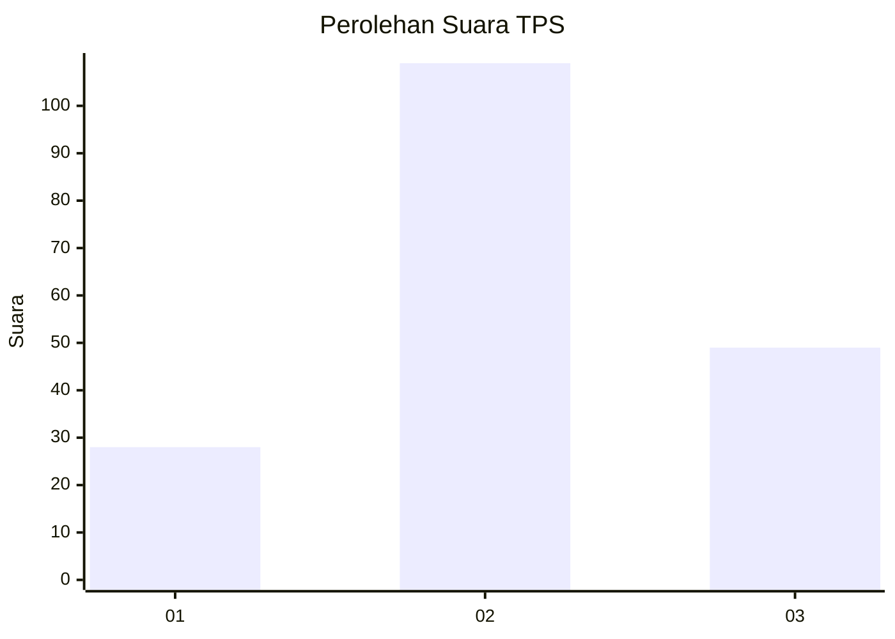
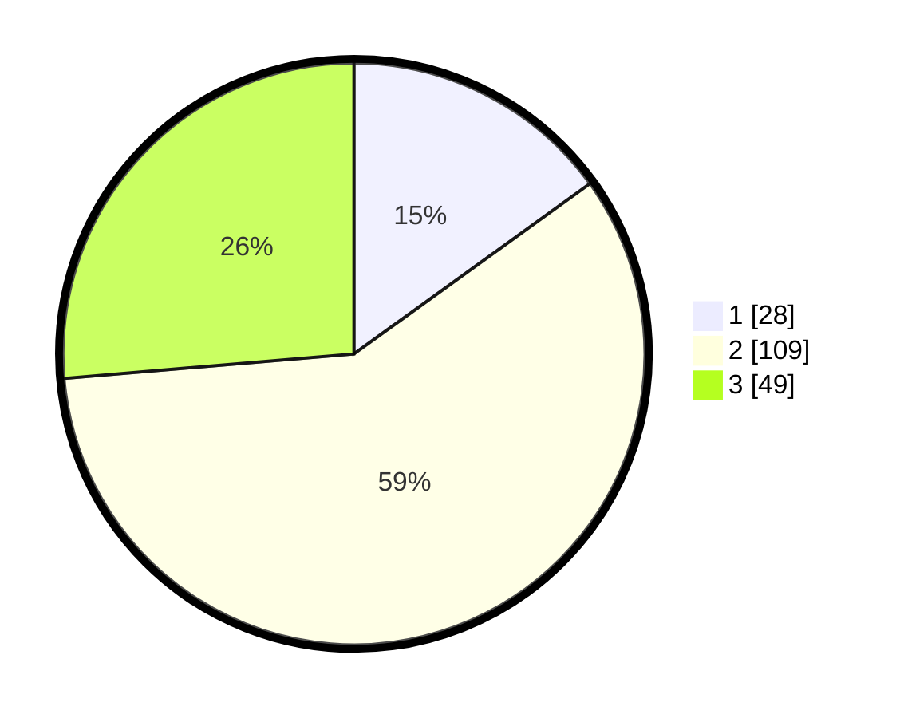

# Hasil

## Grafik

## Tabel

| No. | Nama Paslon    | Suara | Suara (raw) | Persentase |
|:--- |:-------------- | -----:| -----------:| ----------:|
| 1   | ANIES MUHAIMIN | 28    | [28][p-1]   | 15,05      |
| 2   | PRABOWO GIBRAN | 109   | [109][p-2]  | 58,60      |
| 3   | GANJAR MAHFUD  | 49    | [49][p-3]   | 26,34      |

[p-1]: https://github.com/gigit-pemilu/pemilu-2024/blob/main/pilpres/hitung-suara/sub/35-jawa-timur/sub/09-jember/sub/25-jelbuk/sub/2002-panduman/sub/005-tps/sub/paslon-1.txt
[p-2]: https://github.com/gigit-pemilu/pemilu-2024/blob/main/pilpres/hitung-suara/sub/35-jawa-timur/sub/09-jember/sub/25-jelbuk/sub/2002-panduman/sub/005-tps/sub/paslon-2.txt
[p-3]: https://github.com/gigit-pemilu/pemilu-2024/blob/main/pilpres/hitung-suara/sub/35-jawa-timur/sub/09-jember/sub/25-jelbuk/sub/2002-panduman/sub/005-tps/sub/paslon-3.txt

## Foto C Plano

https://sirekap-obj-formc.kpu.go.id/8324/pemilu/ppwp/35/09/25/20/02/3509252002005-20240219-100441--ce5df7ed-6429-4192-8cf7-6ec2ccba69ce.jpg

https://sirekap-obj-formc.kpu.go.id/8324/pemilu/ppwp/35/09/25/20/02/3509252002005-20240219-101013--a2322fe6-18a2-45e4-bfea-94838f6f88d2.jpg

https://sirekap-obj-formc.kpu.go.id/8324/pemilu/ppwp/35/09/25/20/02/3509252002005-20240219-100805--5987e9d5-c8e1-43be-bfde-876043b40027.jpg

## Metadata

| Key        | Value               |
| ---------- | ------------------- |
| Time Stamp | 2024-02-25 17:00:00 |

