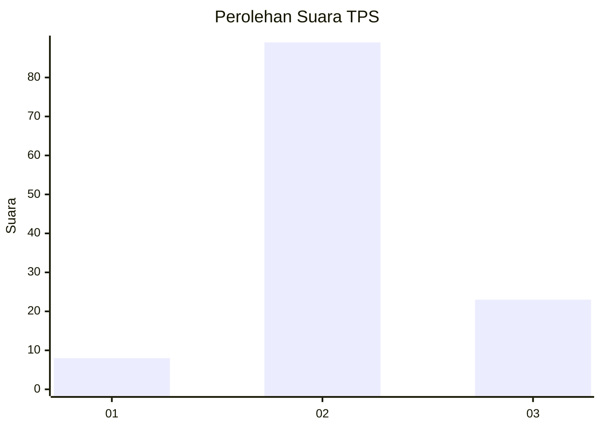
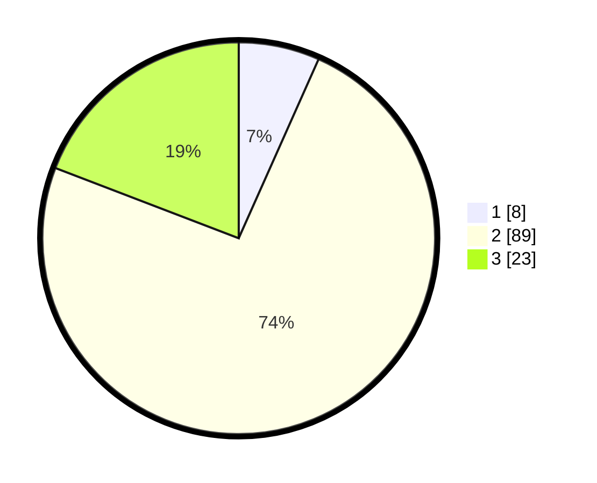

# Hasil

## Grafik

## Tabel

| No. | Nama Paslon    | Suara | Suara (raw) | Persentase |
|:--- |:-------------- | -----:| -----------:| ----------:|
| 1   | ANIES MUHAIMIN | 8     | [8][p-1]    | 6,67       |
| 2   | PRABOWO GIBRAN | 89    | [89][p-2]   | 74,17      |
| 3   | GANJAR MAHFUD  | 23    | [23][p-3]   | 19,17      |

[p-1]: https://github.com/gigit-pemilu/pemilu-2024/blob/main/pilpres/hitung-suara/sub/35-jawa-timur/sub/09-jember/sub/25-jelbuk/sub/2002-panduman/sub/006-tps/sub/paslon-1.txt
[p-2]: https://github.com/gigit-pemilu/pemilu-2024/blob/main/pilpres/hitung-suara/sub/35-jawa-timur/sub/09-jember/sub/25-jelbuk/sub/2002-panduman/sub/006-tps/sub/paslon-2.txt
[p-3]: https://github.com/gigit-pemilu/pemilu-2024/blob/main/pilpres/hitung-suara/sub/35-jawa-timur/sub/09-jember/sub/25-jelbuk/sub/2002-panduman/sub/006-tps/sub/paslon-3.txt

## Foto C Plano

https://sirekap-obj-formc.kpu.go.id/11b5/pemilu/ppwp/35/09/25/20/02/3509252002006-20240219-102046--523cc92a-a0c4-4177-a3ea-80562367ac7b.jpg

https://sirekap-obj-formc.kpu.go.id/11b5/pemilu/ppwp/35/09/25/20/02/3509252002006-20240219-102140--3fa7e0fc-c50d-4566-bb57-a68f14cba5fd.jpg

https://sirekap-obj-formc.kpu.go.id/11b5/pemilu/ppwp/35/09/25/20/02/3509252002006-20240219-102249--22c93230-6cc0-46fa-a2b4-248c82a8712a.jpg

## Metadata

| Key        | Value               |
| ---------- | ------------------- |
| Time Stamp | 2024-02-24 22:31:28 |

