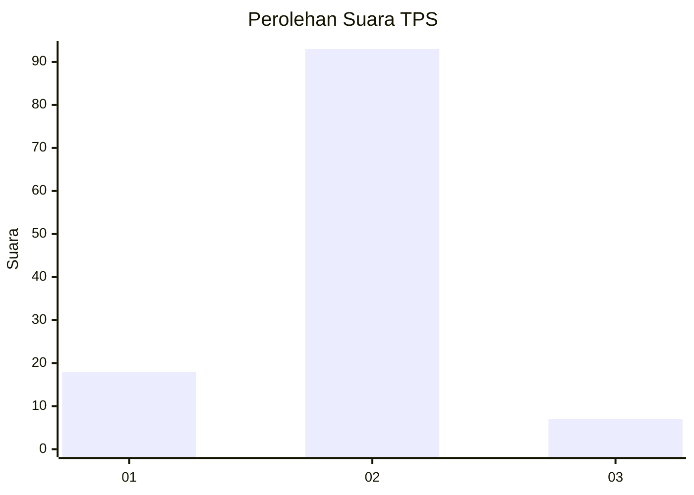
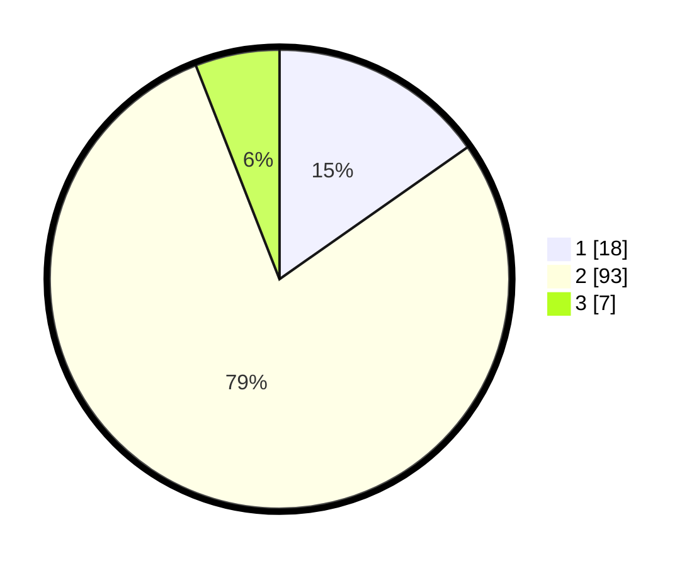

# Hasil

## Grafik

## Tabel

| No. | Nama Paslon    | Suara | Suara (raw) | Persentase |
|:--- |:-------------- | -----:| -----------:| ----------:|
| 1   | ANIES MUHAIMIN | 18    | [18][p-1]   | 15,25      |
| 2   | PRABOWO GIBRAN | 93    | [93][p-2]   | 78,81      |
| 3   | GANJAR MAHFUD  | 7     | [7][p-3]    | 5,93       |

[p-1]: https://github.com/gigit-pemilu/pemilu-2024/blob/main/pilpres/hitung-suara/sub/35-jawa-timur/sub/09-jember/sub/25-jelbuk/sub/2002-panduman/sub/007-tps/sub/paslon-1.txt
[p-2]: https://github.com/gigit-pemilu/pemilu-2024/blob/main/pilpres/hitung-suara/sub/35-jawa-timur/sub/09-jember/sub/25-jelbuk/sub/2002-panduman/sub/007-tps/sub/paslon-2.txt
[p-3]: https://github.com/gigit-pemilu/pemilu-2024/blob/main/pilpres/hitung-suara/sub/35-jawa-timur/sub/09-jember/sub/25-jelbuk/sub/2002-panduman/sub/007-tps/sub/paslon-3.txt

## Foto C Plano

https://sirekap-obj-formc.kpu.go.id/61ca/pemilu/ppwp/35/09/25/20/02/3509252002007-20240219-102524--17994081-4d7f-422d-8a51-3dc3d623c85b.jpg

https://sirekap-obj-formc.kpu.go.id/61ca/pemilu/ppwp/35/09/25/20/02/3509252002007-20240219-102613--04b220c6-e253-412e-96ae-b5235f564966.jpg

https://sirekap-obj-formc.kpu.go.id/61ca/pemilu/ppwp/35/09/25/20/02/3509252002007-20240219-102720--cec9b744-e765-4683-a8e6-404a07b23839.jpg

## Metadata

| Key        | Value               |
| ---------- | ------------------- |
| Time Stamp | 2024-02-25 15:00:00 |

