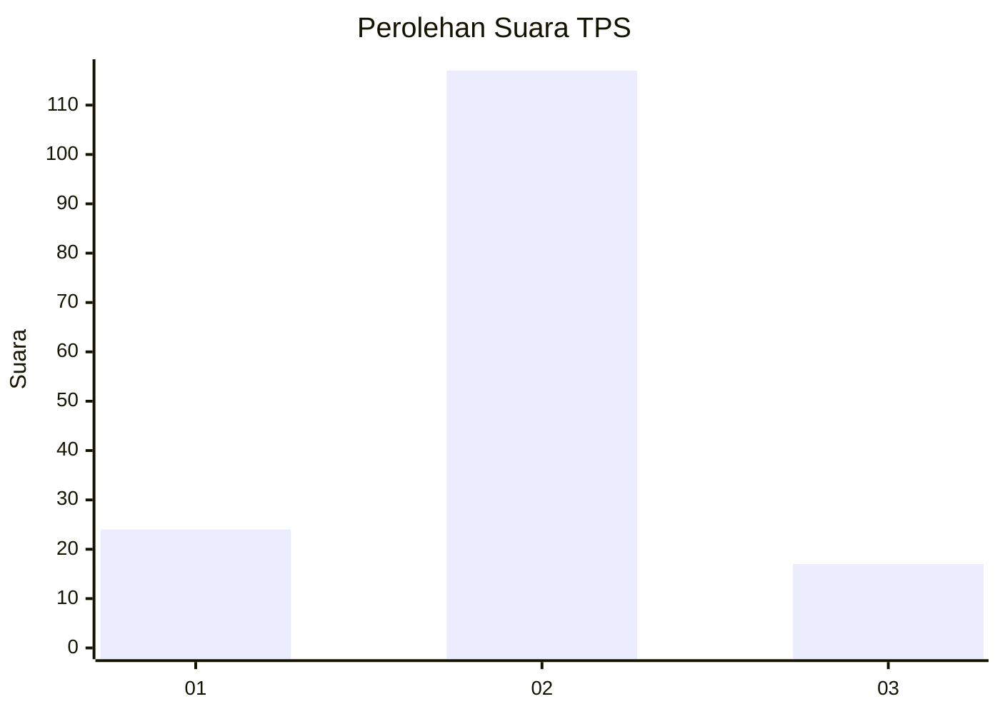
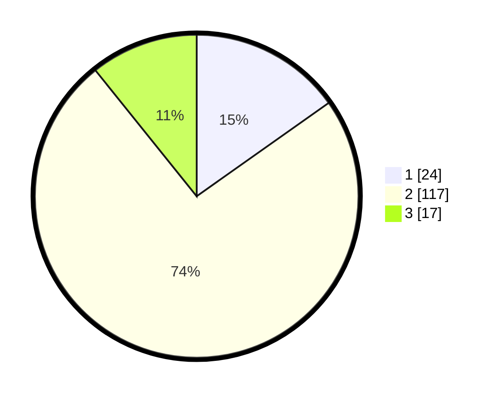

# Hasil

## Grafik

## Tabel

| No. | Nama Paslon    | Suara | Suara (raw) | Persentase |
|:--- |:-------------- | -----:| -----------:| ----------:|
| 1   | ANIES MUHAIMIN | 24    | [24][p-1]   | 15,19      |
| 2   | PRABOWO GIBRAN | 117   | [117][p-2]  | 74,05      |
| 3   | GANJAR MAHFUD  | 17    | [17][p-3]   | 10,76      |

[p-1]: https://github.com/gigit-pemilu/pemilu-2024-35-jawa-timur/blob/main/pilpres/hitung-suara/sub/35-jawa-timur/sub/09-jember/sub/25-jelbuk/sub/2002-panduman/sub/008-tps/sub/paslon-1.txt
[p-2]: https://github.com/gigit-pemilu/pemilu-2024-35-jawa-timur/blob/main/pilpres/hitung-suara/sub/35-jawa-timur/sub/09-jember/sub/25-jelbuk/sub/2002-panduman/sub/008-tps/sub/paslon-2.txt
[p-3]: https://github.com/gigit-pemilu/pemilu-2024-35-jawa-timur/blob/main/pilpres/hitung-suara/sub/35-jawa-timur/sub/09-jember/sub/25-jelbuk/sub/2002-panduman/sub/008-tps/sub/paslon-3.txt

## Foto C Plano

https://sirekap-obj-formc.kpu.go.id/752b/pemilu/ppwp/35/09/25/20/02/3509252002008-20240219-103726--ccd41175-bacd-4a78-b0cc-eaef3a3a36bb.jpg

https://sirekap-obj-formc.kpu.go.id/752b/pemilu/ppwp/35/09/25/20/02/3509252002008-20240219-103532--af6449cd-068b-45b9-9324-41c5412e570e.jpg

https://sirekap-obj-formc.kpu.go.id/752b/pemilu/ppwp/35/09/25/20/02/3509252002008-20240219-103626--fe6abd79-18d8-4c23-af00-8f6e5f294233.jpg

## Metadata

| Key        | Value               |
| ---------- | ------------------- |
| Time Stamp | 2024-02-24 22:31:28 |

