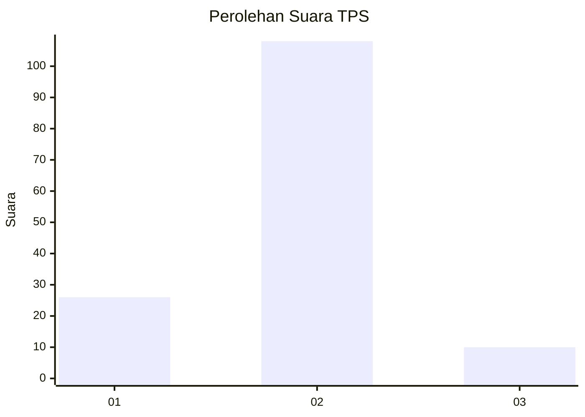
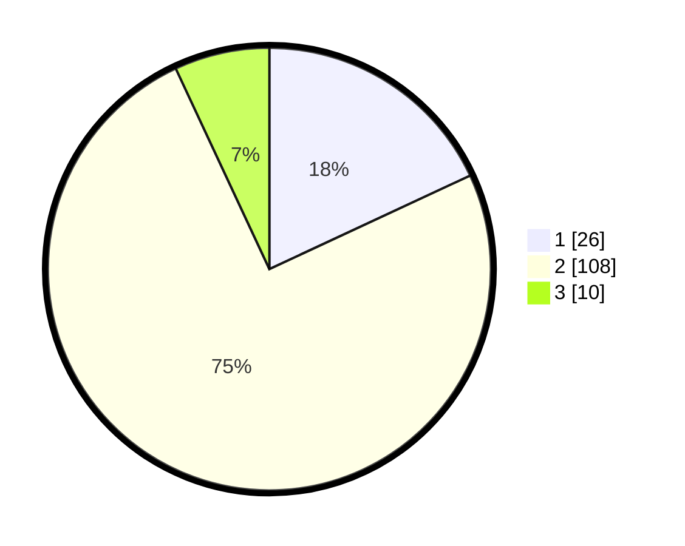

# Hasil

## Grafik

## Tabel

| No. | Nama Paslon    | Suara | Suara (raw) | Persentase |
|:--- |:-------------- | -----:| -----------:| ----------:|
| 1   | ANIES MUHAIMIN | 26    | [26][p-1]   | 18,06      |
| 2   | PRABOWO GIBRAN | 108   | [108][p-2]  | 75,00      |
| 3   | GANJAR MAHFUD  | 10    | [10][p-3]   | 6,94       |

[p-1]: https://github.com/gigit-pemilu/pemilu-2024/blob/main/pilpres/hitung-suara/sub/35-jawa-timur/sub/09-jember/sub/25-jelbuk/sub/2002-panduman/sub/011-tps/sub/paslon-1.txt
[p-2]: https://github.com/gigit-pemilu/pemilu-2024/blob/main/pilpres/hitung-suara/sub/35-jawa-timur/sub/09-jember/sub/25-jelbuk/sub/2002-panduman/sub/011-tps/sub/paslon-2.txt
[p-3]: https://github.com/gigit-pemilu/pemilu-2024/blob/main/pilpres/hitung-suara/sub/35-jawa-timur/sub/09-jember/sub/25-jelbuk/sub/2002-panduman/sub/011-tps/sub/paslon-3.txt

## Foto C Plano

https://sirekap-obj-formc.kpu.go.id/0149/pemilu/ppwp/35/09/25/20/02/3509252002011-20240219-105807--43689ea0-127d-4092-b15b-90be3fae0442.jpg

https://sirekap-obj-formc.kpu.go.id/0149/pemilu/ppwp/35/09/25/20/02/3509252002011-20240219-110136--9c07a24c-4990-4b18-a908-d3bbac5de359.jpg

https://sirekap-obj-formc.kpu.go.id/0149/pemilu/ppwp/35/09/25/20/02/3509252002011-20240219-110243--558572c1-5a89-4bcb-8aa8-e71a068736fb.jpg

## Metadata

| Key        | Value               |
| ---------- | ------------------- |
| Time Stamp | 2024-02-24 22:31:28 |

