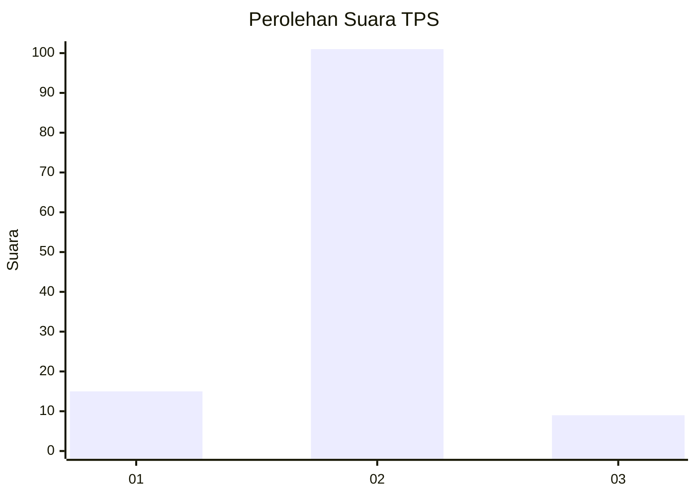
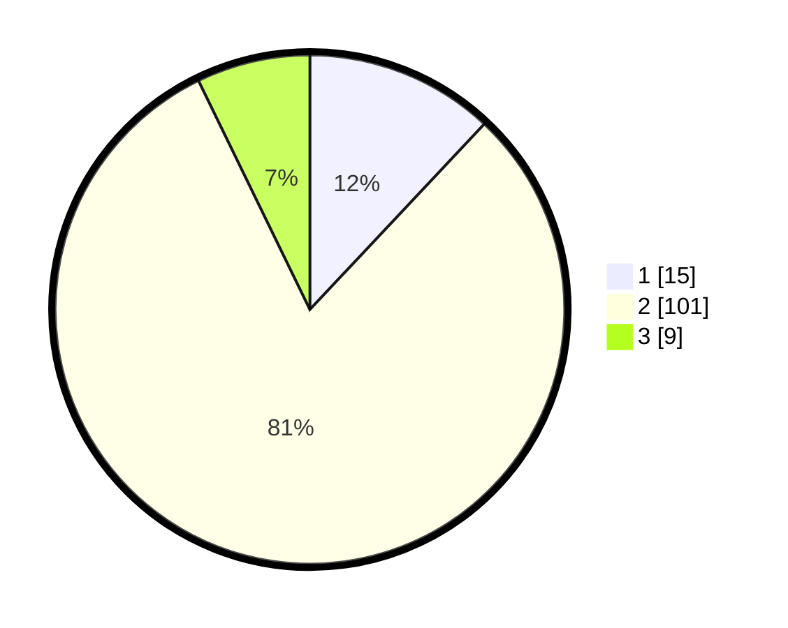

# Hasil

## Grafik

## Tabel

| No. | Nama Paslon    | Suara | Suara (raw) | Persentase |
|:--- |:-------------- | -----:| -----------:| ----------:|
| 1   | ANIES MUHAIMIN | 15    | [15][p-1]   | 12,00      |
| 2   | PRABOWO GIBRAN | 101   | [101][p-2]  | 80,80      |
| 3   | GANJAR MAHFUD  | 9     | [9][p-3]    | 7,20       |

[p-1]: https://github.com/gigit-pemilu/pemilu-2024/blob/main/pilpres/hitung-suara/sub/35-jawa-timur/sub/09-jember/sub/25-jelbuk/sub/2002-panduman/sub/012-tps/sub/paslon-1.txt
[p-2]: https://github.com/gigit-pemilu/pemilu-2024/blob/main/pilpres/hitung-suara/sub/35-jawa-timur/sub/09-jember/sub/25-jelbuk/sub/2002-panduman/sub/012-tps/sub/paslon-2.txt
[p-3]: https://github.com/gigit-pemilu/pemilu-2024/blob/main/pilpres/hitung-suara/sub/35-jawa-timur/sub/09-jember/sub/25-jelbuk/sub/2002-panduman/sub/012-tps/sub/paslon-3.txt

## Foto C Plano

https://sirekap-obj-formc.kpu.go.id/a57f/pemilu/ppwp/35/09/25/20/02/3509252002012-20240219-110439--026ea28c-bd3e-46d5-b213-fef973245a1a.jpg

https://sirekap-obj-formc.kpu.go.id/a57f/pemilu/ppwp/35/09/25/20/02/3509252002012-20240219-110747--0000bf30-c8b1-4239-a1bb-a9d85b8d934f.jpg

https://sirekap-obj-formc.kpu.go.id/a57f/pemilu/ppwp/35/09/25/20/02/3509252002012-20240219-110557--d1be1e0e-7f82-477f-a7df-096f44dd2ba1.jpg

## Metadata

| Key        | Value               |
| ---------- | ------------------- |
| Time Stamp | 2024-02-25 13:00:00 |

