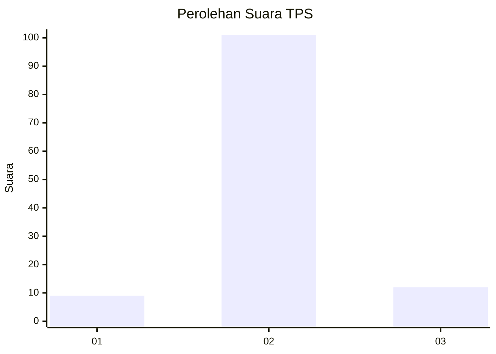
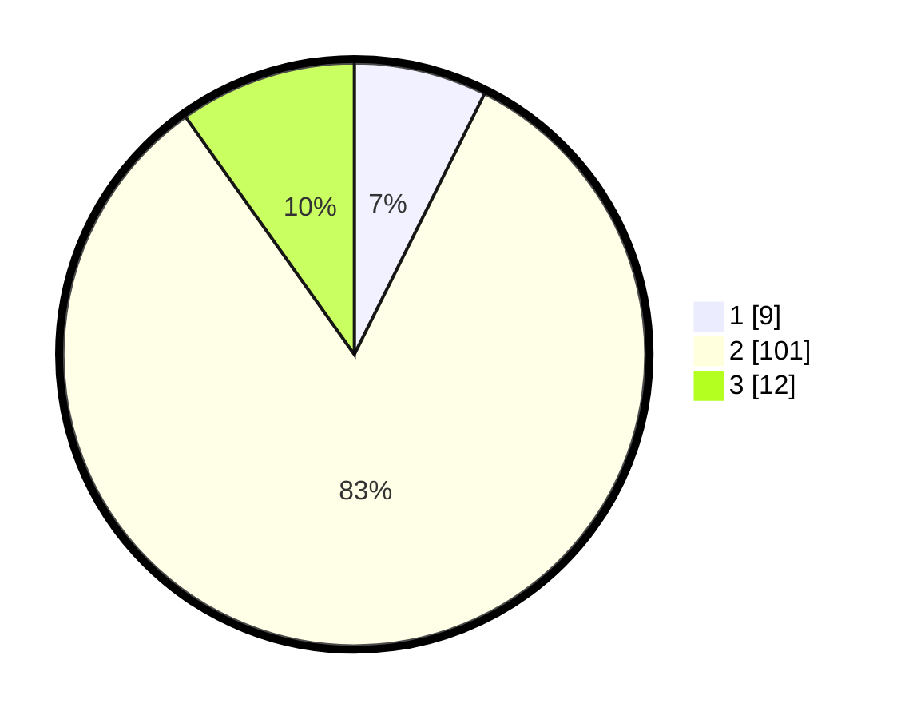

# Hasil

## Grafik

## Tabel

| No. | Nama Paslon    | Suara | Suara (raw) | Persentase |
|:--- |:-------------- | -----:| -----------:| ----------:|
| 1   | ANIES MUHAIMIN | 9     | [9][p-1]    | 7,38       |
| 2   | PRABOWO GIBRAN | 101   | [101][p-2]  | 82,79      |
| 3   | GANJAR MAHFUD  | 12    | [12][p-3]   | 9,84       |

[p-1]: https://github.com/gigit-pemilu/pemilu-2024/blob/main/pilpres/hitung-suara/sub/35-jawa-timur/sub/09-jember/sub/25-jelbuk/sub/2002-panduman/sub/015-tps/sub/paslon-1.txt
[p-2]: https://github.com/gigit-pemilu/pemilu-2024/blob/main/pilpres/hitung-suara/sub/35-jawa-timur/sub/09-jember/sub/25-jelbuk/sub/2002-panduman/sub/015-tps/sub/paslon-2.txt
[p-3]: https://github.com/gigit-pemilu/pemilu-2024/blob/main/pilpres/hitung-suara/sub/35-jawa-timur/sub/09-jember/sub/25-jelbuk/sub/2002-panduman/sub/015-tps/sub/paslon-3.txt

## Foto C Plano

https://sirekap-obj-formc.kpu.go.id/bb7c/pemilu/ppwp/35/09/25/20/02/3509252002015-20240219-112017--1e83ac1f-4699-484a-804d-290be2b88855.jpg

https://sirekap-obj-formc.kpu.go.id/bb7c/pemilu/ppwp/35/09/25/20/02/3509252002015-20240219-112114--3d0cd9ed-8969-442b-ab90-662ab522e911.jpg

https://sirekap-obj-formc.kpu.go.id/bb7c/pemilu/ppwp/35/09/25/20/02/3509252002015-20240219-112207--1f0175e7-1105-48e0-8188-26d97e0e9d38.jpg

## Metadata

| Key        | Value               |
| ---------- | ------------------- |
| Time Stamp | 2024-02-24 22:31:28 |

