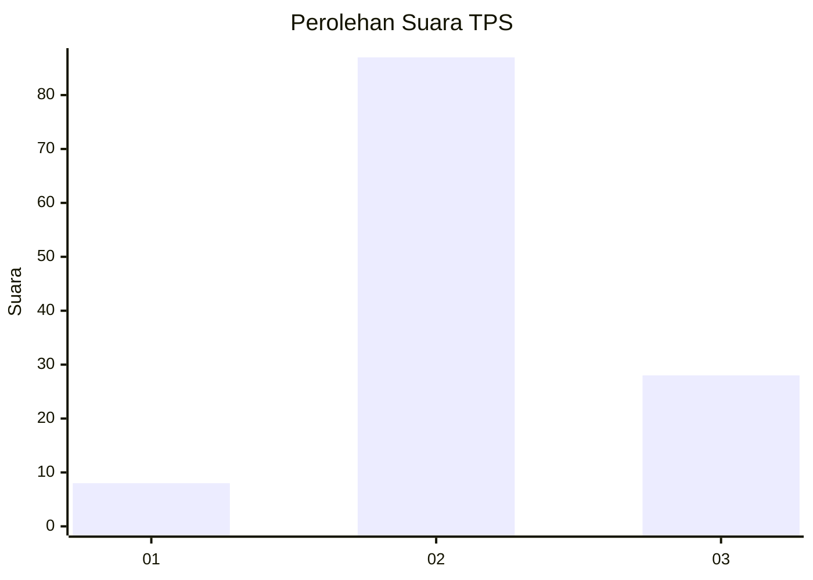
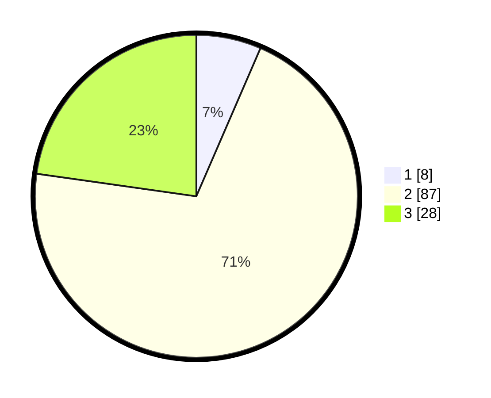

# Hasil

## Grafik

## Tabel

| No. | Nama Paslon    | Suara | Suara (raw) | Persentase |
|:--- |:-------------- | -----:| -----------:| ----------:|
| 1   | ANIES MUHAIMIN | 8     | [8][p-1]    | 6,50       |
| 2   | PRABOWO GIBRAN | 87    | [87][p-2]   | 70,73      |
| 3   | GANJAR MAHFUD  | 28    | [28][p-3]   | 22,76      |

[p-1]: https://github.com/gigit-pemilu/pemilu-2024-35-jawa-timur/blob/main/pilpres/hitung-suara/sub/35-jawa-timur/sub/09-jember/sub/25-jelbuk/sub/2002-panduman/sub/016-tps/sub/paslon-1.txt
[p-2]: https://github.com/gigit-pemilu/pemilu-2024-35-jawa-timur/blob/main/pilpres/hitung-suara/sub/35-jawa-timur/sub/09-jember/sub/25-jelbuk/sub/2002-panduman/sub/016-tps/sub/paslon-2.txt
[p-3]: https://github.com/gigit-pemilu/pemilu-2024-35-jawa-timur/blob/main/pilpres/hitung-suara/sub/35-jawa-timur/sub/09-jember/sub/25-jelbuk/sub/2002-panduman/sub/016-tps/sub/paslon-3.txt

## Foto C Plano

https://sirekap-obj-formc.kpu.go.id/b5cd/pemilu/ppwp/35/09/25/20/02/3509252002016-20240219-112749--32ddd90d-ae47-48e7-b0e8-db6b615e1c39.jpg

https://sirekap-obj-formc.kpu.go.id/b5cd/pemilu/ppwp/35/09/25/20/02/3509252002016-20240219-112452--e0713909-c3a9-4e9d-93ab-47aafbbed661.jpg

https://sirekap-obj-formc.kpu.go.id/b5cd/pemilu/ppwp/35/09/25/20/02/3509252002016-20240219-112648--8dd47b91-47e1-4b43-8b6d-fad5fde68e04.jpg

## Metadata

| Key        | Value               |
| ---------- | ------------------- |
| Time Stamp | 2024-02-25 12:00:00 |

