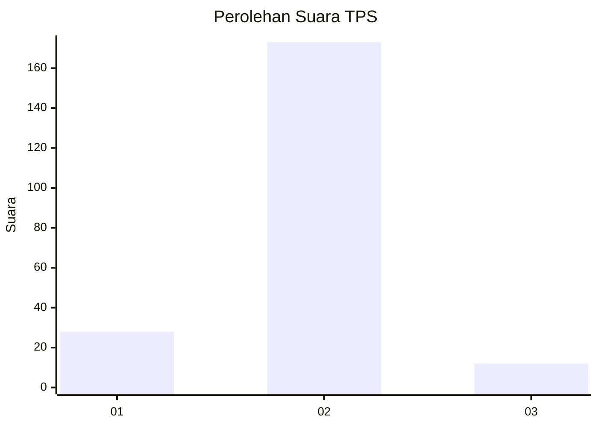
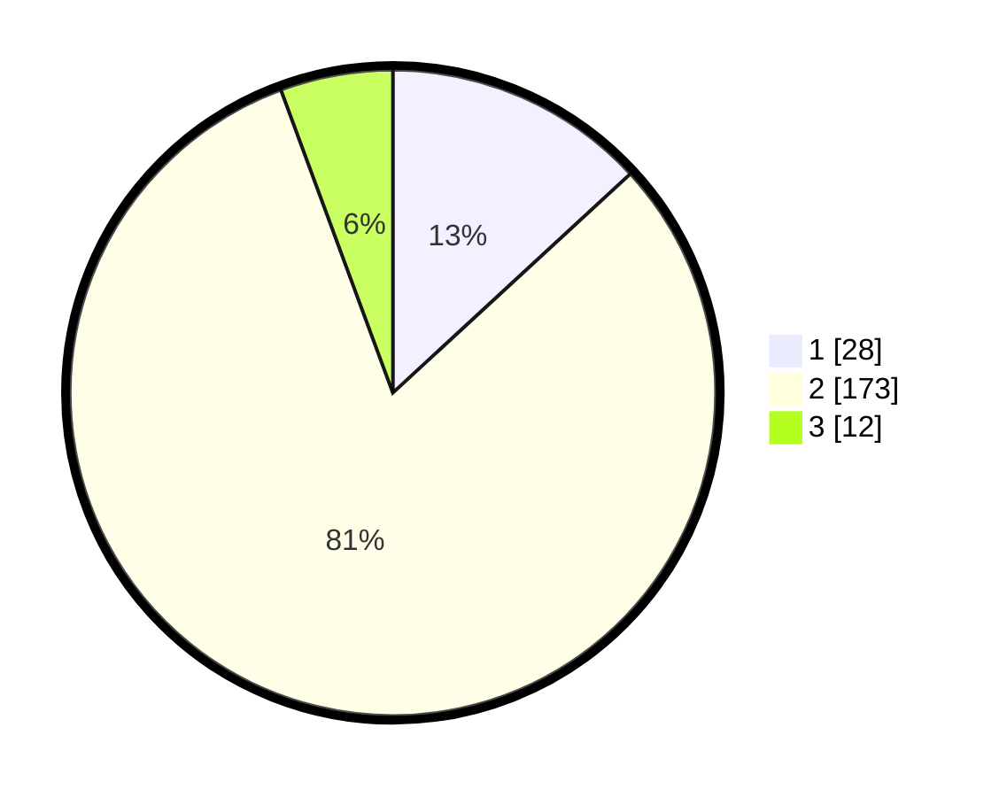

# Hasil

## Grafik

## Tabel

| No. | Nama Paslon    | Suara | Suara (raw) | Persentase |
|:--- |:-------------- | -----:| -----------:| ----------:|
| 1   | ANIES MUHAIMIN | 28    | [28][p-1]   | 13,15      |
| 2   | PRABOWO GIBRAN | 173   | [173][p-2]  | 81,22      |
| 3   | GANJAR MAHFUD  | 12    | [12][p-3]   | 5,63       |

[p-1]: https://github.com/gigit-pemilu/pemilu-2024/blob/main/pilpres/hitung-suara/sub/35-jawa-timur/sub/09-jember/sub/25-jelbuk/sub/2002-panduman/sub/017-tps/sub/paslon-1.txt
[p-2]: https://github.com/gigit-pemilu/pemilu-2024/blob/main/pilpres/hitung-suara/sub/35-jawa-timur/sub/09-jember/sub/25-jelbuk/sub/2002-panduman/sub/017-tps/sub/paslon-2.txt
[p-3]: https://github.com/gigit-pemilu/pemilu-2024/blob/main/pilpres/hitung-suara/sub/35-jawa-timur/sub/09-jember/sub/25-jelbuk/sub/2002-panduman/sub/017-tps/sub/paslon-3.txt

## Foto C Plano

https://sirekap-obj-formc.kpu.go.id/1f5b/pemilu/ppwp/35/09/25/20/02/3509252002017-20240219-113542--6d1c48ec-4b18-4166-8af2-a90a5553ab91.jpg

https://sirekap-obj-formc.kpu.go.id/1f5b/pemilu/ppwp/35/09/25/20/02/3509252002017-20240219-113404--e8457b3c-1bf2-4bba-93ed-fd8c9bdff506.jpg

https://sirekap-obj-formc.kpu.go.id/1f5b/pemilu/ppwp/35/09/25/20/02/3509252002017-20240219-113644--536d16ab-9f30-4ec6-a752-d82ee36958a8.jpg

## Metadata

| Key        | Value               |
| ---------- | ------------------- |
| Time Stamp | 2024-02-24 22:31:28 |

