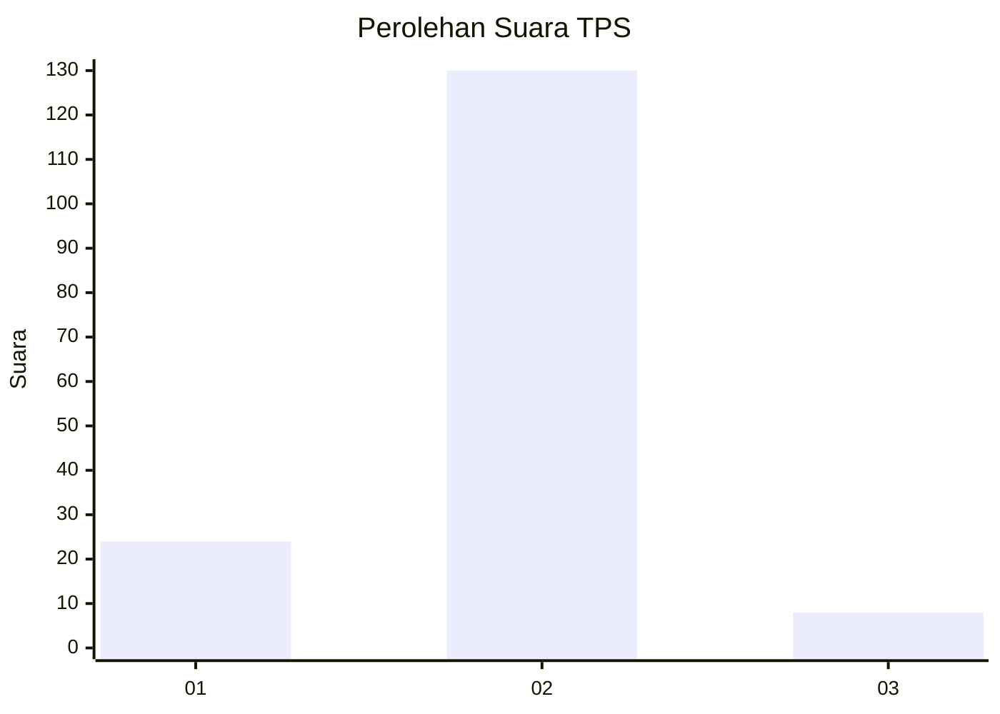
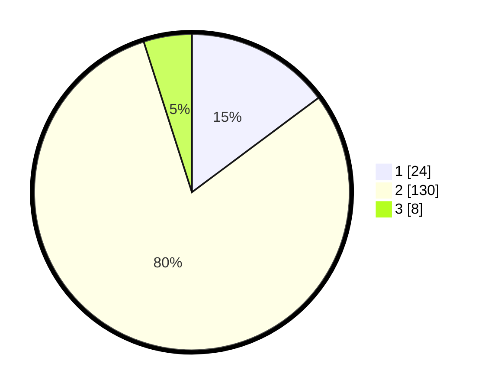

# Hasil

## Grafik

## Tabel

| No. | Nama Paslon    | Suara | Suara (raw) | Persentase |
|:--- |:-------------- | -----:| -----------:| ----------:|
| 1   | ANIES MUHAIMIN | 24    | [24][p-1]   | 14,81      |
| 2   | PRABOWO GIBRAN | 130   | [130][p-2]  | 80,25      |
| 3   | GANJAR MAHFUD  | 8     | [8][p-3]    | 4,94       |

[p-1]: https://github.com/gigit-pemilu/pemilu-2024-35-jawa-timur/blob/main/pilpres/hitung-suara/sub/35-jawa-timur/sub/09-jember/sub/25-jelbuk/sub/2002-panduman/sub/018-tps/sub/paslon-1.txt
[p-2]: https://github.com/gigit-pemilu/pemilu-2024-35-jawa-timur/blob/main/pilpres/hitung-suara/sub/35-jawa-timur/sub/09-jember/sub/25-jelbuk/sub/2002-panduman/sub/018-tps/sub/paslon-2.txt
[p-3]: https://github.com/gigit-pemilu/pemilu-2024-35-jawa-timur/blob/main/pilpres/hitung-suara/sub/35-jawa-timur/sub/09-jember/sub/25-jelbuk/sub/2002-panduman/sub/018-tps/sub/paslon-3.txt

## Foto C Plano

https://sirekap-obj-formc.kpu.go.id/2e59/pemilu/ppwp/35/09/25/20/02/3509252002018-20240219-113907--2b9d019e-b431-46a7-bf00-556518e5aaa0.jpg

https://sirekap-obj-formc.kpu.go.id/2e59/pemilu/ppwp/35/09/25/20/02/3509252002018-20240219-114241--38c197aa-44eb-45d3-b654-490ab7f66c67.jpg

https://sirekap-obj-formc.kpu.go.id/2e59/pemilu/ppwp/35/09/25/20/02/3509252002018-20240219-114342--a0bddc5e-c40b-4f1d-b148-5e5d7bae2519.jpg

## Metadata

| Key        | Value               |
| ---------- | ------------------- |
| Time Stamp | 2024-02-25 13:00:00 |

