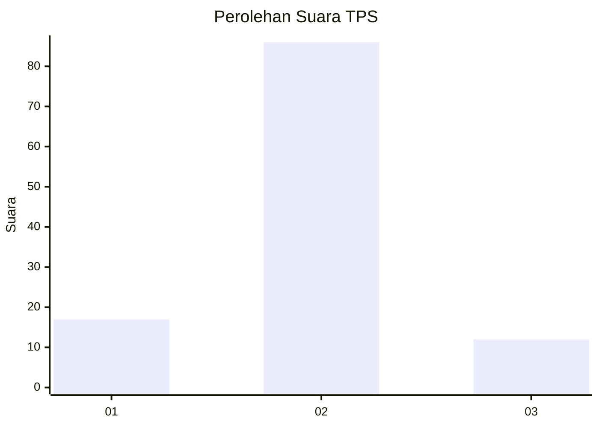
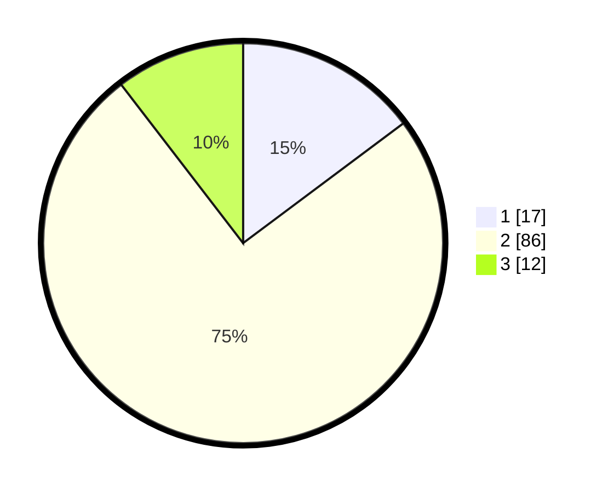

# Hasil

## Grafik

## Tabel

| No. | Nama Paslon    | Suara | Suara (raw) | Persentase |
|:--- |:-------------- | -----:| -----------:| ----------:|
| 1   | ANIES MUHAIMIN | 17    | [17][p-1]   | 14,78      |
| 2   | PRABOWO GIBRAN | 86    | [86][p-2]   | 74,78      |
| 3   | GANJAR MAHFUD  | 12    | [12][p-3]   | 10,43      |

[p-1]: https://github.com/gigit-pemilu/pemilu-2024/blob/main/pilpres/hitung-suara/sub/35-jawa-timur/sub/09-jember/sub/25-jelbuk/sub/2002-panduman/sub/019-tps/sub/paslon-1.txt
[p-2]: https://github.com/gigit-pemilu/pemilu-2024/blob/main/pilpres/hitung-suara/sub/35-jawa-timur/sub/09-jember/sub/25-jelbuk/sub/2002-panduman/sub/019-tps/sub/paslon-2.txt
[p-3]: https://github.com/gigit-pemilu/pemilu-2024/blob/main/pilpres/hitung-suara/sub/35-jawa-timur/sub/09-jember/sub/25-jelbuk/sub/2002-panduman/sub/019-tps/sub/paslon-3.txt

## Foto C Plano

https://sirekap-obj-formc.kpu.go.id/3a17/pemilu/ppwp/35/09/25/20/02/3509252002019-20240219-114546--683e44a3-34e1-4b7d-8a89-243b2efaff63.jpg

https://sirekap-obj-formc.kpu.go.id/3a17/pemilu/ppwp/35/09/25/20/02/3509252002019-20240219-114626--9c615274-693c-4a4d-a193-118f4dc456d0.jpg

https://sirekap-obj-formc.kpu.go.id/3a17/pemilu/ppwp/35/09/25/20/02/3509252002019-20240219-114805--dc397e18-f7e3-4b3a-84c0-fa2346ba6804.jpg

## Metadata

| Key        | Value               |
| ---------- | ------------------- |
| Time Stamp | 2024-02-25 11:00:00 |

