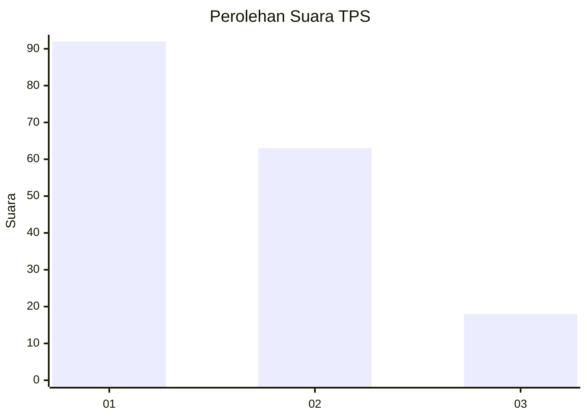
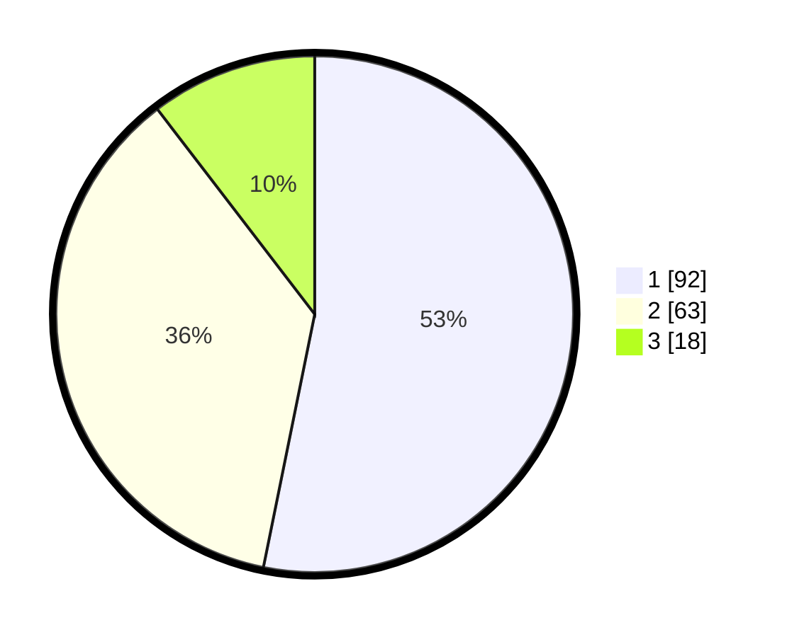

# Hasil

## Grafik

## Tabel

| No. | Nama Paslon    | Suara | Suara (raw) | Persentase |
|:--- |:-------------- | -----:| -----------:| ----------:|
| 1   | ANIES MUHAIMIN | 92    | [92][p-1]   | 53,18      |
| 2   | PRABOWO GIBRAN | 63    | [63][p-2]   | 36,42      |
| 3   | GANJAR MAHFUD  | 18    | [18][p-3]   | 10,40      |

[p-1]: https://github.com/gigit-pemilu/pemilu-2024-35-jawa-timur/blob/main/pilpres/hitung-suara/sub/35-jawa-timur/sub/09-jember/sub/25-jelbuk/sub/2002-panduman/sub/020-tps/sub/paslon-1.txt
[p-2]: https://github.com/gigit-pemilu/pemilu-2024-35-jawa-timur/blob/main/pilpres/hitung-suara/sub/35-jawa-timur/sub/09-jember/sub/25-jelbuk/sub/2002-panduman/sub/020-tps/sub/paslon-2.txt
[p-3]: https://github.com/gigit-pemilu/pemilu-2024-35-jawa-timur/blob/main/pilpres/hitung-suara/sub/35-jawa-timur/sub/09-jember/sub/25-jelbuk/sub/2002-panduman/sub/020-tps/sub/paslon-3.txt

## Foto C Plano

https://sirekap-obj-formc.kpu.go.id/f10c/pemilu/ppwp/35/09/25/20/02/3509252002020-20240219-115023--ed1c6f71-ab75-4be5-bd1c-f1bc073dd372.jpg

https://sirekap-obj-formc.kpu.go.id/f10c/pemilu/ppwp/35/09/25/20/02/3509252002020-20240219-115121--04888a3e-3df7-426a-8d84-95ba8a39af94.jpg

https://sirekap-obj-formc.kpu.go.id/f10c/pemilu/ppwp/35/09/25/20/02/3509252002020-20240219-115240--2526b7bb-417a-429f-99b9-11f476b1a1fe.jpg

## Metadata

| Key        | Value               |
| ---------- | ------------------- |
| Time Stamp | 2024-02-24 22:31:28 |

