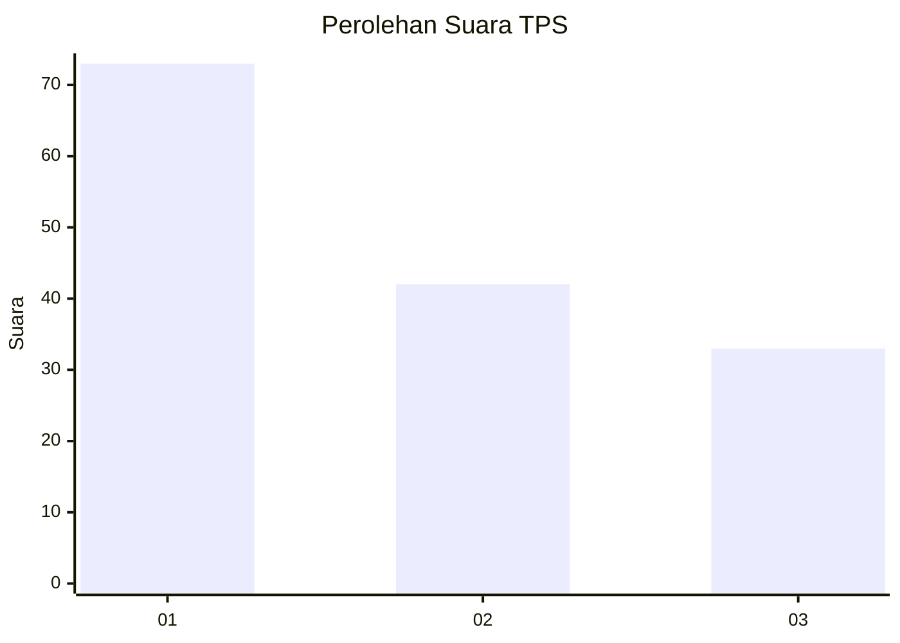
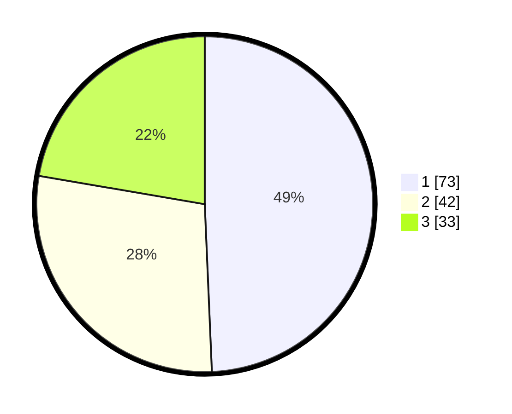

# Hasil

## Grafik

## Tabel

| No. | Nama Paslon    | Suara | Suara (raw) | Persentase |
|:--- |:-------------- | -----:| -----------:| ----------:|
| 1   | ANIES MUHAIMIN | 73    | [73][p-1]   | 49,32      |
| 2   | PRABOWO GIBRAN | 42    | [42][p-2]   | 28,38      |
| 3   | GANJAR MAHFUD  | 33    | [33][p-3]   | 22,30      |

[p-1]: https://github.com/gigit-pemilu/pemilu-2024/blob/main/pilpres/hitung-suara/sub/35-jawa-timur/sub/09-jember/sub/25-jelbuk/sub/2002-panduman/sub/022-tps/sub/paslon-1.txt
[p-2]: https://github.com/gigit-pemilu/pemilu-2024/blob/main/pilpres/hitung-suara/sub/35-jawa-timur/sub/09-jember/sub/25-jelbuk/sub/2002-panduman/sub/022-tps/sub/paslon-2.txt
[p-3]: https://github.com/gigit-pemilu/pemilu-2024/blob/main/pilpres/hitung-suara/sub/35-jawa-timur/sub/09-jember/sub/25-jelbuk/sub/2002-panduman/sub/022-tps/sub/paslon-3.txt

## Foto C Plano

https://sirekap-obj-formc.kpu.go.id/b35a/pemilu/ppwp/35/09/25/20/02/3509252002022-20240219-115851--960f6329-9801-47de-a676-28738db7a127.jpg

https://sirekap-obj-formc.kpu.go.id/b35a/pemilu/ppwp/35/09/25/20/02/3509252002022-20240219-120000--9acfd48c-9ea4-4452-ac80-f5d7f946fae4.jpg

https://sirekap-obj-formc.kpu.go.id/b35a/pemilu/ppwp/35/09/25/20/02/3509252002022-20240219-120034--b778308a-f99d-4c50-896f-00347f56da94.jpg

## Metadata

| Key        | Value               |
| ---------- | ------------------- |
| Time Stamp | 2024-02-25 15:00:00 |

