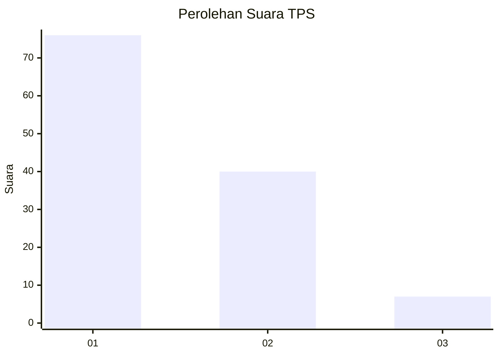
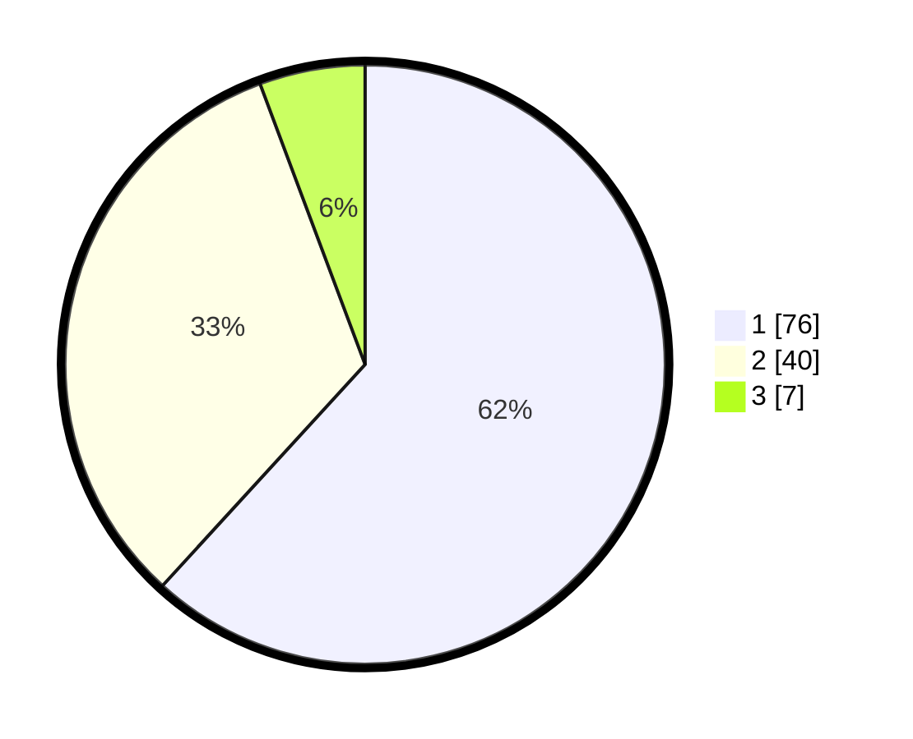

# Hasil

## Grafik

## Tabel

| No. | Nama Paslon    | Suara | Suara (raw) | Persentase |
|:--- |:-------------- | -----:| -----------:| ----------:|
| 1   | ANIES MUHAIMIN | 76    | [76][p-1]   | 61,79      |
| 2   | PRABOWO GIBRAN | 40    | [40][p-2]   | 32,52      |
| 3   | GANJAR MAHFUD  | 7     | [7][p-3]    | 5,69       |

[p-1]: https://github.com/gigit-pemilu/pemilu-2024/blob/main/pilpres/hitung-suara/sub/35-jawa-timur/sub/09-jember/sub/25-jelbuk/sub/2002-panduman/sub/023-tps/sub/paslon-1.txt
[p-2]: https://github.com/gigit-pemilu/pemilu-2024/blob/main/pilpres/hitung-suara/sub/35-jawa-timur/sub/09-jember/sub/25-jelbuk/sub/2002-panduman/sub/023-tps/sub/paslon-2.txt
[p-3]: https://github.com/gigit-pemilu/pemilu-2024/blob/main/pilpres/hitung-suara/sub/35-jawa-timur/sub/09-jember/sub/25-jelbuk/sub/2002-panduman/sub/023-tps/sub/paslon-3.txt

## Foto C Plano

https://sirekap-obj-formc.kpu.go.id/746c/pemilu/ppwp/35/09/25/20/02/3509252002023-20240219-120301--fb8b08c3-020c-4f06-b9f6-f1ed5b078395.jpg

https://sirekap-obj-formc.kpu.go.id/746c/pemilu/ppwp/35/09/25/20/02/3509252002023-20240219-120435--9f83f854-729c-42bc-8261-0a664cc396bf.jpg

https://sirekap-obj-formc.kpu.go.id/746c/pemilu/ppwp/35/09/25/20/02/3509252002023-20240219-120537--6806732b-3691-499a-8e9b-9c1c609d2be0.jpg

## Metadata

| Key        | Value               |
| ---------- | ------------------- |
| Time Stamp | 2024-02-25 21:00:00 |

