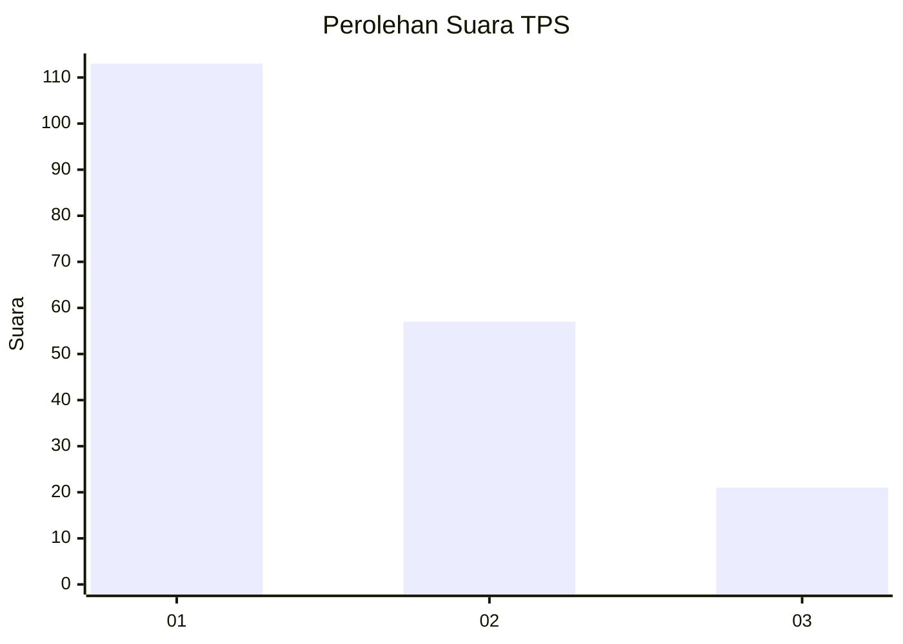
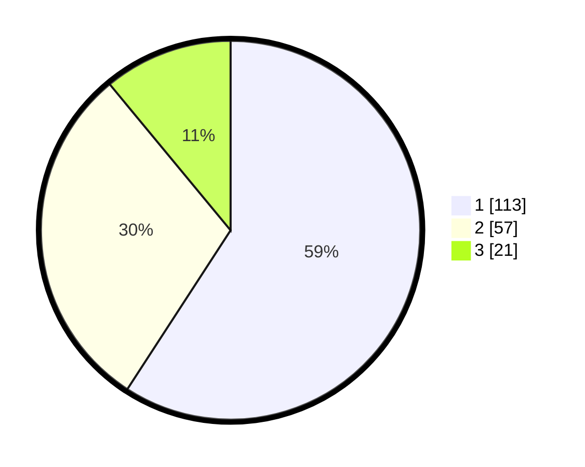

# Hasil

## Grafik

## Tabel

| No. | Nama Paslon    | Suara | Suara (raw) | Persentase |
|:--- |:-------------- | -----:| -----------:| ----------:|
| 1   | ANIES MUHAIMIN | 113   | [113][p-1]  | 59,16      |
| 2   | PRABOWO GIBRAN | 57    | [57][p-2]   | 29,84      |
| 3   | GANJAR MAHFUD  | 21    | [21][p-3]   | 10,99      |

[p-1]: https://github.com/gigit-pemilu/pemilu-2024-35-jawa-timur/blob/main/pilpres/hitung-suara/sub/35-jawa-timur/sub/09-jember/sub/25-jelbuk/sub/2002-panduman/sub/024-tps/sub/paslon-1.txt
[p-2]: https://github.com/gigit-pemilu/pemilu-2024-35-jawa-timur/blob/main/pilpres/hitung-suara/sub/35-jawa-timur/sub/09-jember/sub/25-jelbuk/sub/2002-panduman/sub/024-tps/sub/paslon-2.txt
[p-3]: https://github.com/gigit-pemilu/pemilu-2024-35-jawa-timur/blob/main/pilpres/hitung-suara/sub/35-jawa-timur/sub/09-jember/sub/25-jelbuk/sub/2002-panduman/sub/024-tps/sub/paslon-3.txt

## Foto C Plano

https://sirekap-obj-formc.kpu.go.id/c2a8/pemilu/ppwp/35/09/25/20/02/3509252002024-20240219-120933--2451a9d2-37df-4298-b106-458d9e5a0b26.jpg

https://sirekap-obj-formc.kpu.go.id/c2a8/pemilu/ppwp/35/09/25/20/02/3509252002024-20240219-121013--3e8a17c8-0053-417a-b676-df347624d07a.jpg

https://sirekap-obj-formc.kpu.go.id/c2a8/pemilu/ppwp/35/09/25/20/02/3509252002024-20240219-121206--90b1620c-cd96-4db2-a492-df5d8a4e66f2.jpg

## Metadata

| Key        | Value               |
| ---------- | ------------------- |
| Time Stamp | 2024-02-25 09:00:00 |

