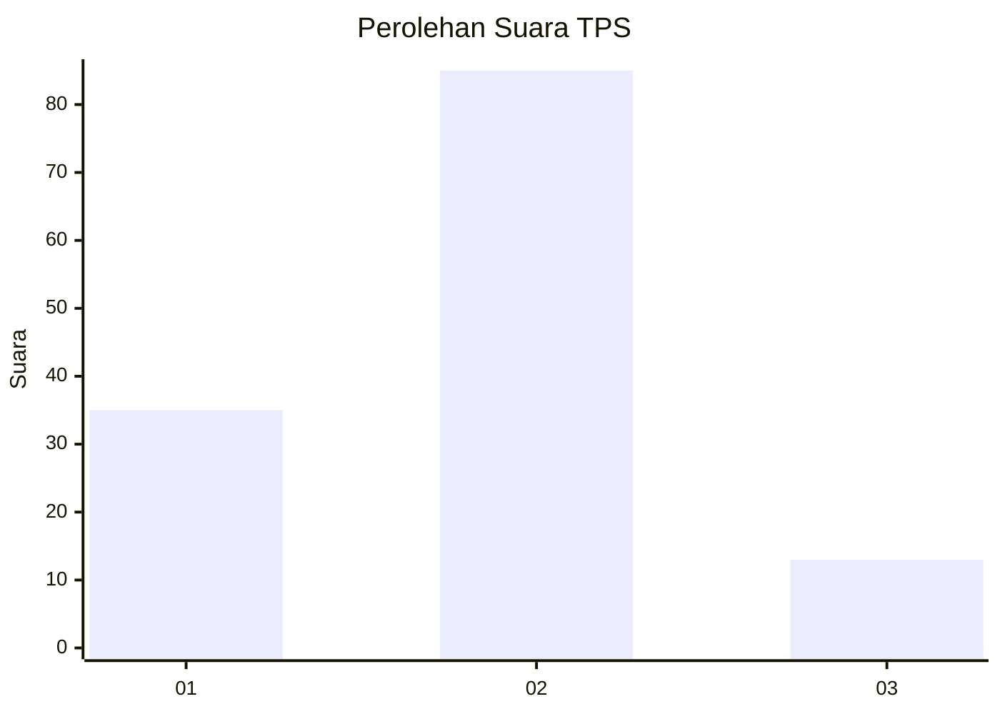
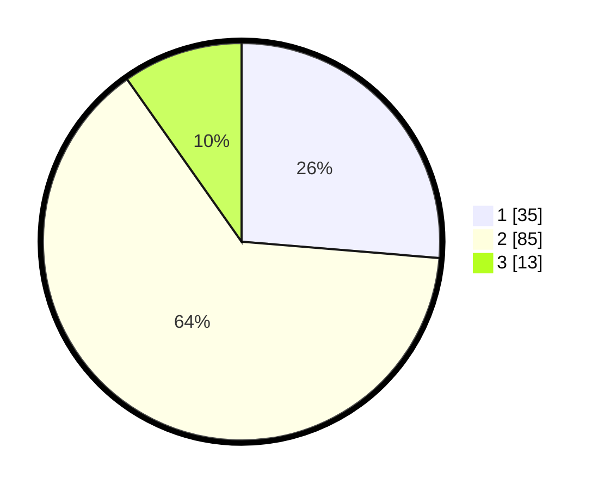

# Hasil

## Grafik

## Tabel

| No. | Nama Paslon    | Suara | Suara (raw) | Persentase |
|:--- |:-------------- | -----:| -----------:| ----------:|
| 1   | ANIES MUHAIMIN | 35    | [35][p-1]   | 26,32      |
| 2   | PRABOWO GIBRAN | 85    | [85][p-2]   | 63,91      |
| 3   | GANJAR MAHFUD  | 13    | [13][p-3]   | 9,77       |

[p-1]: https://github.com/gigit-pemilu/pemilu-2024-35-jawa-timur/blob/main/pilpres/hitung-suara/sub/35-jawa-timur/sub/09-jember/sub/25-jelbuk/sub/2003-sukojember/sub/002-tps/sub/paslon-1.txt
[p-2]: https://github.com/gigit-pemilu/pemilu-2024-35-jawa-timur/blob/main/pilpres/hitung-suara/sub/35-jawa-timur/sub/09-jember/sub/25-jelbuk/sub/2003-sukojember/sub/002-tps/sub/paslon-2.txt
[p-3]: https://github.com/gigit-pemilu/pemilu-2024-35-jawa-timur/blob/main/pilpres/hitung-suara/sub/35-jawa-timur/sub/09-jember/sub/25-jelbuk/sub/2003-sukojember/sub/002-tps/sub/paslon-3.txt

## Foto C Plano

https://sirekap-obj-formc.kpu.go.id/2e56/pemilu/ppwp/35/09/25/20/03/3509252003002-20240218-110519--e8587062-6f19-40d5-b50f-360c9d2a7f65.jpg

https://sirekap-obj-formc.kpu.go.id/2e56/pemilu/ppwp/35/09/25/20/03/3509252003002-20240218-110634--1efb6f16-02ec-4f98-8e84-686ce6b9cac0.jpg

https://sirekap-obj-formc.kpu.go.id/2e56/pemilu/ppwp/35/09/25/20/03/3509252003002-20240218-110743--623dad6b-a890-4932-bc4f-2c39a10ec49e.jpg

## Metadata

| Key        | Value               |
| ---------- | ------------------- |
| Time Stamp | 2024-02-24 22:31:28 |

