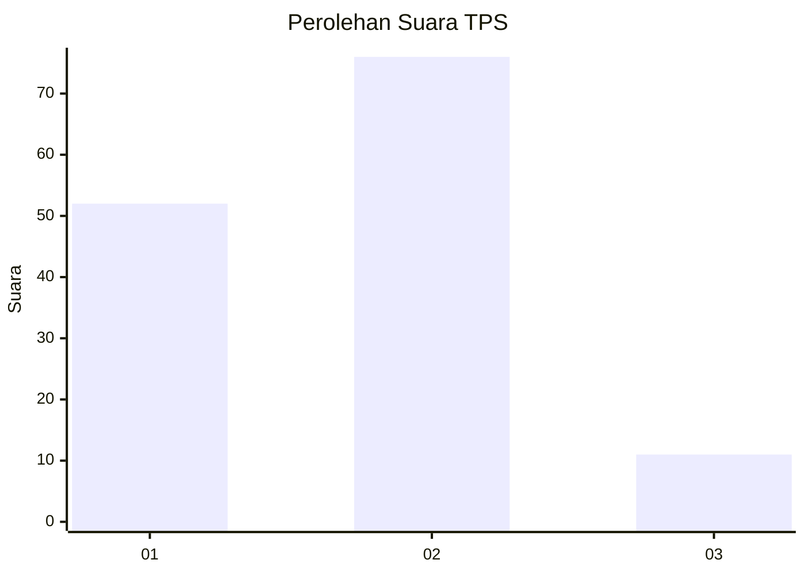
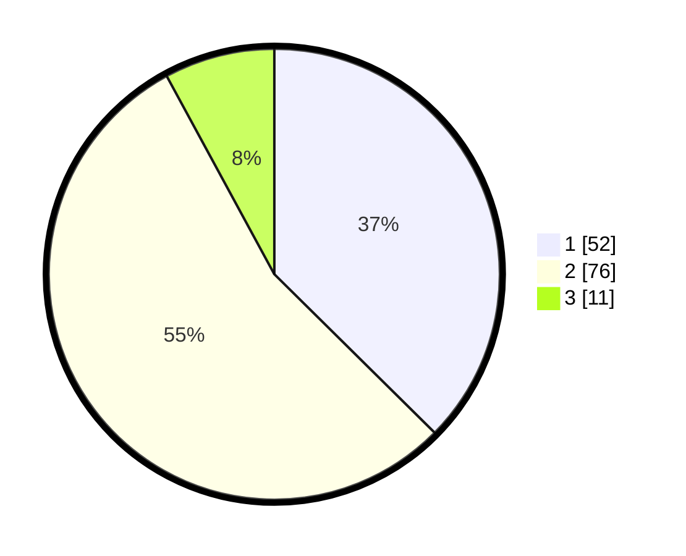

# Hasil

## Grafik

## Tabel

| No. | Nama Paslon    | Suara | Suara (raw) | Persentase |
|:--- |:-------------- | -----:| -----------:| ----------:|
| 1   | ANIES MUHAIMIN | 52    | [52][p-1]   | 37,41      |
| 2   | PRABOWO GIBRAN | 76    | [76][p-2]   | 54,68      |
| 3   | GANJAR MAHFUD  | 11    | [11][p-3]   | 7,91       |

[p-1]: https://github.com/gigit-pemilu/pemilu-2024-35-jawa-timur/blob/main/pilpres/hitung-suara/sub/35-jawa-timur/sub/09-jember/sub/25-jelbuk/sub/2003-sukojember/sub/003-tps/sub/paslon-1.txt
[p-2]: https://github.com/gigit-pemilu/pemilu-2024-35-jawa-timur/blob/main/pilpres/hitung-suara/sub/35-jawa-timur/sub/09-jember/sub/25-jelbuk/sub/2003-sukojember/sub/003-tps/sub/paslon-2.txt
[p-3]: https://github.com/gigit-pemilu/pemilu-2024-35-jawa-timur/blob/main/pilpres/hitung-suara/sub/35-jawa-timur/sub/09-jember/sub/25-jelbuk/sub/2003-sukojember/sub/003-tps/sub/paslon-3.txt

## Foto C Plano

https://sirekap-obj-formc.kpu.go.id/d322/pemilu/ppwp/35/09/25/20/03/3509252003003-20240218-111057--9544b81e-be1d-4c2c-b522-e8bd4b47ed26.jpg

https://sirekap-obj-formc.kpu.go.id/d322/pemilu/ppwp/35/09/25/20/03/3509252003003-20240218-111221--3af9ca1c-f7d0-41d8-a824-14657e948339.jpg

https://sirekap-obj-formc.kpu.go.id/d322/pemilu/ppwp/35/09/25/20/03/3509252003003-20240218-111323--63252607-0fc9-40c0-8a4d-4e11aae2c291.jpg

## Metadata

| Key        | Value               |
| ---------- | ------------------- |
| Time Stamp | 2024-02-24 22:31:28 |

