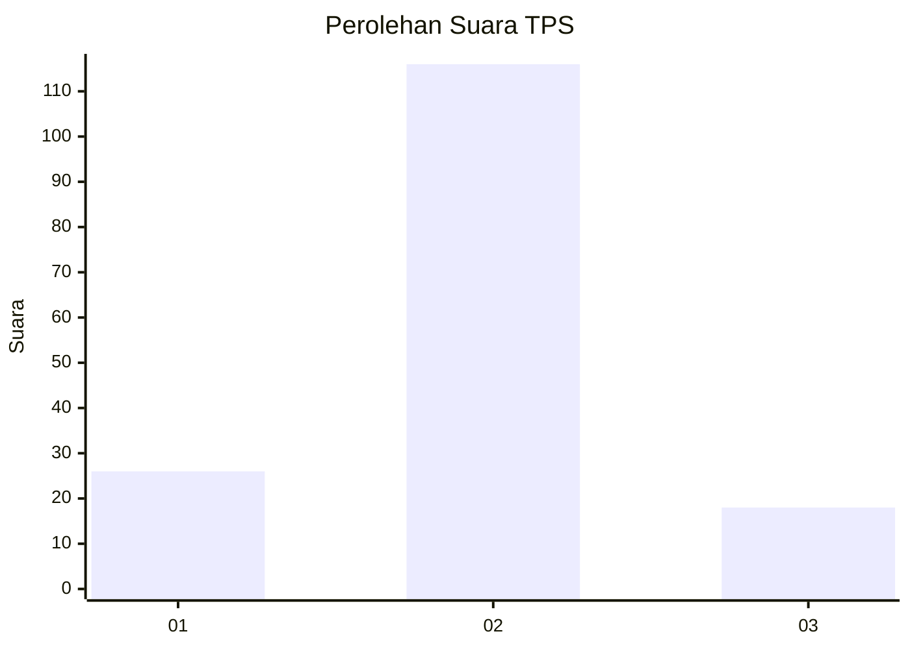
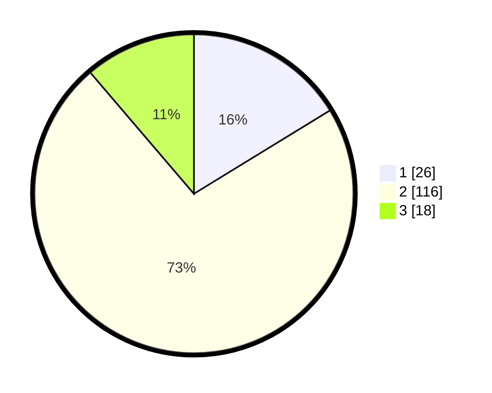

# Hasil

## Grafik

## Tabel

| No. | Nama Paslon    | Suara | Suara (raw) | Persentase |
|:--- |:-------------- | -----:| -----------:| ----------:|
| 1   | ANIES MUHAIMIN | 26    | [26][p-1]   | 16,25      |
| 2   | PRABOWO GIBRAN | 116   | [116][p-2]  | 72,50      |
| 3   | GANJAR MAHFUD  | 18    | [18][p-3]   | 11,25      |

[p-1]: https://github.com/gigit-pemilu/pemilu-2024-35-jawa-timur/blob/main/pilpres/hitung-suara/sub/35-jawa-timur/sub/09-jember/sub/25-jelbuk/sub/2003-sukojember/sub/004-tps/sub/paslon-1.txt
[p-2]: https://github.com/gigit-pemilu/pemilu-2024-35-jawa-timur/blob/main/pilpres/hitung-suara/sub/35-jawa-timur/sub/09-jember/sub/25-jelbuk/sub/2003-sukojember/sub/004-tps/sub/paslon-2.txt
[p-3]: https://github.com/gigit-pemilu/pemilu-2024-35-jawa-timur/blob/main/pilpres/hitung-suara/sub/35-jawa-timur/sub/09-jember/sub/25-jelbuk/sub/2003-sukojember/sub/004-tps/sub/paslon-3.txt

## Foto C Plano

https://sirekap-obj-formc.kpu.go.id/f17d/pemilu/ppwp/35/09/25/20/03/3509252003004-20240218-111645--4ea44bf9-748d-4255-9c2d-3b6c2fbd8a14.jpg

https://sirekap-obj-formc.kpu.go.id/f17d/pemilu/ppwp/35/09/25/20/03/3509252003004-20240218-111747--6f8ba3a1-d58e-4d72-9f80-875de493fac1.jpg

https://sirekap-obj-formc.kpu.go.id/f17d/pemilu/ppwp/35/09/25/20/03/3509252003004-20240218-111912--841ee2fb-84fc-4b6e-948e-e7c8c5593c22.jpg

## Metadata

| Key        | Value               |
| ---------- | ------------------- |
| Time Stamp | 2024-02-24 22:31:28 |

