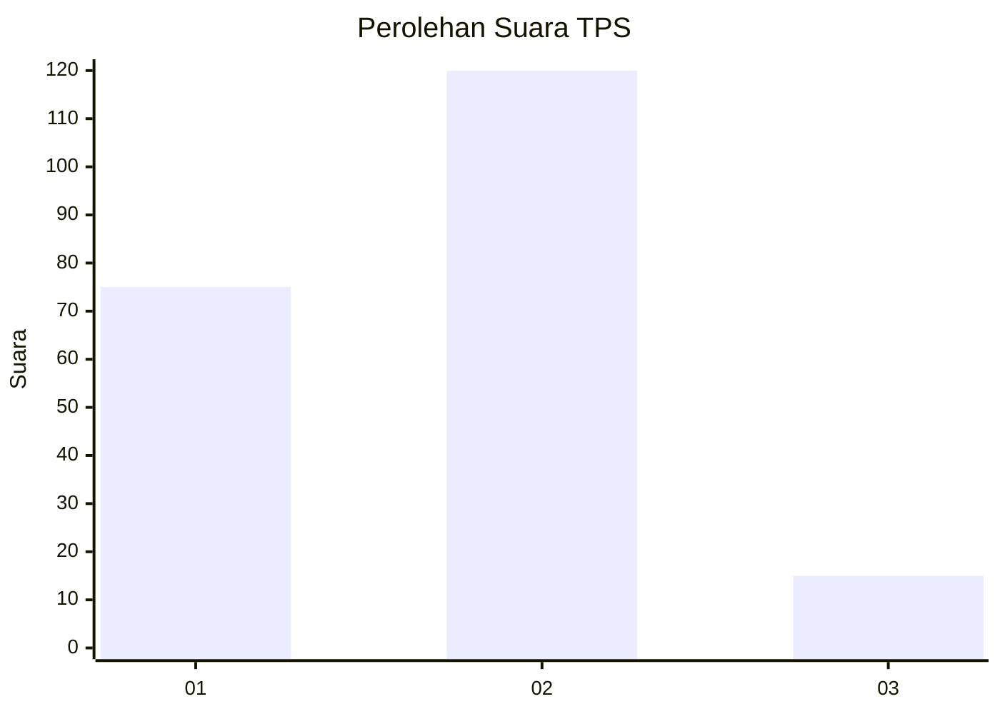
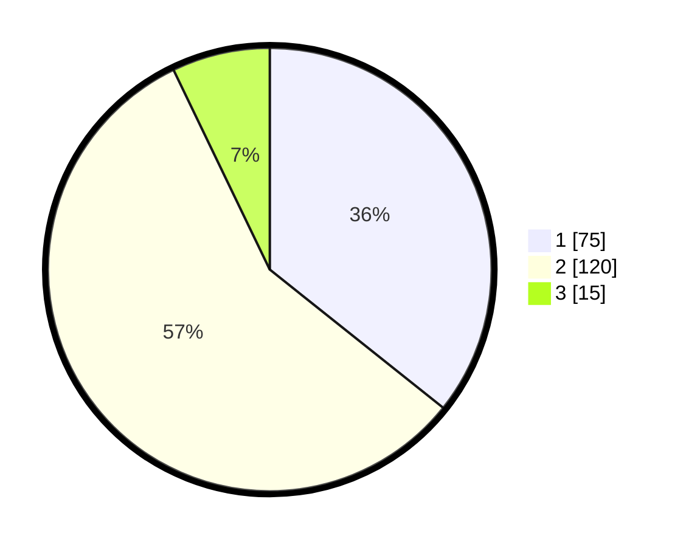

# Hasil

## Grafik

## Tabel

| No. | Nama Paslon    | Suara | Suara (raw) | Persentase |
|:--- |:-------------- | -----:| -----------:| ----------:|
| 1   | ANIES MUHAIMIN | 75    | [75][p-1]   | 35,71      |
| 2   | PRABOWO GIBRAN | 120   | [120][p-2]  | 57,14      |
| 3   | GANJAR MAHFUD  | 15    | [15][p-3]   | 7,14       |

[p-1]: https://github.com/gigit-pemilu/pemilu-2024/blob/main/pilpres/hitung-suara/sub/35-jawa-timur/sub/09-jember/sub/25-jelbuk/sub/2003-sukojember/sub/005-tps/sub/paslon-1.txt
[p-2]: https://github.com/gigit-pemilu/pemilu-2024/blob/main/pilpres/hitung-suara/sub/35-jawa-timur/sub/09-jember/sub/25-jelbuk/sub/2003-sukojember/sub/005-tps/sub/paslon-2.txt
[p-3]: https://github.com/gigit-pemilu/pemilu-2024/blob/main/pilpres/hitung-suara/sub/35-jawa-timur/sub/09-jember/sub/25-jelbuk/sub/2003-sukojember/sub/005-tps/sub/paslon-3.txt

## Foto C Plano

https://sirekap-obj-formc.kpu.go.id/6748/pemilu/ppwp/35/09/25/20/03/3509252003005-20240218-112154--00cd5709-756b-4f4e-909b-f49421172dd8.jpg

https://sirekap-obj-formc.kpu.go.id/6748/pemilu/ppwp/35/09/25/20/03/3509252003005-20240218-112332--e0b680d6-d2ef-44b8-a4a4-dd0988f82cb1.jpg

https://sirekap-obj-formc.kpu.go.id/6748/pemilu/ppwp/35/09/25/20/03/3509252003005-20240218-112451--39093124-ac96-4551-9526-877d05eb397c.jpg

## Metadata

| Key        | Value               |
| ---------- | ------------------- |
| Time Stamp | 2024-02-24 22:31:28 |

