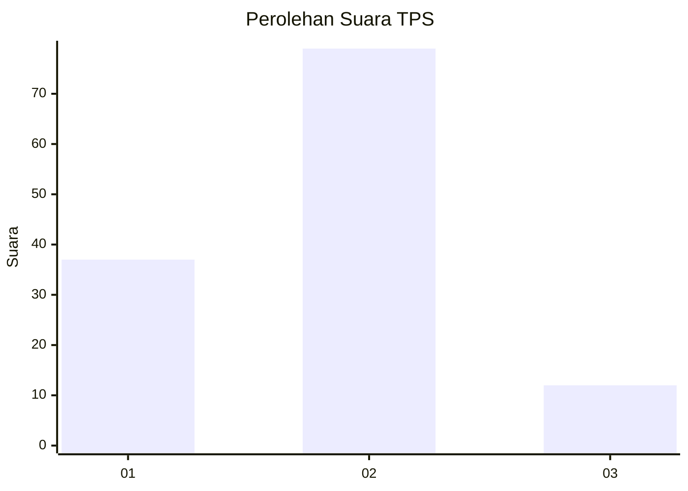
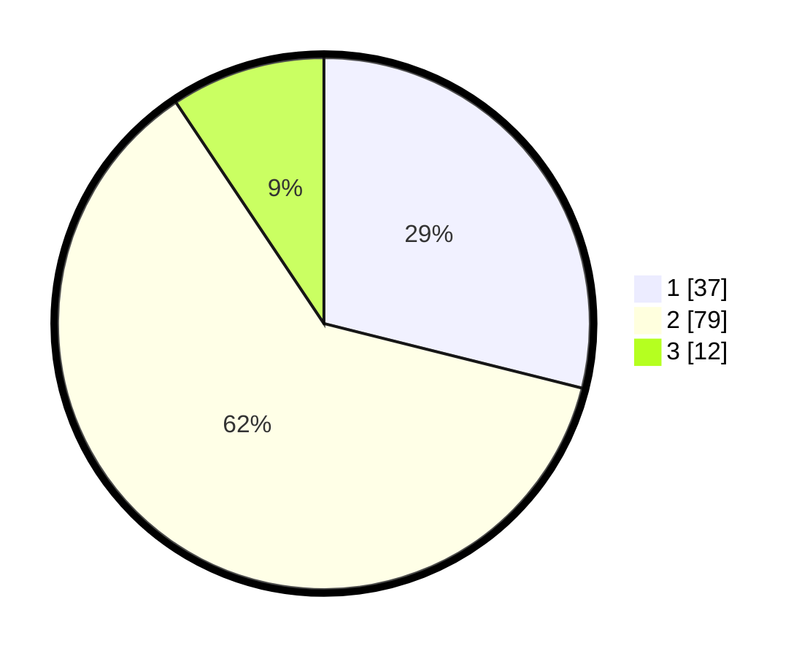

# Hasil

## Grafik

## Tabel

| No. | Nama Paslon    | Suara | Suara (raw) | Persentase |
|:--- |:-------------- | -----:| -----------:| ----------:|
| 1   | ANIES MUHAIMIN | 37    | [37][p-1]   | 28,91      |
| 2   | PRABOWO GIBRAN | 79    | [79][p-2]   | 61,72      |
| 3   | GANJAR MAHFUD  | 12    | [12][p-3]   | 9,38       |

[p-1]: https://github.com/gigit-pemilu/pemilu-2024/blob/main/pilpres/hitung-suara/sub/35-jawa-timur/sub/09-jember/sub/25-jelbuk/sub/2003-sukojember/sub/007-tps/sub/paslon-1.txt
[p-2]: https://github.com/gigit-pemilu/pemilu-2024/blob/main/pilpres/hitung-suara/sub/35-jawa-timur/sub/09-jember/sub/25-jelbuk/sub/2003-sukojember/sub/007-tps/sub/paslon-2.txt
[p-3]: https://github.com/gigit-pemilu/pemilu-2024/blob/main/pilpres/hitung-suara/sub/35-jawa-timur/sub/09-jember/sub/25-jelbuk/sub/2003-sukojember/sub/007-tps/sub/paslon-3.txt

## Foto C Plano

https://sirekap-obj-formc.kpu.go.id/0797/pemilu/ppwp/35/09/25/20/03/3509252003007-20240218-113343--da9d3315-5dfe-4093-9ea4-07fbb921a661.jpg

https://sirekap-obj-formc.kpu.go.id/0797/pemilu/ppwp/35/09/25/20/03/3509252003007-20240218-113441--8c665ce0-aa1c-4162-967b-ef73f1587b6b.jpg

https://sirekap-obj-formc.kpu.go.id/0797/pemilu/ppwp/35/09/25/20/03/3509252003007-20240218-113547--93d10edd-16f4-49df-9b5b-6451de72367a.jpg

## Metadata

| Key        | Value               |
| ---------- | ------------------- |
| Time Stamp | 2024-02-25 16:00:00 |

