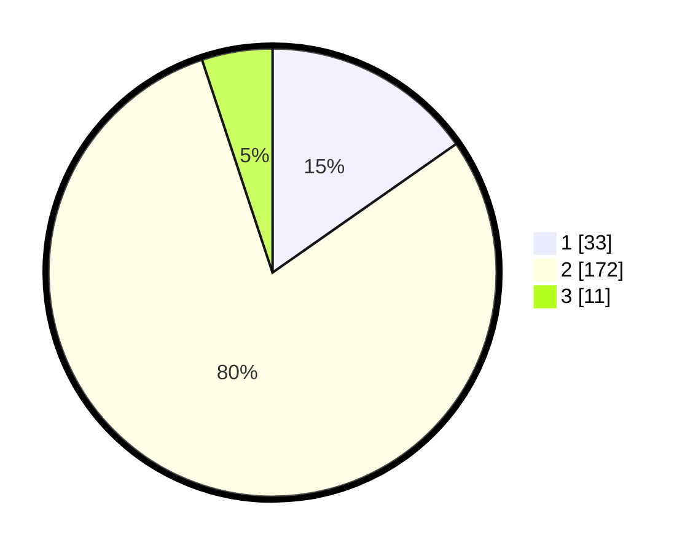

# Hasil

## Grafik

## Tabel

| No. | Nama Paslon    | Suara | Suara (raw) | Persentase |
|:--- |:-------------- | -----:| -----------:| ----------:|
| 1   | ANIES MUHAIMIN | 33    | [33][p-1]   | 15,28      |
| 2   | PRABOWO GIBRAN | 172   | [172][p-2]  | 79,63      |
| 3   | GANJAR MAHFUD  | 11    | [11][p-3]   | 5,09       |

[p-1]: https://github.com/gigit-pemilu/pemilu-2024/blob/main/pilpres/hitung-suara/sub/35-jawa-timur/sub/09-jember/sub/25-jelbuk/sub/2003-sukojember/sub/008-tps/sub/paslon-1.txt
[p-2]: https://github.com/gigit-pemilu/pemilu-2024/blob/main/pilpres/hitung-suara/sub/35-jawa-timur/sub/09-jember/sub/25-jelbuk/sub/2003-sukojember/sub/008-tps/sub/paslon-2.txt
[p-3]: https://github.com/gigit-pemilu/pemilu-2024/blob/main/pilpres/hitung-suara/sub/35-jawa-timur/sub/09-jember/sub/25-jelbuk/sub/2003-sukojember/sub/008-tps/sub/paslon-3.txt

## Foto C Plano

https://sirekap-obj-formc.kpu.go.id/4b90/pemilu/ppwp/35/09/25/20/03/3509252003008-20240218-113817--8c2a9a28-1427-4b15-8e27-5c78f0ed42c4.jpg

https://sirekap-obj-formc.kpu.go.id/4b90/pemilu/ppwp/35/09/25/20/03/3509252003008-20240218-113944--bf28b0b6-1378-4070-b629-1ed2bb864be0.jpg

https://sirekap-obj-formc.kpu.go.id/4b90/pemilu/ppwp/35/09/25/20/03/3509252003008-20240218-114141--52b57d81-a6bb-4300-b345-f1a1f8dace42.jpg

## Metadata

| Key        | Value               |
| ---------- | ------------------- |
| Time Stamp | 2024-02-25 21:00:00 |

