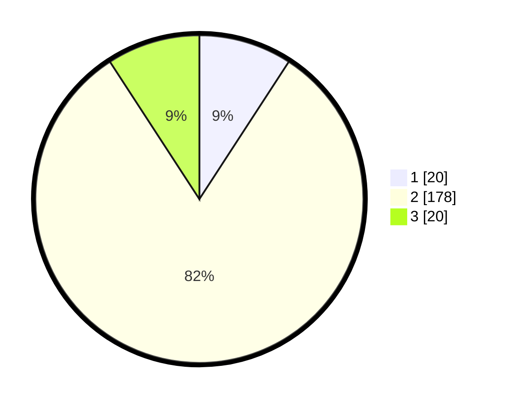

# Hasil

## Grafik

## Tabel

| No. | Nama Paslon    | Suara | Suara (raw) | Persentase |
|:--- |:-------------- | -----:| -----------:| ----------:|
| 1   | ANIES MUHAIMIN | 20    | [20][p-1]   | 9,17       |
| 2   | PRABOWO GIBRAN | 178   | [178][p-2]  | 81,65      |
| 3   | GANJAR MAHFUD  | 20    | [20][p-3]   | 9,17       |

[p-1]: https://github.com/gigit-pemilu/pemilu-2024-35-jawa-timur/blob/main/pilpres/hitung-suara/sub/35-jawa-timur/sub/09-jember/sub/25-jelbuk/sub/2003-sukojember/sub/009-tps/sub/paslon-1.txt
[p-2]: https://github.com/gigit-pemilu/pemilu-2024-35-jawa-timur/blob/main/pilpres/hitung-suara/sub/35-jawa-timur/sub/09-jember/sub/25-jelbuk/sub/2003-sukojember/sub/009-tps/sub/paslon-2.txt
[p-3]: https://github.com/gigit-pemilu/pemilu-2024-35-jawa-timur/blob/main/pilpres/hitung-suara/sub/35-jawa-timur/sub/09-jember/sub/25-jelbuk/sub/2003-sukojember/sub/009-tps/sub/paslon-3.txt

## Foto C Plano

https://sirekap-obj-formc.kpu.go.id/c70b/pemilu/ppwp/35/09/25/20/03/3509252003009-20240218-124934--4c1b5f09-2b8c-4aa4-af58-8601eed0f0a1.jpg

https://sirekap-obj-formc.kpu.go.id/c70b/pemilu/ppwp/35/09/25/20/03/3509252003009-20240218-125129--348f41e3-4ee7-4961-a8a4-10ed96baa13a.jpg

https://sirekap-obj-formc.kpu.go.id/c70b/pemilu/ppwp/35/09/25/20/03/3509252003009-20240218-125215--f9b96b25-4a6b-499e-8572-13cb01964179.jpg

## Metadata

| Key        | Value               |
| ---------- | ------------------- |
| Time Stamp | 2024-02-24 22:31:28 |

