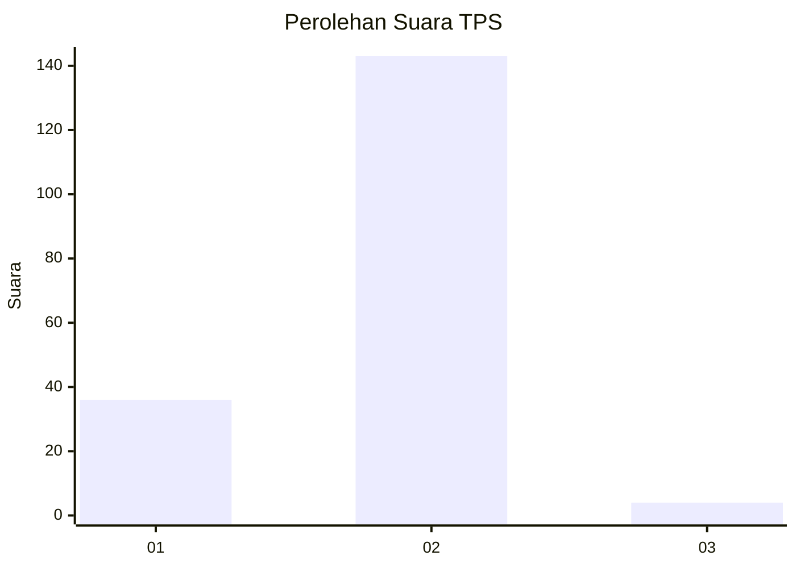
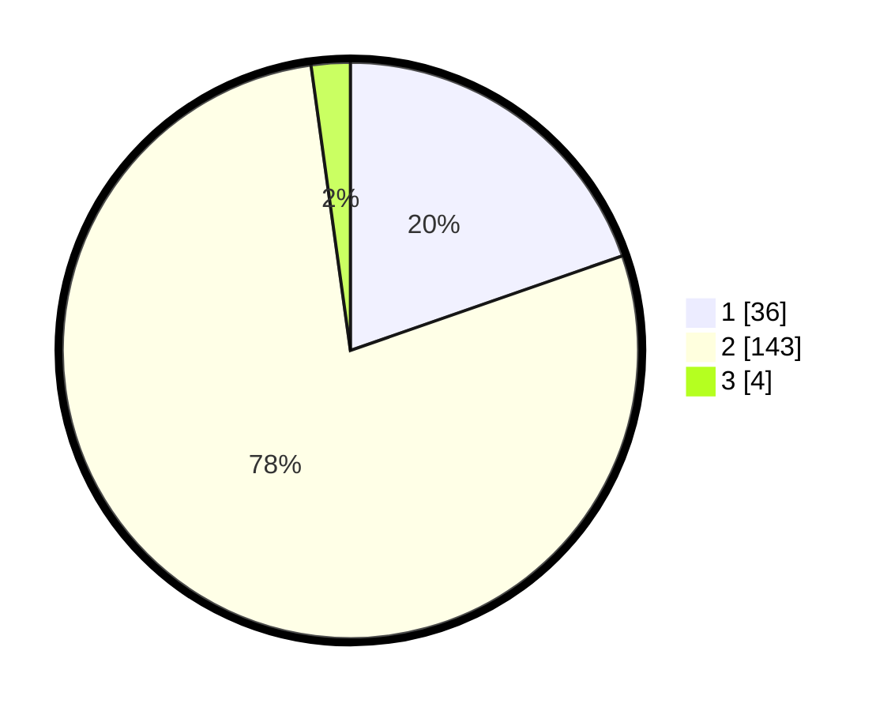

# Hasil

## Grafik

## Tabel

| No. | Nama Paslon    | Suara | Suara (raw) | Persentase |
|:--- |:-------------- | -----:| -----------:| ----------:|
| 1   | ANIES MUHAIMIN | 36    | [36][p-1]   | 19,67      |
| 2   | PRABOWO GIBRAN | 143   | [143][p-2]  | 78,14      |
| 3   | GANJAR MAHFUD  | 4     | [4][p-3]    | 2,19       |

[p-1]: https://github.com/gigit-pemilu/pemilu-2024/blob/main/pilpres/hitung-suara/sub/35-jawa-timur/sub/09-jember/sub/25-jelbuk/sub/2003-sukojember/sub/010-tps/sub/paslon-1.txt
[p-2]: https://github.com/gigit-pemilu/pemilu-2024/blob/main/pilpres/hitung-suara/sub/35-jawa-timur/sub/09-jember/sub/25-jelbuk/sub/2003-sukojember/sub/010-tps/sub/paslon-2.txt
[p-3]: https://github.com/gigit-pemilu/pemilu-2024/blob/main/pilpres/hitung-suara/sub/35-jawa-timur/sub/09-jember/sub/25-jelbuk/sub/2003-sukojember/sub/010-tps/sub/paslon-3.txt

## Foto C Plano

https://sirekap-obj-formc.kpu.go.id/5caf/pemilu/ppwp/35/09/25/20/03/3509252003010-20240218-125418--7ab07906-9831-4bb9-befc-406f21c0df7e.jpg

https://sirekap-obj-formc.kpu.go.id/5caf/pemilu/ppwp/35/09/25/20/03/3509252003010-20240218-125613--7dab0b48-2319-43a7-9a72-3c5eadacace3.jpg

https://sirekap-obj-formc.kpu.go.id/5caf/pemilu/ppwp/35/09/25/20/03/3509252003010-20240218-125706--7deacbfb-dd37-4e8a-8411-20fa560e94c3.jpg

## Metadata

| Key        | Value               |
| ---------- | ------------------- |
| Time Stamp | 2024-02-25 12:00:00 |

