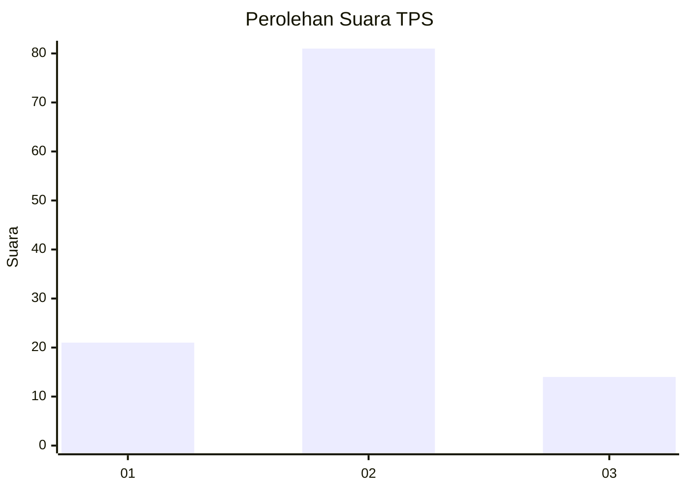
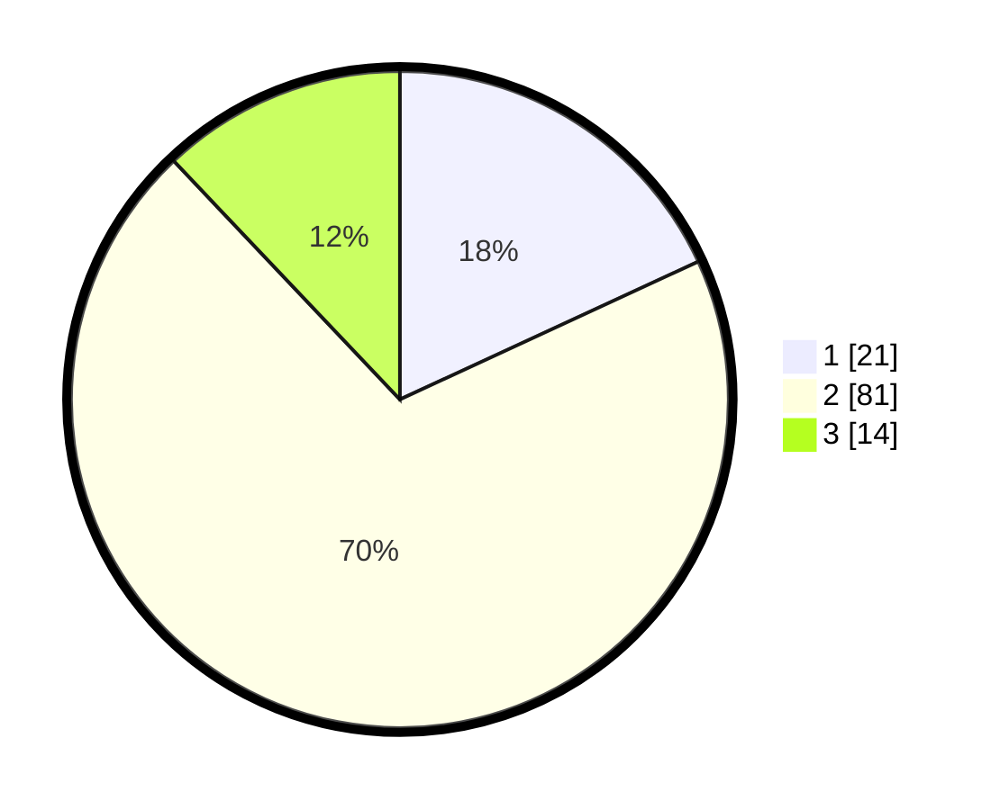

# Hasil

## Grafik

## Tabel

| No. | Nama Paslon    | Suara | Suara (raw) | Persentase |
|:--- |:-------------- | -----:| -----------:| ----------:|
| 1   | ANIES MUHAIMIN | 21    | [21][p-1]   | 18,10      |
| 2   | PRABOWO GIBRAN | 81    | [81][p-2]   | 69,83      |
| 3   | GANJAR MAHFUD  | 14    | [14][p-3]   | 12,07      |

[p-1]: https://github.com/gigit-pemilu/pemilu-2024-35-jawa-timur/blob/main/pilpres/hitung-suara/sub/35-jawa-timur/sub/09-jember/sub/25-jelbuk/sub/2003-sukojember/sub/017-tps/sub/paslon-1.txt
[p-2]: https://github.com/gigit-pemilu/pemilu-2024-35-jawa-timur/blob/main/pilpres/hitung-suara/sub/35-jawa-timur/sub/09-jember/sub/25-jelbuk/sub/2003-sukojember/sub/017-tps/sub/paslon-2.txt
[p-3]: https://github.com/gigit-pemilu/pemilu-2024-35-jawa-timur/blob/main/pilpres/hitung-suara/sub/35-jawa-timur/sub/09-jember/sub/25-jelbuk/sub/2003-sukojember/sub/017-tps/sub/paslon-3.txt

## Foto C Plano

https://sirekap-obj-formc.kpu.go.id/b4a6/pemilu/ppwp/35/09/25/20/03/3509252003017-20240218-133654--51fd7350-bc29-4fa7-9c56-0736738bdb0b.jpg

https://sirekap-obj-formc.kpu.go.id/b4a6/pemilu/ppwp/35/09/25/20/03/3509252003017-20240218-133750--5d5d8c79-3af7-4a08-961a-b46342436d2f.jpg

https://sirekap-obj-formc.kpu.go.id/b4a6/pemilu/ppwp/35/09/25/20/03/3509252003017-20240218-133844--1618f431-21e0-4833-9961-54d115f02d4d.jpg

## Metadata

| Key        | Value               |
| ---------- | ------------------- |
| Time Stamp | 2024-02-24 22:31:28 |

