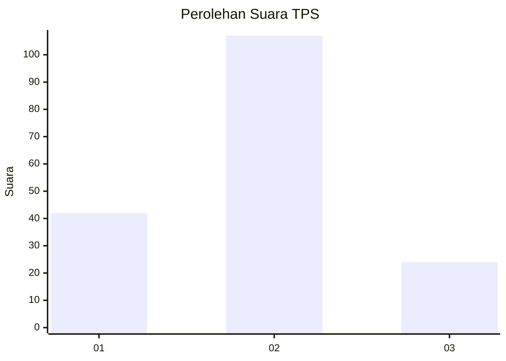
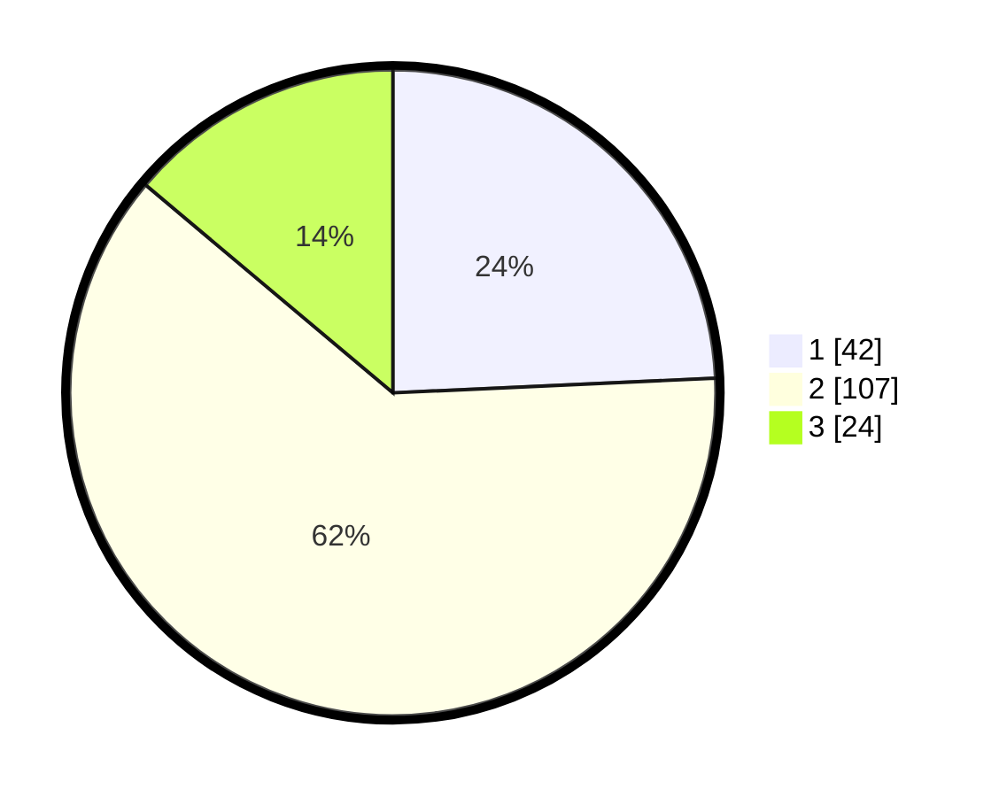

# Hasil

## Grafik

## Tabel

| No. | Nama Paslon    | Suara | Suara (raw) | Persentase |
|:--- |:-------------- | -----:| -----------:| ----------:|
| 1   | ANIES MUHAIMIN | 42    | [42][p-1]   | 24,28      |
| 2   | PRABOWO GIBRAN | 107   | [107][p-2]  | 61,85      |
| 3   | GANJAR MAHFUD  | 24    | [24][p-3]   | 13,87      |

[p-1]: https://github.com/gigit-pemilu/pemilu-2024/blob/main/pilpres/hitung-suara/sub/35-jawa-timur/sub/09-jember/sub/25-jelbuk/sub/2003-sukojember/sub/020-tps/sub/paslon-1.txt
[p-2]: https://github.com/gigit-pemilu/pemilu-2024/blob/main/pilpres/hitung-suara/sub/35-jawa-timur/sub/09-jember/sub/25-jelbuk/sub/2003-sukojember/sub/020-tps/sub/paslon-2.txt
[p-3]: https://github.com/gigit-pemilu/pemilu-2024/blob/main/pilpres/hitung-suara/sub/35-jawa-timur/sub/09-jember/sub/25-jelbuk/sub/2003-sukojember/sub/020-tps/sub/paslon-3.txt

## Foto C Plano

https://sirekap-obj-formc.kpu.go.id/ba2e/pemilu/ppwp/35/09/25/20/03/3509252003020-20240218-135256--e1453c2a-293d-4251-8289-c68bfe35ff9a.jpg

https://sirekap-obj-formc.kpu.go.id/ba2e/pemilu/ppwp/35/09/25/20/03/3509252003020-20240218-135355--dd5604be-8b8a-4778-9274-9a93306a31f1.jpg

https://sirekap-obj-formc.kpu.go.id/ba2e/pemilu/ppwp/35/09/25/20/03/3509252003020-20240218-135515--c160e350-a75d-459d-b35f-d9aa938e8b2f.jpg

## Metadata

| Key        | Value               |
| ---------- | ------------------- |
| Time Stamp | 2024-02-25 15:00:00 |

