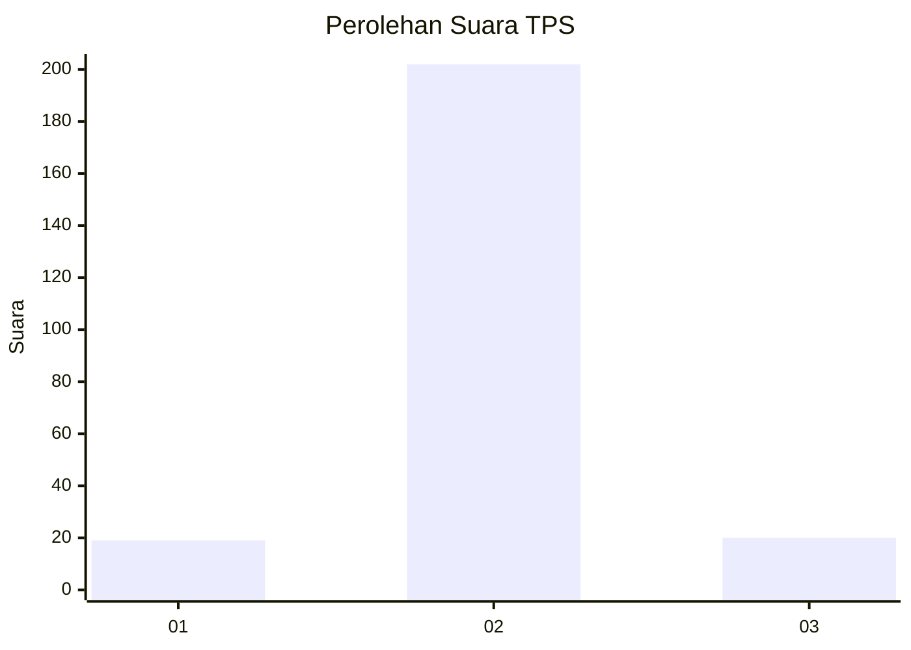
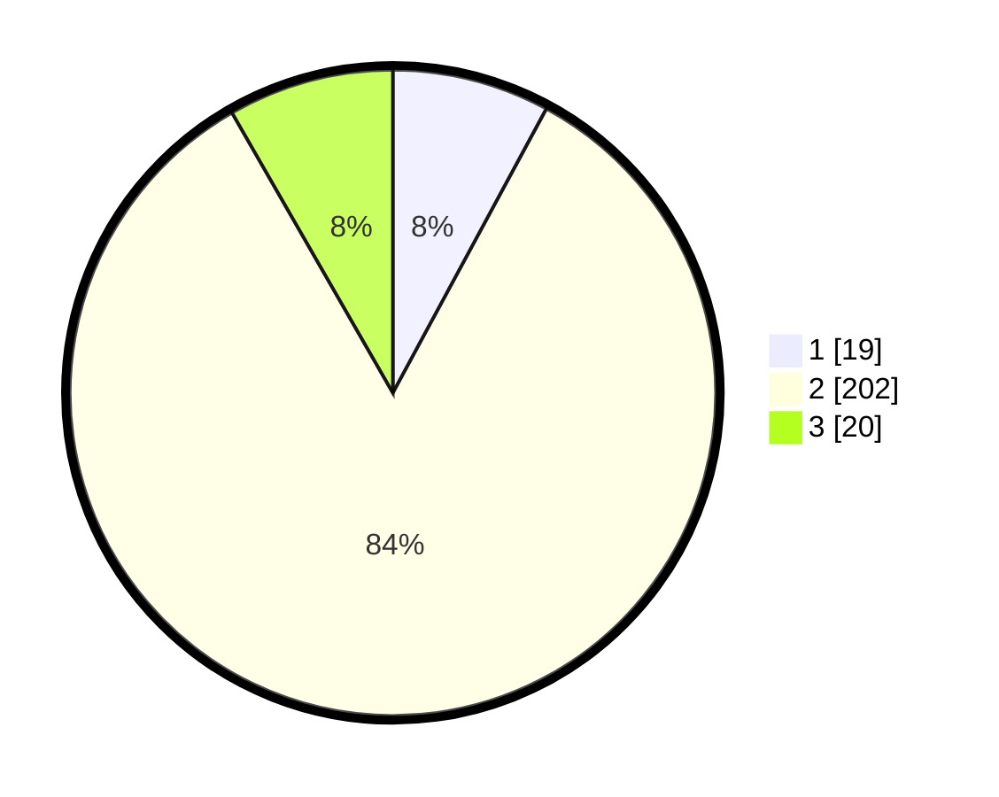

# Hasil

## Grafik

## Tabel

| No. | Nama Paslon    | Suara | Suara (raw) | Persentase |
|:--- |:-------------- | -----:| -----------:| ----------:|
| 1   | ANIES MUHAIMIN | 19    | [19][p-1]   | 7,88       |
| 2   | PRABOWO GIBRAN | 202   | [202][p-2]  | 83,82      |
| 3   | GANJAR MAHFUD  | 20    | [20][p-3]   | 8,30       |

[p-1]: https://github.com/gigit-pemilu/pemilu-2024-35-jawa-timur/blob/main/pilpres/hitung-suara/sub/35-jawa-timur/sub/09-jember/sub/25-jelbuk/sub/2004-jelbuk/sub/003-tps/sub/paslon-1.txt
[p-2]: https://github.com/gigit-pemilu/pemilu-2024-35-jawa-timur/blob/main/pilpres/hitung-suara/sub/35-jawa-timur/sub/09-jember/sub/25-jelbuk/sub/2004-jelbuk/sub/003-tps/sub/paslon-2.txt
[p-3]: https://github.com/gigit-pemilu/pemilu-2024-35-jawa-timur/blob/main/pilpres/hitung-suara/sub/35-jawa-timur/sub/09-jember/sub/25-jelbuk/sub/2004-jelbuk/sub/003-tps/sub/paslon-3.txt

## Foto C Plano

https://sirekap-obj-formc.kpu.go.id/20c6/pemilu/ppwp/35/09/25/20/04/3509252004003-20240218-104842--ca79f8dd-5e7b-4cb0-b4d8-53ee24ad0610.jpg

https://sirekap-obj-formc.kpu.go.id/20c6/pemilu/ppwp/35/09/25/20/04/3509252004003-20240218-104928--eb611daa-a27a-47be-af8a-0d98a860a6fc.jpg

https://sirekap-obj-formc.kpu.go.id/20c6/pemilu/ppwp/35/09/25/20/04/3509252004003-20240218-105013--ef10a856-2117-4e5d-a400-7697355c5d96.jpg

## Metadata

| Key        | Value               |
| ---------- | ------------------- |
| Time Stamp | 2024-02-25 21:00:00 |

