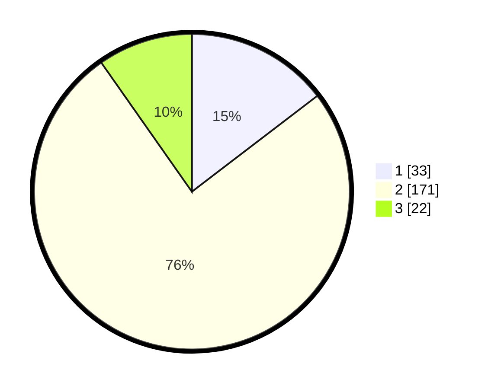

# Hasil

## Grafik

## Tabel

| No. | Nama Paslon    | Suara | Suara (raw) | Persentase |
|:--- |:-------------- | -----:| -----------:| ----------:|
| 1   | ANIES MUHAIMIN | 33    | [33][p-1]   | 14,60      |
| 2   | PRABOWO GIBRAN | 171   | [171][p-2]  | 75,66      |
| 3   | GANJAR MAHFUD  | 22    | [22][p-3]   | 9,73       |

[p-1]: https://github.com/gigit-pemilu/pemilu-2024-35-jawa-timur/blob/main/pilpres/hitung-suara/sub/35-jawa-timur/sub/09-jember/sub/25-jelbuk/sub/2004-jelbuk/sub/004-tps/sub/paslon-1.txt
[p-2]: https://github.com/gigit-pemilu/pemilu-2024-35-jawa-timur/blob/main/pilpres/hitung-suara/sub/35-jawa-timur/sub/09-jember/sub/25-jelbuk/sub/2004-jelbuk/sub/004-tps/sub/paslon-2.txt
[p-3]: https://github.com/gigit-pemilu/pemilu-2024-35-jawa-timur/blob/main/pilpres/hitung-suara/sub/35-jawa-timur/sub/09-jember/sub/25-jelbuk/sub/2004-jelbuk/sub/004-tps/sub/paslon-3.txt

## Foto C Plano

https://sirekap-obj-formc.kpu.go.id/3246/pemilu/ppwp/35/09/25/20/04/3509252004004-20240218-105319--1d57e4c3-6ebb-44e6-967b-d45c32b57a72.jpg

https://sirekap-obj-formc.kpu.go.id/3246/pemilu/ppwp/35/09/25/20/04/3509252004004-20240218-105406--f2fc92cd-ded5-4598-8b4b-03cbb70486f5.jpg

https://sirekap-obj-formc.kpu.go.id/3246/pemilu/ppwp/35/09/25/20/04/3509252004004-20240218-105454--f7d87422-249b-4532-ae6a-518416bb30b0.jpg

## Metadata

| Key        | Value               |
| ---------- | ------------------- |
| Time Stamp | 2024-02-25 00:00:00 |

