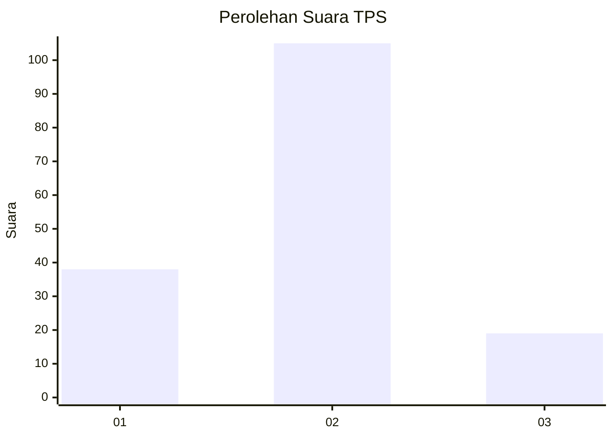
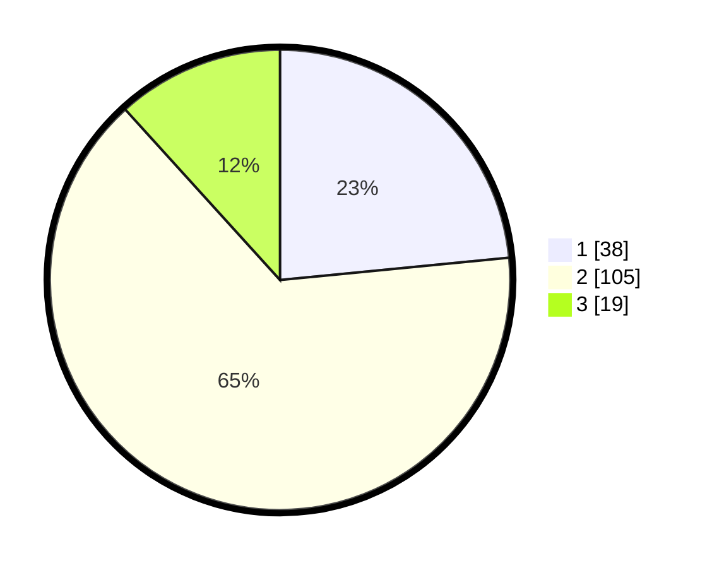

# Hasil

## Grafik

## Tabel

| No. | Nama Paslon    | Suara | Suara (raw) | Persentase |
|:--- |:-------------- | -----:| -----------:| ----------:|
| 1   | ANIES MUHAIMIN | 38    | [38][p-1]   | 23,46      |
| 2   | PRABOWO GIBRAN | 105   | [105][p-2]  | 64,81      |
| 3   | GANJAR MAHFUD  | 19    | [19][p-3]   | 11,73      |

[p-1]: https://github.com/gigit-pemilu/pemilu-2024/blob/main/pilpres/hitung-suara/sub/35-jawa-timur/sub/09-jember/sub/25-jelbuk/sub/2004-jelbuk/sub/005-tps/sub/paslon-1.txt
[p-2]: https://github.com/gigit-pemilu/pemilu-2024/blob/main/pilpres/hitung-suara/sub/35-jawa-timur/sub/09-jember/sub/25-jelbuk/sub/2004-jelbuk/sub/005-tps/sub/paslon-2.txt
[p-3]: https://github.com/gigit-pemilu/pemilu-2024/blob/main/pilpres/hitung-suara/sub/35-jawa-timur/sub/09-jember/sub/25-jelbuk/sub/2004-jelbuk/sub/005-tps/sub/paslon-3.txt

## Foto C Plano

https://sirekap-obj-formc.kpu.go.id/844c/pemilu/ppwp/35/09/25/20/04/3509252004005-20240218-111318--3f1cb6d7-dfe7-4468-bfc7-d3dadf90b5a6.jpg

https://sirekap-obj-formc.kpu.go.id/844c/pemilu/ppwp/35/09/25/20/04/3509252004005-20240214-225836--fb1ccca9-5993-404e-ae4b-3383a1f82b75.jpg

https://sirekap-obj-formc.kpu.go.id/844c/pemilu/ppwp/35/09/25/20/04/3509252004005-20240218-111446--63b0ee63-1bc9-49e5-9c46-5eb4d79ad177.jpg

## Metadata

| Key        | Value               |
| ---------- | ------------------- |
| Time Stamp | 2024-02-19 06:16:00 |

