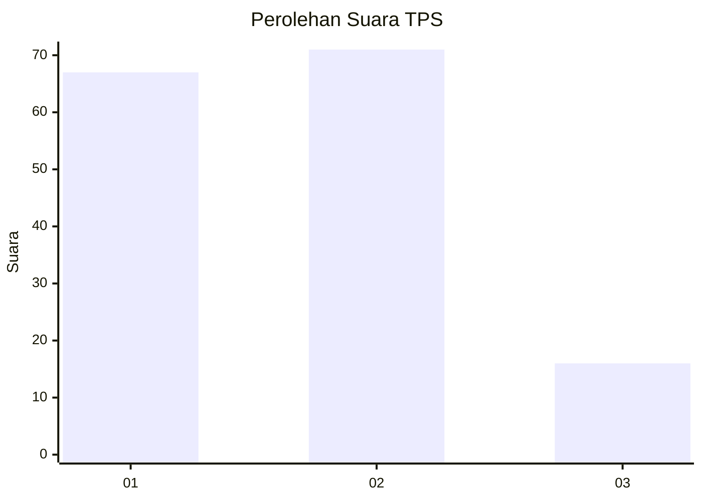
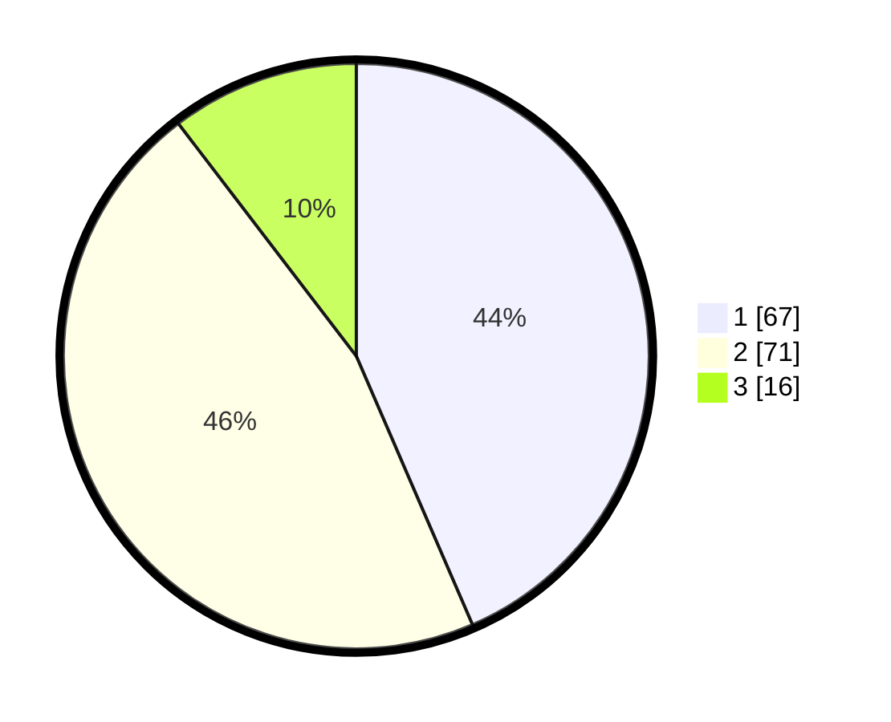

# Hasil

## Grafik

## Tabel

| No. | Nama Paslon    | Suara | Suara (raw) | Persentase |
|:--- |:-------------- | -----:| -----------:| ----------:|
| 1   | ANIES MUHAIMIN | 67    | [67][p-1]   | 43,51      |
| 2   | PRABOWO GIBRAN | 71    | [71][p-2]   | 46,10      |
| 3   | GANJAR MAHFUD  | 16    | [16][p-3]   | 10,39      |

[p-1]: https://github.com/gigit-pemilu/pemilu-2024/blob/main/pilpres/hitung-suara/sub/35-jawa-timur/sub/09-jember/sub/25-jelbuk/sub/2004-jelbuk/sub/009-tps/sub/paslon-1.txt
[p-2]: https://github.com/gigit-pemilu/pemilu-2024/blob/main/pilpres/hitung-suara/sub/35-jawa-timur/sub/09-jember/sub/25-jelbuk/sub/2004-jelbuk/sub/009-tps/sub/paslon-2.txt
[p-3]: https://github.com/gigit-pemilu/pemilu-2024/blob/main/pilpres/hitung-suara/sub/35-jawa-timur/sub/09-jember/sub/25-jelbuk/sub/2004-jelbuk/sub/009-tps/sub/paslon-3.txt

## Foto C Plano

https://sirekap-obj-formc.kpu.go.id/7a4a/pemilu/ppwp/35/09/25/20/04/3509252004009-20240218-123154--eb361289-b70e-4e0f-b465-3c927d34f207.jpg

https://sirekap-obj-formc.kpu.go.id/7a4a/pemilu/ppwp/35/09/25/20/04/3509252004009-20240218-123246--f9c7abbc-8cbc-478e-994d-0ccbb6195635.jpg

https://sirekap-obj-formc.kpu.go.id/7a4a/pemilu/ppwp/35/09/25/20/04/3509252004009-20240214-222313--ce04be99-c7f4-4686-8727-ae5aad6229bb.jpg

## Metadata

| Key        | Value               |
| ---------- | ------------------- |
| Time Stamp | 2024-02-24 23:00:00 |

